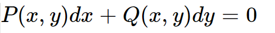
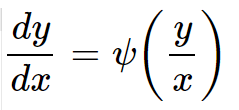
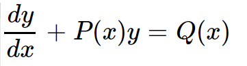
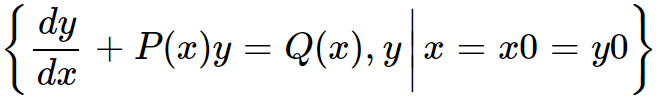
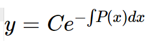
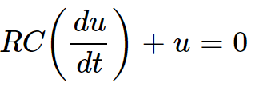
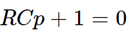
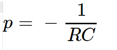

# 基本概念     

表示未知函数、未知函数的导数与自变量之间关系的方程，称为微分方程。     

未知函数为一元函数的微分方程称为常微分方程。微分方程中出现的未知函数的各阶导数(系数非零)的最高阶数就是微分方程的阶。       

## 微分方程的应用    

微分方程是表现函数变化规律的重要形式，对于要求函数的问题，我们可以通过求导数的方法建立函数满足的微分方程，再求出微分方程的解得到函数。     

## 微分方程的解        

如果一个函数带入微分方程后，方程两端恒等，则称此函数为该方程的解。     

* 通解     

如果微分方程的解中所含相互独立的任意常数的个数等于该微分方程的阶数，则称此解为通解。          

* 特解     

如果给出微分方程的解或其导数在自变量特定取值时具体取值，这种定解条件叫做初始条件，进一步利用该条件将通解中任意常数确定后得到的解，称为特解。    

## 齐次方程     

如果一阶微分方程    

        

能够通过方程的等价变化化为形式为：   

       

此形式(称为标准形式)的方程称为齐次微分方程。        

## 一阶线性微分方程     

* 有关概念    

对于所给方程，其中的未知函数及其导数都是一次的，则该方程可以化为：     

      

这里y就是未知函数，也就是我们要解出来的结果。       

这样的方程就称为一阶线性微分方程。        

该方程的特解问题可以看作是下面这样：       

      

如果此时`Q(x)=0`,方程就变成了一个齐次方程，称为一阶线性齐次微分方程，然后采用分离变量的方式可以求得方程的通解为：     

       

* 常数变易法         

## 微分方程的特征方程    

特征方程一般是针对于一阶或高阶常系数线性微分方程而言的，下面我们先来举个例子：       

     

这里RC为常量，方程中有一个未知函数和它的一阶倒数，而且是齐次的，我们就可以对照着列出该方程的特征方程：      

             

特征根就可以解出为：     

      
