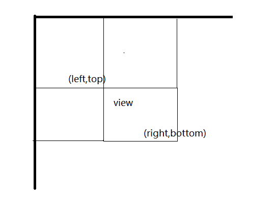

# View    
View是Android中控件的超类，不论是简单的button，textview还是布局LinearLayout等等都是view，但是还有一个概念就是ViewGroup，ViewGroup从字面上看是控件组的概念，它内部可以又包括多个view，但其实ViewGroup还是View的子类，举个例子，LinearLayout直观上看是一个ViewGroup，但它也是一个View，LinearLayout内部可以有多个子View，同样也可以有子ViewGroup.    

## View的位置参数     

任何一个View的位置都是由View左上角和右下角点的坐标确定的，这两个点的坐标对应着View的四个属性:top、bottom、left、right，左上角点坐标为`(left,top)`,右下角点坐标为`(right,bottom)`,但是需要注意的是，这两个坐标都是相对于View的父容器来说的。        

   

可以得到view的长度和高度分别为:   
`width = right - left`   
`height = bottom - top`    

其实长度和高度都有相应的getter方法。         

四个坐标参数在类内部也有相应的getter方法。    

后来，Android又增加了几个位置参数,`x,y,translationX,translationY`,其中x,y表示View左上角点的坐标，translationX,translationY表示view左上角相对于父容器的偏移量，看上去x，y好像与left，top有点重复，看一下他们之间的换算关系就明白了，`x = left + translationX`,`y = top + translationY`,这样一来，我们就将原始view左上角的坐标固定了，如果view发生了位置的平移，left,top是不会改变的，只有两个translation值发生改变。     

## MotionEvent    
我们用触摸手机屏幕后一般会有一下几种触摸事件：    

* ACTION_DOWN：手指刚按住屏幕      
* ACTION_MOVE：手指在屏幕上滑动    
* ACTION_UP:手指从屏幕上松开的一瞬间    

通过MotionEvent对象获取点击事件发生的x，y坐标，具体有两组方法`getX()/getY()`和`getRawX()/getRawY()`，区别是前者获取到的是相对于当前view左上角的x和y坐标，后者获取的是相对于手机屏幕左上角的x和y坐标     


## TouchSlop     

TouchSlop只是一个常量，它表示系统所能识别的最小滑动距离，如果一次手指滑动屏幕的距离小于该常量的话，就不能看成是一次滑动，这个常量在不同的设备上值可能是不同的，获取它可以通过`ViewConfiguration.get(getContext()).getScaledTouchSlop()`来获取，在处理滑动冲突时，我们可以根据这个常量来过滤掉一些滑动，以达到更好的用户体验。        


## VelocityTracker(速度追踪器)    

用于追踪手指在屏幕上的滑动速度，使用比较简单，只需要在view的onTouchEvent()回调中调用API就可以计算滑动速度。     

首先获取VelocityTracker实例:   

```java
VelocityTracker velocityTracker = VelocityTracker.obtain();
velocityTracker.addMovement(event);
```   

然后计算一段时间间隔内的滑动速度:   

```java
velocityTracker.computeCurrentVelocity(1000);
int xVelocity = (int) velocityTracker.getXVelocity();
int yVelocity = (int) velocityTracker.getYVelocity();   
```    
这里`computeCurrentVelocity()`的参数就是时间间隔，单位是ms，这里计算的就是1000ms内水平方向和竖直方向上的速度，然后根据两个getter方法获取，很明显，这里的速度是平均速度，还需要注意的是，这里的速度带有方向，可以为负值，我们以Android坐标系的方向为正方向，如果滑动的方向与正方向相同，那速度的值就为正，反之为负，可以总结出一个计算速度的公式，这其实和中学物理中计算物体平均速度的公式一致：     

`速度 = 位移 / 时间`        
最终计算得到的速度就是单位时间间隔内手指在水平或竖直方向上所滑动的像素数。        

 


