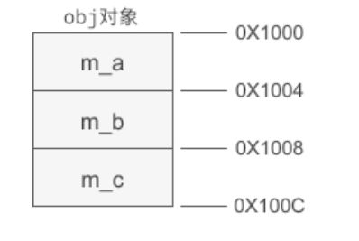

# C++继承权限   

C++中有三个权限修饰符,`private`,`public`,`protected`,他们可以修饰类的成员，现在他们也可以修饰基类成员在派生类中的访问权限。    

C++中通常的类继承形式如下:   

```c++
class SonClass : public FatherClass{
    //派生类中新添加的成员
};
```   

这里的继承权限是public的，如果这里省略不写继承权限修饰符的话，默认就是private的，这个和在类中定义成员时不写权限修饰符就默认是private是一致的。     


## public,protected,private修饰类的成员    

类成员的访问权限由高到低依次为:public protected private，之前我们只知道类的对象可以访问到public修饰的成员，private修饰的成员是访问不到的。     

加入了protected修饰符后，就有新的情况了，同private一样，通过类的对象也不可以访问到protected修饰的成员，**但是当存在继承关系时，protected就和private不同了，基类中的protected成员可以在派生类中使用。**       

## public,protected,private指定继承方式    

不同的继承方式会影响基类成员在派生类中的访问权限。     

* 基类成员在派生类中的访问权限不得高于继承方式中指定的权限，比如当继承方式定为了protected,那基类成员在派生类中的访问权限最高也为protected，高于继承方式的成员也会被降级为protected,但低于protected的不会升级，再如，当继承方式为public时，那基类成员在派生类中的访问权限不会改变。    

    **也就是说继承方式定义的是基类成员在派生类当中的最高访问权限。**       

* 不管继承方式如何，基类中的private成员在派生类中始终无法使用(不能在派生类的成员函数中访问或调用。)     

* 如果希望基类成员既不向外暴露(不能通过对象访问)，还能在派生类中访问，那只能声明为protected.    

* 这里说的基类中声明为private的成员不能在派生类中使用，并不是说这些成员不能被继承，其实他们会占用派生类对象的内存，但是因为在派生类无法使用，导致不可见。    


## 改变访问权限   

使用`using`关键字可以改变基类成员在派生类中的访问权限，但是只能改变基类中public和protected成员的访问权限，不能改变private成员的访问权限，因为基类中private成员在派生类中是不可见的，根本不能使用，所以基类中的private成员在派生类中无论如何都不能访问。    

using关键字使用:    

```c++
#include <iostream>

using namespace std;

class People {
public:
    void show();

protected:
    char *m_name;
    int m_age;
};

void People::show() {
    cout << "名字是:" << m_name << "年龄是:" << m_age << endl;
}

//派生类
class Student : public People {
public:
    void read();

public:
    using People::m_name; //将基类中protected成员的权限改为public
    using People::m_age; //同上
    float m_grade;
private:
    using People::show; //将基类中public成员的权限修改为private
};
        

void Student::read() {
    cout << "姓名为:" << m_name << "年龄为:" << m_age << "分数为:" << m_grade << endl;
}


int main() {
    Student stu;
    stu.m_age = 20;
    stu.m_grade = 100.0;
    stu.show(); //编译错误，因为我们将这个成员函数的权限降低为private，无法通过对象访问了。     
    stu.read();
    return 0;
}
```     


## 继承时的名称覆盖    

如果派生类中的成员(包括成员变量和成员函数)和基类中的成员名字一样，就会造成覆盖情况，即使在派生类中使用该成员时(包括在定义派生类时使用，也包括通过派生类对象访问该成员时)，实际上使用的派生类中新增的成员，而不是从基类中继承过来的。     

## 基类成员函数和派生类成员函数不构成重载      

如果只是在派生类的同名成员变量造成名称覆盖，这个很容易理解，但是如果对于成员函数来说，不管函数的参数如何，只要名字一样就会造成覆盖，也就是说基类成员和派生类成员函数之间不会构成重载，如果派生类中有同名函数，就会覆盖基类中的所有同名函数，不管他们的参数是否一样。    

下面来看一个例子:     

```c++
#include <iostream>

using namespace std;

class Base {
public:
    void fun();

    void fun(float a);
};

void Base::fun() {
    cout << "Base::fun()" << endl;
}

void Base::fun(float a) {
    cout << "Base::fun(float a)" << endl;
}

class Derived : public Base {
public:
    void fun(char *a);

    void fun(bool b);
};

void Derived::fun(char *a) {
    cout << "Derived::fun(char *a)" << endl;
}

void Derived::fun(bool b) {
    cout << "Derived::fun(bool b)" << endl;
}


int main() {
    Derived d;
    d.fun(true);
    d.fun("bao");
    d.fun(); //编译错误
    d.fun(4f); //编译错误

    return 0;

}
```      

上面代码中派生类和基类中函数名称都是fun，但是参数都不相同，看似构成了函数重载，其实派生类中的fun函数覆盖了基类中的两个函数，如果要说函数的重载的话，就是基类中的两个fun函数构成了一次重载，而派生类中的两个fun函数又构成了一次重载，这两次重载之间是没有联系的。     


##  继承时的对象内存模型     

已经知道普通情况时对象的内存模型，就是成员变量和成员函数会分开存储。    

* 对象的内存中只有成员变量，存储在栈区和堆区(当使用new关键字创建对象时)      
* 成员函数存储在代码区      

当存在继承关系时，派生类的内存模型**可以看成是基类成员变量和新增成员变量的总和**，而所有成员函数仍然存储在代码区，对所有对象共享。       

要注意的是，这个总和在出现成员变量覆盖时仍然成立，也就是说就算是出现了派生类覆盖基类的成员变量时，派生类对象的内存中仍然有基类的成员变量。    

总结:在派生类的对象模型中，会包含所有基类的成员变量，这种设计方式是访问效率高，能够在派生类对象中直接访问基类变量(如果被覆盖，要加上类名作用域符号)，无需经过好几层间接计算。        


## 使用指针突破访问权限      

已经知道如果是一个私有成员，无法通过类的对象和指针去访问到这些私有成员，就像下面这段代码：   

```c++
#include <iostream>

using namespace std;

class A {
public:
    A(int a, int b, int c);

private:
    int m_a;
    int m_b;
    int m_c;
};

A::A(int a, int b, int c) : m_a(a), m_b(b), m_c(c) {}


int main() {
    A a(1, 3, 4);
    int a =  a.m_a;//编译错误
    A *ap = new A(2,3,5);
    int b = ap->m_b;//编译错误
}
```   

如果我们将abc三个成员的访问权限改为public，就可以通过上面的方式访问到了，这只是语法层面上的访问限制，如果我们去找下访问成员的原理的话，就能跨越限制，访问到私有成员。    

* 使用偏移   
    在类对象的内存模型中，成员变量是顺序排列的，如图：   
         
    不管对象的访问权限是public还是private的，它们都是按照上图这样的方式排列的，所以如果能得到该对象起始地址，通过加上每个成员的在内存中的偏移量(offset)我们就能将指针定位到要访问的成员，也就能够访问了。    

    我们来看一下上面的一行代码:   
    `int b = ap->m_a;`     
    编译器内部会发生下列转换:  
    `int b = *(int*)((int)ap + sizeof(int));`
    ap是对象a的指针，先将指针转换为int类型然后才能进行加减运算，给该指针加上一个偏移量就定位到了m_a，然后再将这个int值转换为(int *)的指针类型，然后再用**取到该地址的值。  

所以如果我们能够正确计算各成员变量的地址，就可以通过指针访问到私有成员，这也正式其中的内部原理。    


