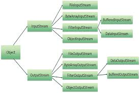

## Java I/O 概述      

I/O即Input Output,输入输出。        

+ IO流用来处理设备间的数据传递。    

+ Java传输数据都是通过IO流实现的。     

+ JavaIO流的对象都放在IO包里。     

+ 流按操作分为：字节流和字符流。     

+ 流按流向分为：输出流和输入流。     

      

这张图列举了javaIO的所有对象，可以看到一共分为两大类。      

+ 字节流的抽象基类       

  - InputStream        

  - OutputStream      

+ 字符流的抽象基类    

  - Reader    

  - Writer      

可以看到表里其他子类的后缀都是上面这几个基类。           


## 字符流操作文件(FileWriter)      

* 构造函数    

```java
FileWriter(String filename, boolean append);
FileWriter(File file, boolean append);
```   

必须要指定被操作的文件，如果不指定文件位置，就新创建在该程序相同文件夹下，如果文件名已存在，会覆盖。      


* 举例     

```java
public static void main(String[] args) {
        try {
            FileWriter fileWriter = new FileWriter("test.txt");
            //写入数据
            fileWriter.write("barack");
            //刷新该流的缓冲
            //fileWriter.flush();
            //关闭流，关闭之前会执行一次刷新操作，但是关闭流之后该流就被看作废弃了，如果只是刷新，则该流仍能继续使用
            fileWriter.close();
        } catch (IOException e) {
            e.printStackTrace();
        }
    }
```   

可以看到成功在项目目录下生成了文件。      


## 文件续写      

上面提到如果文件名一样我们再操作的时候会覆盖，但是我们想续写，java也提供了这样的操作。      

上面列出来的字符操作流的构造函数有的有两个参数，其中第二个参数是boolean,利用这个参数来控制是否进行续写。       

当这个参数为true时，可以续写。   

```java
public static void main(String[] args) {
        try {
            FileWriter fileWriter = new FileWriter("test.txt", true);
            fileWriter.write("bao");
            fileWriter.close();
        } catch (IOException e) {
            e.printStackTrace();
        }
    }
```   

文件中就成了"barackbao"了。      


## 字符流文件读取(FileReader)       

* 构造函数    

```java
FileReader(String fileName);
FileReader(File file);
FileReader(FileDesriptor fd);
```     

可以看到在创建该对象时必须与指定好的存在的文件进行关联，如果文件不存在，则会抛出异常。       

```java
public static void main(String[] args) {
       try {
           FileReader fileReader = new FileReader("test.txt");
           int cd = fileReader.read();
           System.out.println((char) cd);

           fileReader.close();
       } catch (FileNotFoundException e) {
           e.printStackTrace();
       } catch (IOException e) {
           e.printStackTrace();
       }
   }
```   

输出文件中的第一个字符。      

这里有一个方法       

* 读取函数(1)     

```java
/**
     * Reads a single character.
     *
     * @return The character read, or -1 if the end of the stream has been
     *         reached
     *
     * @exception  IOException  If an I/O error occurs
     */
    public int read() throws IOException {
        return sd.read();
    }
```    

这是它的源码，注释说的很清楚，返回的就是每个字符的对应的ASCll码，如果当字符流到达文件末尾，就返回-1表示已读取完。      

我们把文件全部读取出来      

```java
public static void main(String[] args){
    try {
        FileReader filereader = new FileReader("test.txt");
        int result = 0;
        while((result = filereader.read()) != -1){
              System.out.println((char) result);
        }
        filereader.close();
      } catch (FileNotFoundException e) {
          e.printStackTrace();
      } catch (IOException e) {
          e.printStackTrace();
      }
}
```       

* 读取函数(2)    


下面将文件中的数据读取出来并存在数组里       

```java
public static void main(String[] args) {
        try {
            FileReader fileReader = new FileReader("test.txt");
            char[] result = new char[10];
            int length = fileReader.read(result);
            System.out.println("result.length: " + length);
            System.out.println(new String(result));
        } catch (FileNotFoundException e) {
            e.printStackTrace();
        } catch (IOException e) {
            e.printStackTrace();
        }
    }
```    

输出：    

```
result.length: 9
barackbao
```    

这里又是一个读取函数，参数与上面那个不同，功能也与上面那个不同。         

```java

    /**
     * Reads characters into an array.  This method will block until some input
     * is available, an I/O error occurs, or the end of the stream is reached.
     *
     * @param       cbuf  Destination buffer
     *
     * @return      The number of characters read, or -1
     *              if the end of the stream
     *              has been reached
     *
     * @exception   IOException  If an I/O error occurs
     */
    public int read(char cbuf[]) throws IOException {
        return read(cbuf, 0, cbuf.length);
    }
```    

这里有一个参数，就是一个字符数组，返回值是这个字符流读取过的字符个数，并把这些读取过的字符存放在所传入的数组中，如果返回值为-1，说明字符流已经到达了文件的末尾，表示读取结束。       


## 字符流小练习       

我们将读取一个java文件，并打印出来。    

```java
public static void main(String[] args) {
        try {
            FileReader fileReader = new FileReader("D:\\TestProjects\\src\\com\\barackbao\\MyThread.java");
            char[] result = new char[1024];
            int length = 0;
            while ((length = fileReader.read(result)) != -1) {
                System.out.println(new String(result));
            }
            fileReader.close();
        } catch (FileNotFoundException e) {
            e.printStackTrace();
        } catch (IOException e) {
            e.printStackTrace();
        }
    }
```    

输出：   

```
package com.barackbao;

public class MyThread extends Thread {
    private static int classes = 100;

    @Override
    public void run() {
        super.run();
        while (true) {
            if (classes > 0) {
                System.out.println(Thread.currentThread().getName() + " 课余量" + classes--);
            }
        }
    }
}
```
