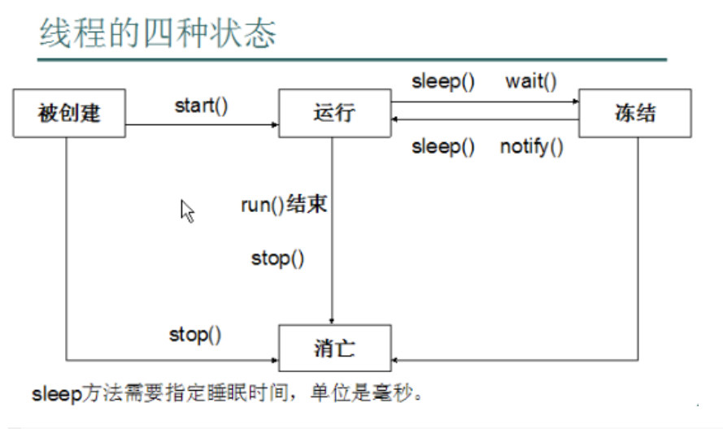
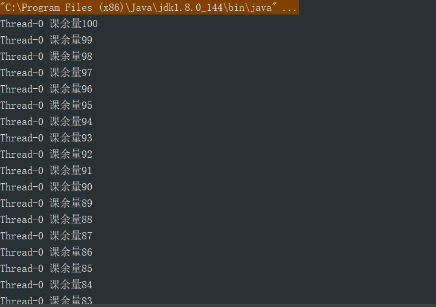

## 进程和多线程      
一个应用程序可能会由一个或多个进程组成，而进程又是由很多线程组成的，一个进程至少会有一个线程，即主线程，JVMJava虚拟机就是一个多线程进程，它还有负责垃圾回收的线程等等，其中至少有一个线程负责java程序的启动和执行，而且这个线程的代码处于main()方法中，这个线程就是主线程。                

## 使用Thread类实现一个线程    

有几个步骤：   

* 1). 继承Thread类   

* 2). 覆盖Thread类的run()方法     

* 3). 调用线程的start()方法，该方法才是启动线程的入口。      

```java
public class MyThread extends Thread{
    @Override
    public void run(){
        System.out.println("This is a thread");
    }
}

public class main{
    public static void main(String[] args) {
        MyThread thread = new MyThread();
        thread.start();
    }
}
```      

上面就是一个最简单的线程定义和调用的过程。          

我们来修改一下     

```java
public class MyThread extends Thread {
    @Override
    public void run() {
        super.run();
        for (int i = 0; i < 10; i++) {
            System.out.println("This a thread");
        }
    }
}

public class Main {

    public static void main(String[] args) {
        MyThread thread = new MyThread();
        thread.start();
        for (int i = 0; i < 10; i++) {
            System.out.println("BarackBao");
        }
    }
}
```        

输出：    
```
BarackBao
BarackBao
BarackBao
BarackBao
BarackBao
BarackBao
This a thread
This a thread
This a thread
This a thread
This a thread
This a thread
This a thread
This a thread
This a thread
This a thread
BarackBao
BarackBao
BarackBao
BarackBao
```      

可以看到时交替输出的，这个就可以体现出多线程，这段程序最少是有两个线程在同时作用，两个线程在一起竞争cpu，但是cpu在同一时间只能执行一个任务，但这是对于单核cpu来说的，某一时刻，哪个线程争取到了cpu，就执行哪个线程，cpu在两个线程之间迅速切换来执行任务，就给我们一种两个线程同时执行的假象。        

## run()和线程的生命周期         

* run()      
我们在新建了一个线程后，要重写父类的run()函数，而重写的内容就是我们要让该线程要执行的代码，所以run()的作用就是存储线程执行任务的代码。     

* 线程执行的过程(生命周期)     

      

## 使用Runnable接口实现线程     

先来写一个例子，这几天同学们又开始选选修课了，我用多线程模拟一下多台手机或电脑选课的情景，假设一种选修课只有100个名额，然后有三台电脑供同学们选课。    

先用Thread类实现       

```java
public class MyThread extends Thread {
    private int classes = 100;

    @Override
    public void run() {
        super.run();
        while (true) {
            if (classes > 0) {
                System.out.println(Thread.currentThread().getName() + " 课余量" + classes--);
            }
        }
    }   

    public class Main {

        public static void main(String[] args) {
            MyThread thread1 = new MyThread();
            MyThread thread2 = new MyThread();
            MyThread thread3 = new MyThread();
            thread1.start();
            thread2.start();
            thread3.start();
        }
    }
```         

输出：    

  

输出结果我省略了很多。    

这种写法看上没有什么毛病，就是新建了三个线程来选课，但是这三个线程执行的任务不是同一个，我们本来是想让三个线程来共同选100节课。          

但是现在一共选了300节课。       

所以现在让classes变成静态的。        

```java
public class MyThread extends Thread {
    private static int classes = 100;

    @Override
    public void run() {
        super.run();
        while (true) {
            if (classes > 0) {
                System.out.println(Thread.currentThread().getName() + " 课余量" + classes--);
            }
        }
    }   
```     

输出：   

```
Thread-0 课余量100
Thread-2 课余量99
Thread-1 课余量100
Thread-2 课余量97
Thread-0 课余量98
Thread-2 课余量95
Thread-1 课余量96
Thread-2 课余量93
Thread-0 课余量94
Thread-2 课余量91
Thread-1 课余量92
Thread-2 课余量89
Thread-0 课余量90
Thread-2 课余量87
Thread-1 课余量88
Thread-2 课余量85
Thread-0 课余量86
Thread-2 课余量83
Thread-1 课余量84
Thread-2 课余量81
Thread-0 课余量82
```


这次输出结果仍有省略，但是这次的选课是正常的，三个线程交替完成。         

但是我们一般不定义静态，他的生命周期太长了，我们还要换种方法,就是使用Runnable接口实现。      

* 使用Runnable接口的步骤        


   * 1). 定义类实现Runnable接口    

  * 2). 重写Runnable接口的run方法     

  * 3). 通过Thread类建立线程对象    

  * 4). 将Runnable接口的子类对象当作参数传递给Thread类构造函数     
 其实很好理解，我们可以把Runnable当作是具体的任务，当我们建立线程Thread后，就将任务Runnable传给它，这样线程就有事可干了，线程要运行的代码就保存在Runnable的```run()```中。        

  * 5). 调用Thread类的```start()```方法开启线程并调用Runnable中的```run()```方法。     


* 实现     

```java
public class Elective implements Runnable {

    private int classes = 100;

    @Override
    public void run() {
        while (true) {
            if (classes > 0) {
                System.out.println(Thread.currentThread().getName() + " 课余量" + classes--);
            }
        }
    }
}

public class Main {

    public static void main(String[] args) {
        Elective elective = new Elective();
        Thread thread1 = new Thread(elective);
        Thread thread2 = new Thread(elective);
        Thread thread3 = new Thread(elective);
        thread1.start();
        thread2.start();
        thread3.start();
    }
}
```    

输出结果是正确的，这样实现的好处就是避免了单继承的局限性，让类的只有一个继承的限额去实现更重要的任务，在定义线程时建议采用这种方式。        

再看一段源码：     

```java
public
class Thread implements Runnable {
    /* Make sure registerNatives is the first thing <clinit> does. */
    private static native void registerNatives();
    static {
        registerNatives();
    }
```      

可以看到Thread类也是实现了Runnable接口的。所以我们的第一种实现方式其实也是在使用第二种方式。       

      
