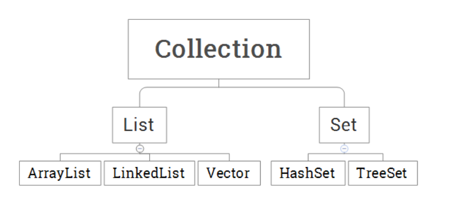

## 基本数据类型及其对应包装类      

* byte ———— Byte      

* int ————— Integer     

* long ———— Long    

* boolean — Boolean     

* float ———— Float     

* double ——— Double    

* char ————— Character      

既然都有了基本数据类型了，为什么要有这些包装类呢，下面根据例子说明：    

+  包装类里有数据类型的一些属性     

```java
public class Javatest {
	public static void main(String[] args) {
		System.out.println(Integer.MAX_VALUE);
		System.out.println(Integer.MIN_VALUE);
	}
}
```     

输出：  
```
2147483647
-2147483648
```       

+  用于基本数据类型与字符串数据类型之间的转换      

   - 基本数据类型转换成字符串类型      
```
基本数据类型 + "";
Integer.toString(100);
```    

  - 字符串数据转换为基本数据类型       
  ```java
     int num = Integer.parseInt("666");
     System.out.println(num);
  ```          


* 再来看一个例子     

```java
public class Javatest {
	public static void main(String[] args) {
		Integer a = new Integer(666);
		Integer b = new Integer("666");
		System.out.println("a == b :" + (a == b));
		System.out.println("a.equals(b) :" + a.equals(b));
	}
}
```   

输出：    

```
a == b :false
a.equals(b) :true
```    


* 自动装箱和拆箱         

先看一个例子：     

```java
Integer a = 10;
//相当于
Integer a = new Integer(10);
//进行自动拆箱装箱
a = a - 2;
```      

这里相当于将a自动装箱成为包装类实例。         

然后又自动拆箱成为int类型，再和2进行加法运算，再将和进行装箱，赋值给a。           


在看一个有趣的例子：   

```java
Integer x = 127;
Integer y = 127;

Integer a = 128;
Integer b = 128;

System.out.println(x == y);
System.out.println(a == b);
```    

输出：     

```
true
false
```    

这个情况的答案我们可以在源码中找到答案：      

```java
/**
     * Cache to support the object identity semantics of autoboxing for values between
     * -128 and 127 (inclusive) as required by JLS.
     *
     * The cache is initialized on first usage.  The size of the cache
     * may be controlled by the {@code -XX:AutoBoxCacheMax=<size>} option.
     * During VM initialization, java.lang.Integer.IntegerCache.high property
     * may be set and saved in the private system properties in the
     * sun.misc.VM class.
     */

    private static class IntegerCache {
        static final int low = -128;
        static final int high;
        static final Integer cache[];

        static {
            // high value may be configured by property
            int h = 127;
            String integerCacheHighPropValue =
                sun.misc.VM.getSavedProperty("java.lang.Integer.IntegerCache.high");
            if (integerCacheHighPropValue != null) {
                try {
                    int i = parseInt(integerCacheHighPropValue);
                    i = Math.max(i, 127);
                    // Maximum array size is Integer.MAX_VALUE
                    h = Math.min(i, Integer.MAX_VALUE - (-low) -1);
                } catch( NumberFormatException nfe) {
                    // If the property cannot be parsed into an int, ignore it.
                }
            }
            high = h;

            cache = new Integer[(high - low) + 1];
            int j = low;
            for(int k = 0; k < cache.length; k++)
                cache[k] = new Integer(j++);

            // range [-128, 127] must be interned (JLS7 5.1.7)
            assert IntegerCache.high >= 127;
        }

        private IntegerCache() {}
    }
```    

这段代码的大致意思是整形包装类设计了缓存机制，而且范围为-128~127，也就是说当我们初始化这个范围的实例时，返回的同样的对象，当超过这个范围时，才会产生新的对象。           

## 集合

### 集合框架概述         

* 为什么出现集合?     

面向对象编程中少不了要存储对象,而集合就是设计用来存储对象的.      

* 集合与数组的区别     

数组和集合都是用来存储数据的容器,数组的长度是固定的,数组可以存储数据类型,相比之下,集合的长度是可变的,用来存储对象.      

### 集合的种类        

     

可以看到集合的类型有很多种,但是拥有一个超类接口`Collection`,下面这些集合内部的实现都是不同的数据结构.          


### 集合的公共方法     

添加元素`add()`       

删除元素`remove()`     

获取集合长度`size()`     

判断元素是否存在`contains()`     

清空集合`clear()`    

判空`isEmpty()`      

求两个集合的交集`retainAll()`       


### 迭代器Iterator的使用                  

```java
public static void main(String[] args) {
		ArrayList<String> array = new ArrayList<>();
		array.add("bao");
		array.add("qian");
		array.add("yue");
		array.add("barack");
		array.add("bao");

		Iterator iterator = array.iterator();
		while (iterator.hasNext()) {
				System.out.println(iterator.next());
		}
}
```    

输出:    

```
bao
qian
yue
barack
bao
```       
