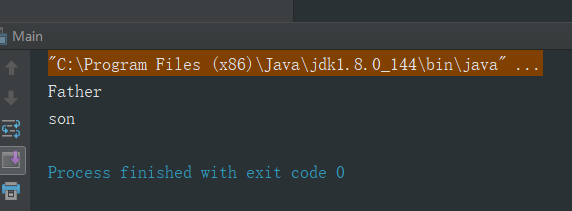

## 1. static关键字如何理解        
static翻译为静态，从面向对象的角度讲，当一个类中的变量或方法用static修饰时，这些变量和方法就成为了类本身的，它们和对象的关系并不大，但是从直观的角度看，这些被修饰的量确实被该类所有对象所拥有的，并且被这个类的所有对象所共享，尤其是当使用该类对象进行引用它们时，其实当使用对象进行引用static修饰成员时，在底层代码的实现中，其实还是转换为类名进行引用，这表明这个些成员是属于该类的。     

* Precautions         

1). 最初学习这个关键字时，书上有个重点，那就是一个类中，static修饰的成员不能访问实例成员，只能访问静态成员，这其实很好理解，static修饰的成员其实也叫类成员，属于类本身的属性，随着类的编译进行初始化，而此时实例成员未必进行初始化，这就会带来很多错误，所以类成员访问实例成员是不能通过编译的。           

2). 静态方法中不可以定义this，super关键字，因为静态元素优先于对象存在。           

3). main即主函数是静态的。         

* 什么时候定义静态变量           

当对象中出现共享数据时，该数据被修饰成静态，对象中的特有数据，修饰为非静态，存在于堆内存中。       

* 什么时候定义静态方法      

当功能内部没有访问到非静态数据(对象中特有的数据)，该函数可以定义为静态的。          

## 2. 抽象类和接口的区别     
我觉的这个问题的答案会随着我编程能力的增长而发生变化，这大概是面向对象程序设计的精髓之一了吧，在Java中，多继承是不存在的，不同于C++，抽象类和接口是Java的独创。    
* 抽象类(后续会补充)              
抽象类主要作为多个类的模板，使用abstract关键字修饰一个类时，就表示这个类只能被继承，当使用abstract修饰方法时，就表示这个必须被重写，而final修饰的类不能被继承，final修饰的方法不能被重写，所以abstract和final不能同时存在      

* 接口(后续会补充)         
接口定义了多个类应该遵守的规范，是需要被具体实现的         


## 3. 静态代码块          

如果一个类中存在静态代码块，那么这个代码块中的内容在这个类加载中将拥有最高的优先级，下面举个例子说明：         

```Java
public class Main {


    static {
        System.out.println("bao");
    }

    public static void main(String[] args) {
        System.out.println("qian");
    }

    static {
        System.out.println("yue");
    }
}
```       

我写的顺序是baoqianyue，但是实际输出的结果是这样的：        

```
bao
yue
qian
```      

可以得出代码的执行顺序是静态代码块从上往下执行且优先于主函数。        

同时静态代码块只能执行一次。            

## 4. 聚集关系         

这个概念很偏，而且在实际开发种很少提到，但确实是对象与对象之间的关系。             

* 聚合           

球员是球队的element，球队中有球员，这就是聚合关系。           

* 组合      

脑袋和四肢都是人身体的组成部分，它与聚合的区别就是，一个球队少了一个球员问题不大，但一个人要是少了脑袋，你懂的，所以组合关系要更紧密一些。         

## 5. 重载和覆盖(重写)                 

最开始的时候我一直没有将这两者区分开，下面分别介绍一下。                  

* 重载               

一个类中的任何函数都可以有相同的函数名，但是参数列表多多少少要有些区别，这样才符合语法规范，这就叫作函数的重载。      

For example  

```Java
public class Person {

    private String name;
    private int age;    

    public Person() {

    }

    //第一个重载  
    public Person(String name){
        this.name = name;
    }
    //第二个重载
    public Person(String name, int age){
        this.name = name;
        this.age = age;
    }
}
```          

* 覆盖(重写)         

覆盖这种情况同样是针对于函数的，覆盖出现在子类出现了一个和父类中一模一样的函数，尤其是连参数列表都一样，这种情况就叫做覆盖，此时调用该方法时，只会执行子类方法中定义的内容，而父类的内容却像消失了一样，所以叫做覆盖(重写)。       


* Precautions        

重载：只看同名的参数列表     

覆盖(重写)：字符类方法要一模一样，包括返回值类型。         

## 6. 构造函数      

先看一个例子      

```Java
public class Father {

    public Father(){
        System.out.println("Father");
    }
}


public class Son extends Father {
   public Son(){
       System.out.println("son");
   }
}


public class Main {

    public static void main(String[] args){
        Son son = new Son();
    }
}
```      

输出：     

    

这就有点奇怪了，我并没有新建父类，也没有在子类构造函数中调用，为什么显示调用了父类的构造函数，而其比子类更加优先。        

这是因为子类的构造函数的第一行默认有一句```super()```,所以才会在实例化子类的时候将父类也实例化了。       


* 为什么子类一定要先访问父类的构造函数？      

因为父类中的数据子类可以直接读取，但是如果子类想要使用父类中的数据的话，就要知道父类是如何对自己数据进行初始化的。所以子类在实例化的时候，先调用父类的构造函数，这就是子类的实例化过程。       

* Precautions         

1). 如果父类中没有空参数的构造函数，那么在子类的构造函数中必须用super语句指定要访问的父类构造函数，即```super(xxxxx)```.      

2). 如果子类构造函数进行了重载，即在有些参数列表较长的构造函数中使用了```this(xxx)```来指定调用子类自己的构造函数，那么子类中至少会有一个构造函数会访问父类中的构造函数，这个结论就是子类的实例化过程，逐级向上查找。     
