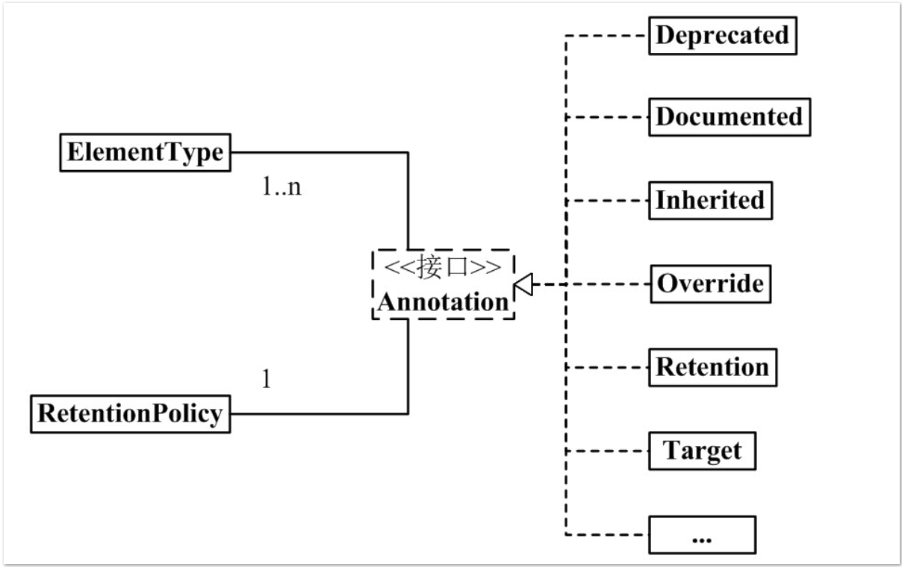

# Annotation        
注解作为Java的高级内容，提起来给人一种特殊的感觉，直到今天才搞明白它的一些基础内容。         
Java Annotation were added to Java from Java5,as far as I know,Java annotation have not changed in Java7.So this note will be vaild for a long time.             

## Structure Diagram           

          

This diagram includes the elements of the Java Annotation and the Java built-in annotations.            


## Basic Knowledge            


图的左边分别是ElementType和RetentionPolicy，下面分开描述       

* ElementType      
字面意思上是元素类型，其实这个属性就是表明该注解可以修饰的元素类型。  
**Look at the source code，but I have added some Chinese comments on it **        

```Java
public enum ElementType {
    /** Class, interface (including annotation type), or enum declaration, 类，接口(包括注解类型)，或者枚举类型声明 */
    TYPE,

    /** Field declaration (includes enum constants)，字段声明 */
    FIELD,

    /** Method declaration，方法声明 */
    METHOD,

    /** Formal parameter declaration，参数声明 */
    PARAMETER,

    /** Constructor declaration，构造器说明 */
    CONSTRUCTOR,

    /** Local variable declaration，局部变量声明 */
    LOCAL_VARIABLE,

    /** Annotation type declaration，注解类型声明 */
    ANNOTATION_TYPE,

    /** Package declaration ，包声明*/
    PACKAGE,

    /**
     * Type parameter declaration
     *
     * @since 1.8
     */
    TYPE_PARAMETER,

    /**
     * Use of a type
     *
     * @since 1.8
     */
    TYPE_USE
}
```         
这个属性是每一个注解所必须的内容，表示该注解适用的类型，For example,you define an annotation,and its ElementYype includes the METHOD,you can only add the annotation to methods in your code.             *


* RetentionPolicy          
字面意思是保留策略，就是规定注解的作用域和保存位置，看一下源码         

```Java
public enum RetentionPolicy {
    /**
     * Annotations are to be discarded by the compiler.
     */
    SOURCE,

    /**
     * Annotations are to be recorded in the class file by the compiler
     * but need not be retained by the VM at run time.  This is the default
     * behavior.
     */
    CLASS,

    /**
     * Annotations are to be recorded in the class file by the compiler and
     * retained by the VM at run time, so they may be read reflectively.
     *
     * @see java.lang.reflect.AnnotatedElement
     */
    RUNTIME
}

```      
**SOURCE**:该注解信息只保留在编译时期，编译结束后该注解失效        

举个例子：         

常见的@Override重写注解的RetentionPolicy就是SOURCE      
它的源码定义       
```Java
@Target(ElementType.METHOD)
@Retention(RetentionPolicy.SOURCE)
public @interface Override {
}
```        
当该注解修饰一个方法时，就意为该方法是覆盖了父类的方法，并且在编译期该方法会被检查，编译器处理完成后，该注解就失效了。        
此注解可以起到一个断言的作用，比如当我们使用该注解标记了一个方法，但是该方法并没有覆盖父类，或者在覆盖时出现了一些错误，那么在程序编译时，将会以一个编译错误来警示。所以该注解常常在我们试图覆盖父类方法而又写错了方法名或出现其他错误加上了一个保障性的校验过程。              


**CLASS**:该注解被保存在该类的.class文件中，如果你在定义注解的时候没有定义ElementYype，那系统将默认将该注解定义为该类型。        

**RUNTIME**:该注解在程序运行时仍保留，并且可以被JVM读取，保存在.class文件中           

* 属性特点         

一个注解可以对应多种ElementYype,但是只能对应一种RetentionPolicy。这一点至关重要。  


## Generic Definition Mode        

```Java
package com.barackbao;

import java.lang.annotation.*;

@Documented
@Target(ElementType.TYPE)
@Retention(RetentionPolicy.SOURCE)
public @interface MyAnnotation {
}

```        

* Detailed Description      

1).@Documented可有可无，表示该注解是否出现在Javadoc中。          

2).@Target指定该注解作用类型，参数为```ElementType.TYPE```,表示该注解可以修饰类，接口或枚举类型。        

3).@Retention指定该注解保留位置和策略，参数为```RetentionPolicy.SOURCE```，表示该注解在编译期有效。    

4).@interface是注解定义关键字，这里也反映了注解其实就是一个接口，这个关键字隐含了一条信息，它是继承了java.long.annotation.Annotation接口，而非声明了一个接口。     

注意：当使用关键字@interface定义了一个注解后，该注解不能继承其他接口或注解。          


5).该注解名定义为MyAnnotation,所以我们可以在代码中以"@MyAnnotation"的形式来使用这个注解。     
x          


## Java Built-in Annotation

|注释             | 说明                                    |      
|-----------------| ---------------------------------------|          
| @Deprecated    | 被@Deprecated标注的内容不再被建议使用(弃用)     |
| @Override      | @Override只能标注方法，表示该方法覆盖父类方法|
| @Documented    | 被@Documented标注的内容，会出现再javadoc中  |
| @Inherited     | @Inherited只能标注"Annotation类型"，表示该注解具有继承的性质|
| @Retention     | @Retention只能标注"Annotation类型"，用来指定该注解的RetentionPolicy属性  |
| @Target        | @Target只能标注"Annotation类型"，用来指定该注解的ElementType属性   |
| @SuppressWarnings| @SuppressWarnings标注的内容发生的警告，编译器会对这些警告保持静默    |      


I will detail a few of them.         

### 1. @Inherited         

define       

```java
@Documented
@Retention(RetentionPolicy.RUNTIME)
@Target(ElementType.ANNOTATION_TYPE)
public @interface Inherited {
}
```        
从定义中可以得出@Inherited会出现再javadoc中，会保存在.class文件中，可以被JVM读取，并且只能修饰“Annotation类型”。          

* The function of @Inherited             

如果我定义了一个注解@BarackAnnotation，并给它加上了@Inherited注解，则注解@BarackAnnotation就具有了继承属性，当我们在一个类中使用@BarackAnnotation后，这个类就具有了"@BarackAnnotation",现在有另一个类继承了刚才的类，这个新的类同样具有注解"@BarackAnnotation",可以看出，@Inherited会赋予其他注解向下继承的能力。    

* For example           

```java
package com.barackbao;

import java.lang.annotation.*;

/**
 * 定义具有继承性的注解
 */

@Documented
@Target(ElementType.TYPE)
@Retention(RetentionPolicy.RUNTIME)
//赋予该注解继承能力
@Inherited
public @interface Inheritable {
}


//新建类Father并加上注解@Inheritable，并输出类所带有注解信息   
package com.barackbao;

@Inheritable
public class Father {
  public Father(){
      System.out.println("Father:" + Father.class.isAnnotationPresent(Inheritable.class));
  }
}

//新建类并继承于类Father，并输出类所带有注解信息   
package com.barackbao;

public class Son extends Father {
    public Son(){
        //执行父类构造方法
        super();
        System.out.println("Son:" + Son.class.isAnnotationPresent(Inheritable.class));
    }
}

//测试，输出信息
package com.barackbao;

public class Main {

    public static void main(String[] args) {
        Son son = new Son();
    }
}

```      

输出：      
```
Father:true
Son:true
```             


### 2.@Deprecated      

* define      

```java
@Documented
@Retention(RetentionPolicy.RUNTIME)
@Target(value={CONSTRUCTOR, FIELD, LOCAL_VARIABLE, METHOD, PACKAGE, PARAMETER, TYPE})
public @interface Deprecated {
}
```

* The function of @Deprecated        

这个注解标注的内容表示已被弃用或不建议使用，一些IDE会在这些内容上面做出标志，而且该注解带有一定的延续性，当我们在代码中以继承或覆盖的方式使用到了这个被标注内容的子类或其他，虽然子类没有直接被@Deprecated标注，但IDE仍然会标注出这个元素不再被建议使用，编译器也会报出警告。     


### 3.@SuppressWarnings         

* define       

```java
@Target({TYPE, FIELD, METHOD, PARAMETER, CONSTRUCTOR, LOCAL_VARIABLE})
@Retention(RetentionPolicy.SOURCE)
public @interface SuppressWarnings {
    /**
     * The set of warnings that are to be suppressed by the compiler in the
     * annotated element.  Duplicate names are permitted.  The second and
     * successive occurrences of a name are ignored.  The presence of
     * unrecognized warning names is <i>not</i> an error: Compilers must
     * ignore any warning names they do not recognize.  They are, however,
     * free to emit a warning if an annotation contains an unrecognized
     * warning name.
     *
     * <p> The string {@code "unchecked"} is used to suppress
     * unchecked warnings. Compiler vendors should document the
     * additional warning names they support in conjunction with this
     * annotation type. They are encouraged to cooperate to ensure
     * that the same names work across multiple compilers.
     * @return the set of warnings to be suppressed
     */
    String[] value();
}
```     

从定义中可以得到该注解只作用于编译期,并且该注解含有参数。

* The function of @SuppressWarnings         
使编译器对该注解标注的内容产生的警告保持静默，例如@SuppressWarnings(value = {"deprecation","unchecked"})就会让编译器对该注解标注的内容有可能产生的“不再建议使用警告”，和“未检查的转换时的警告”保持静默。     

* @SuppressWarnings参数常用关键字       

|关键字         | 说明                                                   |
|--------------|-------------------------------------------------------|
|decription     | 使用了丢弃的类或方法时的警告                            |
|unchecked     | 执行了未检查的转换时的警告，例如当使用集合时没有用泛型 (Generics) 来指定集合保存的类型。|
|fallthrough   | 当switch程序块直接通往下一种情况时没有break的警告         |
|path          | 在类路径、源文件路径等中有不存在的路径时的警告。           |
|all           | 以上所有情况的警告                                      |                       


## The role of Annotations            
