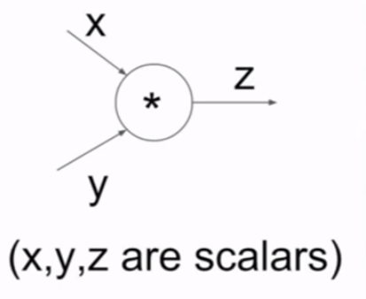
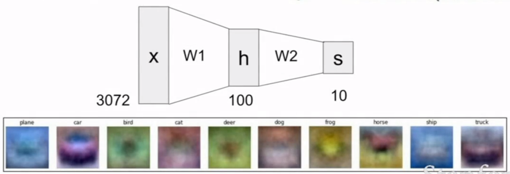
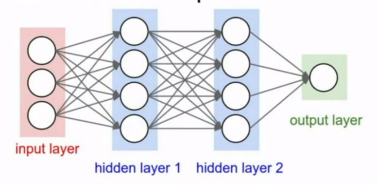
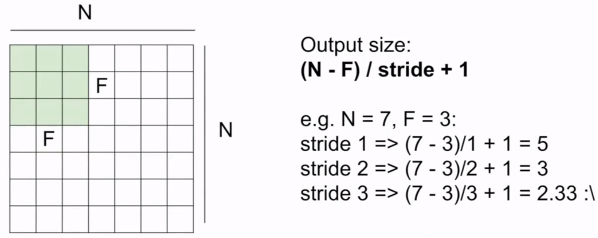
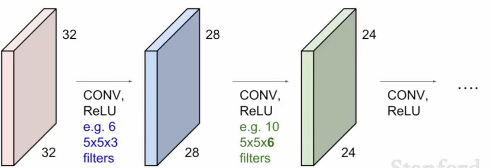
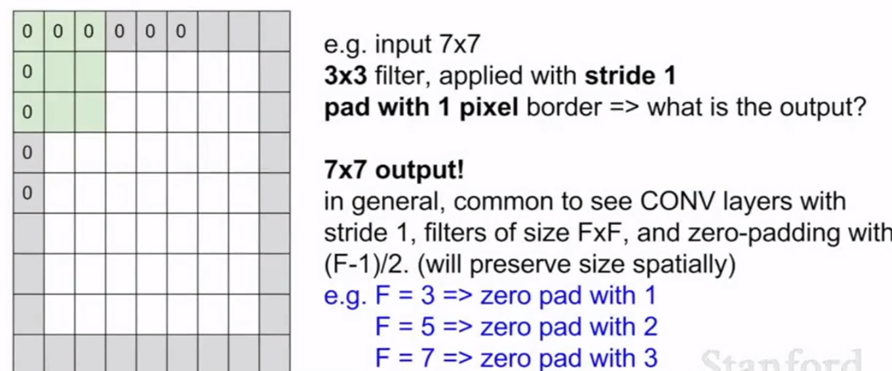

##   神经网络   

### 反向传播(Backpropation)      

* 三种基本计算结点   

  * 加法运算

    在反向传播过程中，不管输入值是多少，该结点只会将传回的梯度值均匀的分配给之前与它相连的所有路径，因为加法的偏导都是+1.0        

  * max运算 

    max结点在反向传播过程中，只会将传回的梯度值分配给与它相连的其中一条路径，这条路径的输入值是所有输入值的最大值，其他路径上的梯度都为0       

  * 乘法运算 

    乘法结点在反向传播过程中，如果只连接了两个输入路径，那相当于`x*y` ,那各自路径上的梯度值就是传回的梯度值乘上相应的偏导，`x*y`对`x`的偏导是`y`，`x*y`对`y`的偏导是`x`         

* 前向计算和反向传播API封装  
   * Graph(or Net) object    

     ```python
     class ComputationalGraph(objcet):
     	def forward(inputs):
     		# 1. [pass inputs to input gates...]
     		# 2. forward the computational graph:
     		for gate in self.graph.nodes_topologically_sorted():
     			gate.forward()
     		return loss # the final gate in the graph outputs the loss   
     	def backward():
     		for gate in reversed(self.graph.nodes_topologically_sorted()):
     			gate.backward() # little piece of backprop(chain rule applied)
     		return inputs_gradients   
     ```

     

   * MultiplyGate(乘法结点)    

     

     ```python
     class MutiplyGate(object):
         def forward(x, y):
             z = x * y
             self.x = x # must keep these around 保存起来为了反向时计算梯度
             self.y = y
             return z 
        	def backward(dz):
             dx = self.y * dz # [dz/dx * dL/dz] 这里dL/dz=dz/dz=1
             dy = self.x * dz # [dz/dy * dL.dz]
             return [dx, dy]
     ```

### 神经网络(Neural Networks)      

* 神经网络和之前的逻辑回归、SVM的区别   

  * (Before) Linear score function:  


    $$
    f = Wx
    $$

  * (Now) 2-layer Neural Network: 


    $$
    f = W_2 max(0,W_1x)
    $$
    

    * 1. 我们通过学习训练集得到权重`W1`,对应于一些类别的模板(直接将`W1`中的一列数据进行绘制)，上图下部只是每个类别中的一个模板(template)      
    * 2. 输入新的数据`X`,结合`W1`，计算得到一个得分score(可能再经过一些非线性变换，如relu，sigmod等激活函数)，也就是`h`      
    * 3. 得到h后，由于一个类别对应很多个模板(template),我们用`W2`作为权重在对这些**同一类别的不同模板**对应的score进行运算得到最终的对应于这个输入X的score         

* Example feed-forward computation of a neural network        

  * 单个神经元的计算(single neuron tick)     

    ```python
    class Neuron:
    	def neuron_trick(inputs):
    		"""assume inputs and weigths are 1-D numpy arrays and bias is a number"""
            cell_body_sum = np.sum(inputs * self.weights) + self.bias
            firing_rate = 1.0 / (1.0 + math.exp(-cell_body_sum)) # activation function
            return firing_rate
    ```

    如果输入和权值`W`都是多维度的，那就可以将隐藏层`hidden layer`看成是一组向量，代表一组神经元，这其中的每个神经元都可以使用上面的方式进行计算，当然，也可以使用矩阵乘法一次运算就可以将整个隐藏层的神经元的数值计算出来。        

  * 整个隐藏层使用向量化运算   

    

    ```python
    # forward-pass of  a 3-layer neural network:
    f = lambda x: 1.0 / (1.0 + np.exp(-x)) # activation function(use sigmod)
    x = np.random.randn(3, 1) # random input vector of three numbers(3x1)
    # 由上图看出，输入层与第一个隐藏层之间全连接，所以W1.shape=(4, 3)
    # 使用矩阵乘法的方式直接求得隐藏层上对应四个神经元上送给激活函数的数值
    # W1(4,3).dot X(3,1) -> (4,1) + b(4,1) -> (4,1)
    h1 = f(np.dot(W1, x) + b1) # calculate first hidden layer activations(4x1)
    h2 = f(np.dot(W2, h1) + b2) # calculate second hidden layer activations(4x1)
    out = np.dot(W3, h2) + b3 # output neuron(1x1)     
    ```   


### 卷积神经网络(ConvNet)      

#### 卷积的具体过程     
  * 无填充的卷积     
         
    这里直接将卷积核放在原图像的左上角然后开始滑动，`stride`表示步长。      
    然后有计算卷积后得到的图像尺寸公式：       

    $$
    (N - F)/stride + 1
    $$       
    N代表原图像的尺寸，F为卷积核尺寸         

  * 有填充的卷积       
    为原图像进行填充有什么意义？     
    大致有两个原因：   
    * 采用上面的卷积方式其实有一个潜在的问题，图像的最边缘部分只经历过一次计算，而图像的中心部分会被多次计算，这势必会引起边缘特征提取的缺乏，所以可以在开始卷积前对图像进行预处理，即在边缘部分补零，补零的作用只是将真正的图像边缘移动到相对于卷积核较近的位置上，而且补的是零，在计算时也不会添加噪声。        

    * 如果设计的一个深度卷积网络的层数很多，那随着卷积层的向前推进，图像的尺寸将会越来越小，到后面就无法在进行计算了，这种情况就必须根据卷积层数进行填充的设计。     
        

    * 填充0尺寸的选择     
      有这样的公式：   
      
      $$pad = (F - 1) / 2$$   
      `F`是卷积核尺寸     
          

      * e.g.   
        input volume:`32 x 32 x 3`   
        10 `5x5` filter(卷积核) with stride `1`, pad `2`[(5 - 1) / 2]          

        output volume size(输出图像尺寸)：    
        `(32 + 2 * 2 - 5) / 1 + 1 = 32`，是`32 x 32 x 10`       

        number of parameters in this layer(卷积核参数个数)：        
        each filter has `5 * 5 * 3 + 1 = 76`params (+1 for bias)      
        total number is `760`        

      * 卷积步长(stride)的选择       
        ...      
        