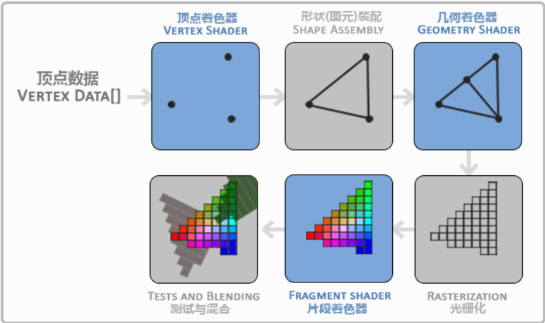

## GLFW      

一个c语言库，它提供了一些渲染物体所需的最低限度的接口，帮助创建OpenGL上下文，定义窗口参数以及处理用户输入。          

## GLEW      

由于OpenGL的版本是根据不同的显卡定义的，所以大多数OpenGL函数的位置无法在编译时确定下来，需要在运行时进行查询，开发者需要在运行时获取函数地址并将其保存在一个函数指针中以便之后调用函数，GLEW库帮助开发者正确的查找当前合适的函数地址。            

## 视口(Viewport)       

规定OpenGL渲染窗口的尺寸大小     

```c++
int width,height;
glfwGetFramebufferSize(window, &width, &height);
glViewport(0, 0, width, height);   
```   

`glViewport`函数前两个参数控制窗口左下角的位置，后两个参数控制窗口的长宽        


## 图形渲染管线(Graphics Pipeline)      

在OpenGL中，任何事物都是处于3D空间中，图形渲染管线做的事就是将3D坐标转换为适应你计算机屏幕的2D坐标。        

图形渲染管线可以分为两个部分，第一部分就是将3D坐标转换为2D坐标，第二个部分是将2D坐标转换为实际的像素              


* 图形渲染管线的过程        

             

    * vertex shader          

        第一个阶段是顶点shader，主要作用是将输入的3D坐标进行转换，这一阶段还允许我们对顶点属性做一些处理。       

    * primitive assembly        

        图元装配，指定上一步输入的顶点的渲染类型，上图的例子中渲染了一个三角形     

    * Geometry shader     

        几何着色器，将一系列的图元形式的顶点作为输入，生成其他形状，这里生成了另一个三角形       

    * Rasterization stage     

        光栅化，这里将图元映射成最终屏幕上相应的像素         

    * Fragment shader     

        片段着色器的主要目的是计算一个像素的最终颜色，这里也是OpenGL中高级效果产生的地方，通常片段着色器包含3D场景的数据(光照、阴影)，这些数据都被用来计算最终的颜色      

    * Alpha和混合(Blending)       

        这个阶段检测片段的深度，用他们来判断当前像素是在其他物体后面还是前面，决定是否要丢弃，这个阶段还会检测alpha值，并对物体进行混合，所以即使在片段shader中计算出来一个颜色值，在渲染多个三角形时最后的颜色还是不确定的。                           


        


* 图元(Primitive)       

    为了让OpenGL明确我们想要的渲染类型，也就是将前面输入的一系列顶点渲染成一些点、三角形、还是直线等等，都需要通过图元来指定       
    `GL_POINTS`,`GL_TRIANGLES`,`GL_LINE_STRIP`等        


