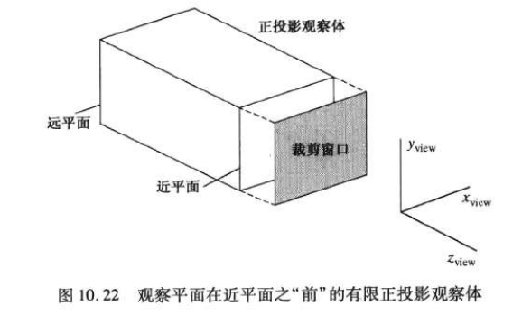

## 三维观察    

### 向量的叉积    

两个向量的叉积仅在三维空间中有定义,向量a和b会构成一个平面    

axb得到的向量c就垂直于这个平面,当然同时垂直于a和b,方向由右手定则决定        

向量c的模长等于以a和b两个向量为边的平行四边形的正面积       

### 三维观察坐标系参数    

在一个世界坐标系中选定观察坐标系原点P0(x0, y0, z0),也叫视点或者观察位置     
该点的位置就是照相机的位置    

**定义Yview方向的向上观察向量V**      

     

* 观察平面法向量      

        

    图中N就是观察平面法向量,该方法沿着观察坐标系的Zview方向,参数指定为从观察远点沿着观察方向和到观察平面的距离       

    **观察平面或者叫投影平面总是与XviewYview平面平行**    

* 观察向上向量    

    在选定观察平面法向量后,可以选定观察平面向上向量V      
    通常通过选定一个点的位置来定义V,因为V要与观察平面法向量N垂直,可以先求该点到世界坐标系原点连线的向量,然后将它**投影到**观察平面上的得到与N垂直的向量    

* XView向量    

    通过求N和V的叉积得到U向量构成右手观察系统     

然后求这三个向量的单位向量n,u,v,由这些单位向量形成uvn观察坐标系统    

现有的图形标准中都使用右手观察坐标系    

左手观察坐标系统通常用于描述屏幕坐标系及规范化变换      

### 投影变换    

平行投影和透视投影     

  

* 平行投影    
    保持对象的有关比例不变       

* 透视投影   
    对象位置沿着会聚到观察平面后的一点的直线变换到投影坐标系    
    不保持对象的相关比例,但是真实感较好,因为在透视显示中较远的对象减小了尺寸    
### 正投影    

对象沿着观察(投影)平面法向量N平行给方向到投影平面上的变换为正投影(正交投影)    

其中投影线和投影平面垂直     

    

### 裁剪窗口和正投影观察体    

裁剪窗口的边指定了要显示的场景部分x和y的范围限制,该限制形成了正投影观察体的上下和两侧       

    

可以通过选择平行于观察平面的一个或者两个边界平面来为正交观察体的Zview方向限定边界,这两个平面称为远-近裁剪平面     

   

### 斜投影   

* 斜等测和斜二测斜平行投影     

    * 斜等测       
        所有垂直于投影平面的线条投影后长度不变    
        投影角α等于45度   

            

    * 斜二测      
        垂直于观察平面的线条投影后得一半的长度    
        投影角满足`tanα=2`   

           

### 透视投影    

当一个物体使用透视映射到观察平面上时，与透视平面平行的线段投影后仍平行，但是任何与观察平面不平行的线段组合投影后会汇聚于一点   
称为**灭点**   

一个对象透视投影后的灭点数与观察平面相交的坐标轴数有关   

    

### GL三维观察函数   

* glMatrixMode(GL_MODELVIEW)   
    指定观察参数时，生成一个矩阵与当前建模观察矩阵合并          

* gluLookAt(x0, y0, z0, xref, yref, zref, Vx, Vy, Vz)     

    在使用该函数指定观察参数时,需要生成一个矩阵(glMatrixMode(GL_MODELVIEW))与当前观察建模矩阵合并,而且该矩阵可能已经和任何几何变换矩阵结合,然后将组合后的矩阵应用到将世界坐标系的对象描述变换到观察坐标系中     

    九个参数都是浮点数类型    

    * 观察坐标系原点P(x0, y0, z0)    
    
    * 参考点坐标Pref(xref, yref, zref)    

        观察方向是-Zview方向,所以Pref也是视点,常被定位在一个场景中心的某个位置   
        可以看成是安放在观察坐标系原点的照相机要瞄准的一个点    

    * 观察平面向上向量V(Vx, Vy, Vz)        

    观察坐标系的正Zview轴在`N = P0-Pref`方向      

      

    **gluLookAt函数指定的观察函数用来形成观察变换矩阵, 该矩阵将观察原点移动到世界坐标系原点的平移和将观察坐标轴与世界坐标轴对齐的旋转组合而成**   

         

    默认参数为`P0=(0,0,0), Pref=(0,0,-1), V=(0,1,0)`    

* glMatrixMode(GL_PROJECTION)    
    投影矩阵用投影模式存储,建立一个投影变换矩阵    

* glOrtho(xwmin, xwmax, ywmin, ywmax, dnear, dfar)   

    用来选择裁剪窗口坐标和观察系原点到近和远裁剪平面的距离     
    在GL中不提供对观察平面的选择功能,**远近裁剪平面重合,裁剪窗口总是位于观察体的近平面上**    

    这一投影变化生成的观察体是一个矩形平行管道,坐标位置由dnear,dfar决定,使用观察体的规范化变换矩阵实现   

    默认参数为`glOrtho(-1.0, 1.0, -1.0, 1.0, -1.0, 1.0)`,构成一个对称规范化正方体.     
    
         

* gluPerspective(theta, aspect, dnear, dfar)    

    四个参数
    对称透视投影棱台,前两个参数定义近裁剪平面的裁剪窗口尺寸和位置     
    **投影参考点是观察坐标系原点而且近裁剪平面是观察平面**       
    * theta   
        表示视场角,即上下裁剪平面之间的夹角θ      

             

    * aspect    
        表示裁剪窗口的纵横比   

    * dnear, dfar   
        定义从观察点(坐标系原点)到远近裁剪平面的距离    
        两个参数都必须取正值,远近裁剪平面的位置记为:`-dfar`,`-dnear`    
 
    对于GL的一个透视投影,**两个裁剪平面都必须位于负Zveiw轴**    

* glFrustum(xwmin, xwmax, ywmin, ywmax, dnear, dfar)    

    GL通用透视投影函数    
    该函数可以指定一个对称棱台观察体或一个斜棱台观察体的透视投影     
    
    **近裁剪平面是观察平面且投影参考点位于观察位置(坐标系原点)**        

    前四个参数设定近平面上的裁剪窗口的坐标,后两个参数设定从坐标系原点沿着Zview轴到近和远裁剪平面的距离     
    
    裁剪窗口可以定义在近平面上任意位置,如果将裁剪窗口定义为`xwmin=-xwmax`且`ywmin=-ywmax`就得到一个对称棱台    

    如果,如果不显示的引入一个投影矩阵,将使用默认的正投影,此时的观察体是一个对称立方体    

* glViewport(xvmin, yvmin, vpwidth, vpheight)   
    如果要保证场景对象的比例,必须将视口的纵横比设定为裁剪窗口一致     

    
    
     
