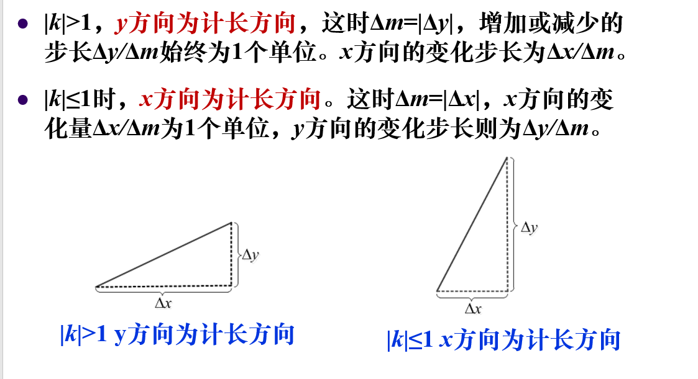

## 图元   

图元通常是不可再分的图形实体,基本二维图元有:点,线,圆弧,多边形,字体符号和位图    

* 三维图像的显示最终也是通过投影转换为二维图形的显示   

* 一个图元中的所有像素点,直线,顶点都是作为一个整体存在,不能再细分为独立的图元   

## 直线生成算法    

### 数值微分算法(DDA)     

根据直线的微分方程     

设起点坐标为$P_s(x_s, y_s)$,终点坐标$P_e(x_e, y_e)$  

可以有如下的直线的微分方程:   

$$\frac{dx}{dt} = \Delta{x}, \frac{dy}{dt} = \Delta{y}$$    

在计算机中我们使用差分代替微分:  

$$\frac{x_{i+1} - x_{i}}{t_{i+1} - t_i} = \Delta{x}, \frac{y_{i+1} - y_{i}}{t_{i+1} - t{i}} = \Delta{y}$$    

然后计算$m = \max{(\Delta{x}, \Delta{y})}$           

确定记长方向,当记长方向每次增加1时,另一个方向上的增量应小于1,然后四舍五入截断,这样处理的原因是,如果另一个方向增长太快,会导致屏幕上显示的点比较少,显示不清晰       

    

```c++
void lineDDA(int x1, int y1, int x2, int y2, int color)  
{
    int dm = 0;
    if(abs(x2 - x1) >= abs(y1 - y2))
        dm = abs(x2 - x1); //x方向为记长方向
    else
        dm = abs(y1 - y2);
    float dx = (float)(x2 - x1) / dm; //当x为记长方向,这里为1
    float dy = (float)(y2 - y1) / dm; 
    float x = 0.5; //起始坐标
    float y = 0.5; 
    for (int i = 0; i < dm; i++)
    { 
        setPixel((int)x, (int)y, color);
        x += dx; //直接在坐标上进行递增
        y += dy;
    }
}
```  

