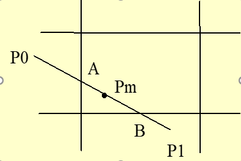
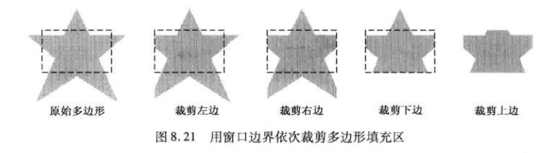
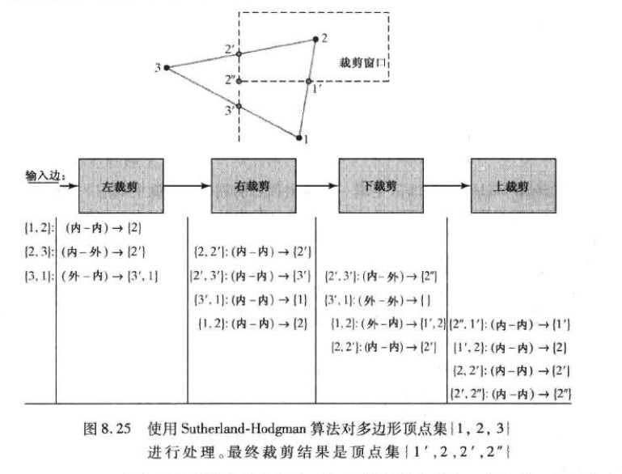
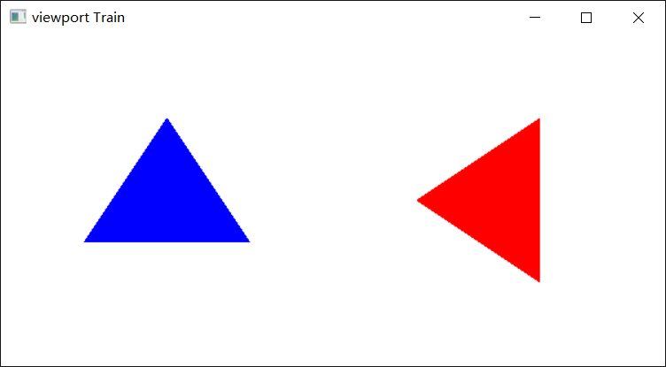

## 二维观察    

### 坐标系统   

* 建模坐标系   
    
    一个局部坐标系，将基本图形与某些角点、中心点联系起来，比如在绘制圆形时，将圆心作为参考点，实质上是建立了一个以圆心为原点的建模坐标系   

* 世界坐标系    

    使用建模坐标系对每个基本对象进行了建模之后，需要将他们组合起来，为了确定他们之间的相对位置，就必须抛弃他们原有的坐标系，将其纳入一个统一的坐标系，就是世界坐标系(全局)    

* 观察坐标系   

    当二维场景确定后，就可以设置视点(照相机)的位置和方向，这就需要使用观察坐标系    

* 规范化设备坐标系     

    为了使观察处理独立于设备，将对象描述转换到一个中间坐标系，这个坐标系的坐标范围为[0,1]   

* 设备坐标系(DC)     

    DC用于定义图像空间，主要用于某一特殊的计算机图形显示设备表面的像素点定义     

### 坐标系之间的变换    

* 建模变换(Modeling Transformation)     

    将多个对象从各自的建模坐标系集合到世界坐标系上    

* 观察变换(Viewing Transformation)    

    VT是从世界坐标系到观察坐标系的变换，也叫视点变换，**观察坐标系的原点模拟视点或摄像机的位置**        

* 视口变换(Windows to Viewport Transformation)     

    屏幕不可能看到全部部分，所以要在观察坐标系下给定一个窗口对显示对象进行裁剪         

    视口变换是在**规范化空间给定一个窗口**，在**显示设备**给定一个视区，实现二维图形对象由窗口到视区的变换     
    就是根据给定的参数，找到窗口和视区的坐标映射关系      

    但是要注意设备坐标系的y轴方向往往和观察坐标的Y轴方向相反         

### 裁剪     

裁剪就是给定一个窗口，确定当前图形那部分在窗口内，哪些部分在窗口外，只显示在窗口内的那部分，这个过程叫裁剪     

* 点的裁剪    

    就是判断坐标在是否在窗口的坐标范围内      

* 直线裁剪    

    * Cohen-Sutherland编码算法     

        快速判断线段的完全可见和显然不可见    
        此算法适用于矩形窗口，对于其他形状的窗口未必有效     

    * 中点分割裁剪算法      

              

        从P0点出发找离P0最近的可见点A，从P1点出发找离P1最近的可见点B     

        效率较高     

    * Liang-Barsky参数化算法(梁友栋先生发明)       

        使用直线的参数方程和不等式组来描述线段和裁剪窗口的交集，求解出来的交集将被用于获知线的哪些部分应当绘制在屏幕上      

        对于端点为(x0,y0)和(x1,y1)的直线段,可以通过参数形式描述:  

        ```
        x = xo + uΔx
        y = y0 + uΔy   0=<u<=1       

        其中Δx = x2 - x1  
        Δy = y2 - y1    
        ```     

* 多边形裁剪    

    * Sutherland-Hodgman(适用于凸多边形)      

        逐次多边形裁剪算法,用一条窗口边界将要要裁剪对象分为可见区域和不可见区域,将不可见区域裁剪掉,保留可见区域,然后将它作为下次裁剪的多边形,直到用窗口的四个边界都裁剪完成   

                
        
        该算法将多边形顶点依次传递给每一个裁剪阶段,每一个裁剪后得到的顶点会立即传递给下一阶段.      
        裁剪结束后,该算法只会返回一个输出顶点队列  

            

        [Sutherland-Hodgman串行实现]()       

    * Welier-Atherton(通用多边形裁剪算法)     

* 其他裁剪方法   

    使用集合论的方法,图形布尔运算实现二维多边形的裁剪        

### GL矩阵形式    

GL中需要指定视点变换,模型变换,投影变换这几种变换的矩阵    

GL中矩阵分为三类,可以通过`void glMatrixMode(GLenum mode)`寒素来指定当前矩阵操作,并寻找到这三种矩阵对应的矩阵堆栈       

* 模型视图矩阵-GL_MODELVIEW   

* 投影变换矩阵-GL_PROJECTION   

* 纹理映射矩阵-GL_TEXTURE      


### GL投影模式      

在选择OpenGL裁剪窗口和视口之前，必须建立合适的模式来构建从世界坐标系到屏幕坐标系变换的矩阵，在OpenGL中，不能建立独立的二维观察坐标系，必须将裁剪窗口的参数作为投影变换的一部分来设置，所以最先设置的应该是投影模式。     

这里定义裁剪窗口和视口的函数将用于投影矩阵   

`glMatrixMode(GL_PROJECTION);`


### GL裁剪窗口函数    

定义一个二维裁剪窗口    

`gluOrtho2D(xwmin, xwmax, ywmin, ywmax);`  

该函数给出了将场景映射到屏幕的正交投影，由于二维场景要交给完整的三维OpenGL观察流水线处理，二维物体的所有Z坐标都为0,所以必须指定正交投影   
  
如果没有为程序指定裁剪窗口范围，就是用默认坐标(-1.0, -1.0)和(1.0, 1.0)，默认的裁剪窗口是以坐标原点为中心，边长为2的规范化正方形      

### GL视口函数   

视口的任务将经过几何变换,投影变换和裁剪的物体显示与屏幕窗口内指定的视区内    

函数为:   

`glViewport(GLint x, GLint y, GLsizei width, GLsizei height);`  

其中GLint x和GLint y指定视区左下角的位置,视区的宽度像素数和高度像素数用width和height指定,然后可以计算出该视区右上角的坐标      
最后,视口中图元的像素颜色被装入指定的屏幕位置的刷新缓存中    ]

GL获取当前活动视口的参数为:  

`glGetIntegerv(GL_VIEWPORT, vpArray)`     

这里的vpArray是一个单下标.四元素的矩阵,会返回当前视口的四个参数,xMin,yMin,width,height    

### 二维观察实例    

通过拆分屏幕来给出中心位于世界坐标系原点的xy平面中一个三角形的两个视图,先将视口定义在显示窗口的左半区,用蓝色显示,然后将视口定义在显示窗口的右半区,用相同的裁剪窗口将三角形填充成红色,然后将三角形绕其中心(z轴)旋转90度    

[code](./demo/Triangle.cpp)      

     


