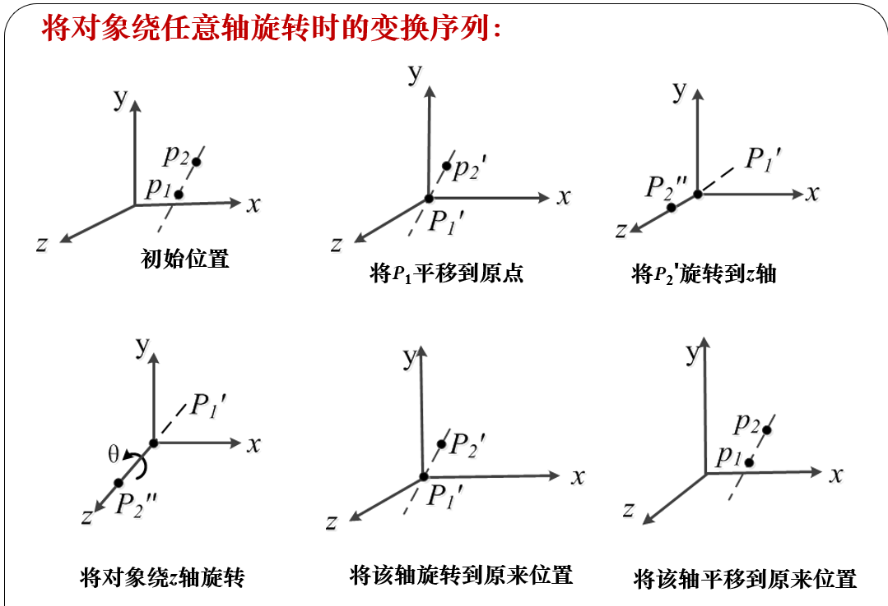
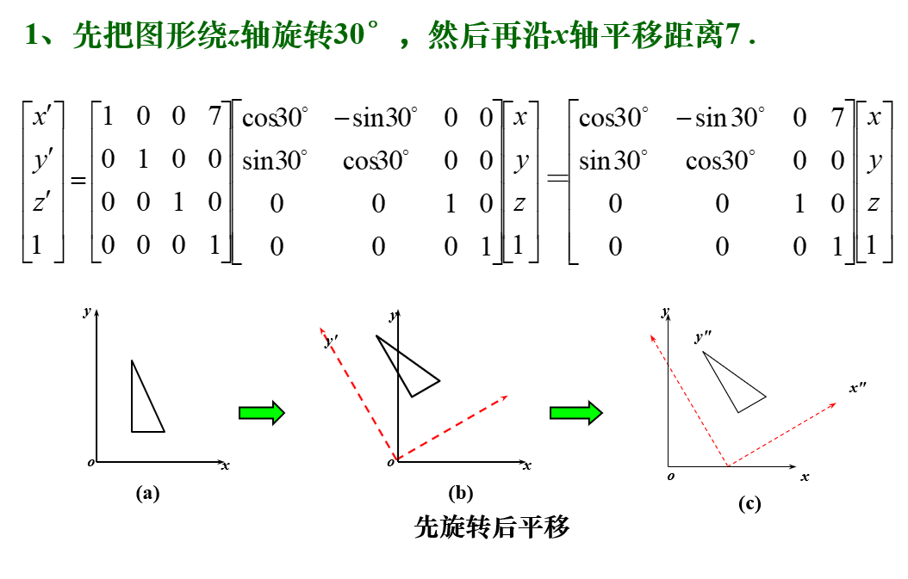
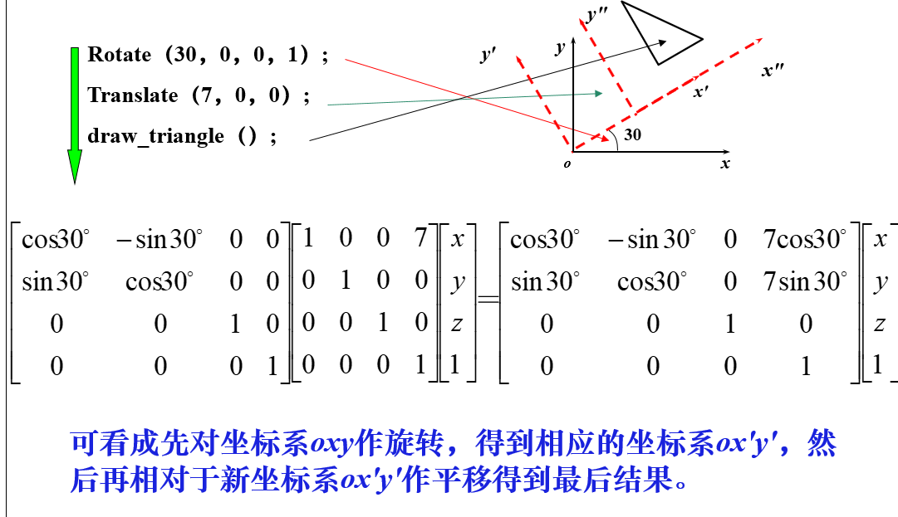
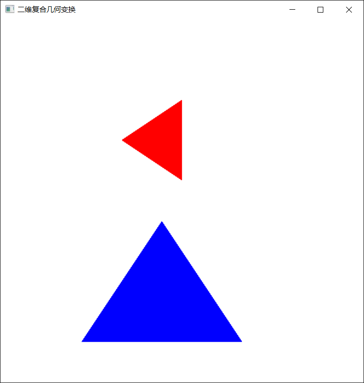
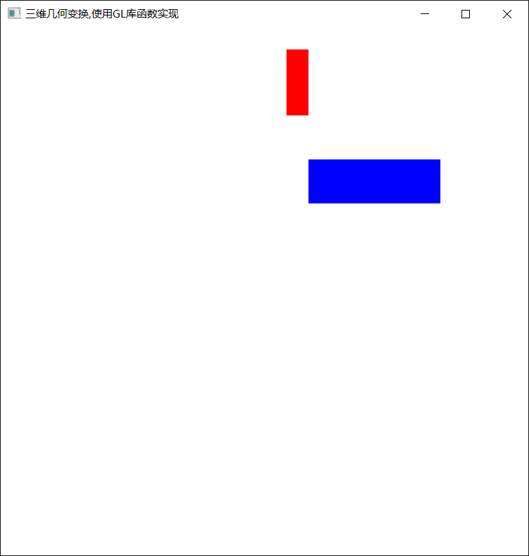

## 图形几何变换    

### 向量的叉积   

两个向量的叉积是另一个三维向量，叉积只对三维向量有意义，它有很多属性，最常用的就是它与原来的两个向量都正交。       

如果已知一个平面上的三个点，就可以通过构造在平面上的两个相连的向量，计算他们的叉积来作为该平面的一个法向量。      


### 二维平移    

将平移距离tx和ty加到原始坐标上，可以实现一个二维位置的平移       

变换矩阵    
```
1  0  tx    
0  1  ty   
0  0  1
```

```c++
#include <iostream>
#include <glut.h>

class wcPt2D {
public:
	GLfloat x, y;
	wcPt2D(GLfloat xx, GLfloat yy) : x(xx), y(yy){}
};

void translatePolygon(wcPt2D * verts, GLint nVerts, GLfloat tx, GLfloat ty)
{
	GLint i;

	for (i = 0; i < nVerts; i++)
	{
		verts[i].x = verts[i].x + tx;
		verts[i].y = verts[i].y + ty;
	}
	glBegin(GL_POLYGON);
	for (i = 0; i < nVerts; i++)
		glVertex2f(verts[i].x, verts[i].y);
	glEnd();
	glFlush();
}

void init()
{
	glClearColor(1.0, 1.0, 1.0, 1.0);
	glMatrixMode(GL_PROJECTION);
	gluOrtho2D(0.0, 200.0, 0.0, 150.0);
}

void display()
{
	wcPt2D p1[2] = {
		wcPt2D(20.0, 20.0),
		wcPt2D(25.0, 25.0),
	};
	glBegin(GL_LINE_LOOP);
	glVertex2d(p1[0].x, p1[0].y);
	glVertex2d(p1[1].x, p1[1].y);
	glEnd();
	translatePolygon(p1, 2, 50.0, 50.0);

}

int main(int argc, char **argv)
{
	glutInit(&argc, argv);
	glutInitDisplayMode(GLUT_SINGLE | GLUT_RGB);
	glutInitWindowPosition(50, 100);
	glutInitWindowSize(400, 300);
	glutCreateWindow("translate");
	init();
	glutDisplayFunc(display);
	glutMainLoop();
	
}
```  


### 二维比例变换      

p点相对于坐标原点沿x方向放缩Sx倍，沿y方向放缩Sy倍，其中Sx和Sy称为比例系数    

变换矩阵   

```
Sx  0  0
0  Sy  0
0  0   1
```     

Sx，Sy可以为任何正整数     

* Sx == Sy      
	
	等比例放缩     

	变换矩阵可以简化为：   

	```
	1  0  0  
	0  1  0  -> [x y S] = [x/S, y/S, 1]     
	0  0  S   
	```   
	若0<S<1,图形整体缩小，若S>1，图形整体放大，若S<0,发生关于原点的对称等比变换       

* Sx != Sy     


### 二维对称变换    

也叫反射变换或镜像变换    

* 关于X轴对称   

	变换矩阵:    

	```
	1  0  0 
	0  -1 0
	0  0  1
	```   

* 关于y轴对称   

	变换矩阵：   

	```
	-1  0  0
	0   1  0
	0   0  1
	```     


### 二维旋转变换      

将p点绕坐标原点转动某个角度θ（逆时针为正）得到新的p'点    

变换矩阵：   

```
 cosθ  -sinθ   0      x   
 sinθ   cosθ   0   *  y   -> [xcosθ - ysinθ  xsinθ  + ycosθ   1]
 0       0     1      1     
```    


### 错切变换    

有时需要产生弹性物体的变形处理，这时就用到错切变换    

这种变换和上述几种变换都不相同，变换后的x'和y'都分别和变换前的x和y有关系，这就导致了图形的形状会发生变换。     

变换矩阵:  

```
1  b  0     x  
c  1  0  *  y   ->  [x + by  cx + y  1]
0  0  1     1  
```     

* 沿x方向错切   

	当c=0时， 有：  
	```
	x' = x + by     
	y' = y    
	```   

* 沿y方向错切     

	当b=0时，有：    
	```
	x' = x     
	y' = cx + y   
	```   
   

### 三维复合变换   

给定一个任意轴,图形绕着该轴旋转    

任意轴可以用两个坐标点来确定,或者通过一个坐标点和旋转轴与两个坐标间的方向角来确定     

**通过两个坐标点来确定旋转轴,可以通过两点坐标轴轻松的计算出旋转轴的单位向量**    

* 1.通过以下变换序列先将旋转轴变换到和某个坐标系坐标轴重合的位置    

	    

	* 先将旋转轴通过原点     

	* 然后将旋转轴与z轴重合   

		由于旋转计算包含了正弦和余弦函数.可以通过标准向量运算来得到两个旋转矩阵的元素  

		* 向量的点积运算可以得到余弦项    

		* 向量的叉积运算可以得到正弦项     

	* 将对象绕z轴进行旋转   

	* 为了实现对于给定轴的旋转,还要将旋转轴变换回原来的位置        

		使用上一步求到的变换矩阵的逆矩阵来实现    
		

### 图形几何变换的两种模式   

* 固定坐标系模式(图形模式)    

	* 先调用的变换放在连乘式的右边,后调用的变换放在连乘式的左边   

	* 每次变换相对于原始坐标系进行,图形位置改变,坐标系位置不变  

	* 在绘图的情况下多用固定坐标系模式,用户比较容易估计变换后的结果   

	   

	
* 活动坐标系模式(空间模式)    

	* 先调用的变换放在连乘式的左边,后调用的变化放在连乘式的右边        
		**先调用的变换后执行,后调用的变换先执行**      

	* 该变换模式是OpenGL中采用的方式,适合堆栈结构实现   
	
	* 每次变换可以看成是在前一次变换所形成的新坐标系中进行,图形形状不变,坐标系位置改变      

	* 在整体变换的基础上再作一些比较独立的局部变换时,常用空间模式     

	     

### 二维复合几何变换实例   

* [三角形的复合变换(基本几何变换未使用GL库函数)](./demo/GeometricTransformationDemo.cpp)     

	     

* [矩形的三维复合变换(使用GL库函数,实际变换顺序和调用顺序相反)](./demo/GLGeometricTransform.cpp)      

	   

	

