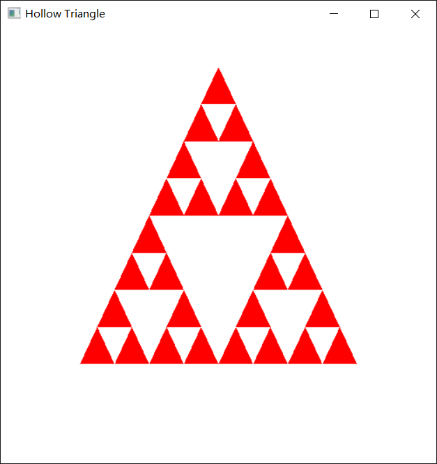

## 镂空三角形    

先绘制一个红色三角形，然后求出三边的中点，绘制一个新的白色三角形，这样就将原红色三角形划分成了四个三角形，中间白色三角形就是要求的镂空效果，然后使用递归的方式在其余三个子红色三角形，重复上面的操作，可以提前设置一个递归出口变量，这里我设置为3，表示子三角形划分深度。    

```c++
#include <iostream>
#include <glut.h>

using namespace std;

class point2D
{
public:
	GLfloat x, y;
};

void init()
{
	//设置窗口背景颜色
	glClearColor(1.0, 1.0, 1.0, 0.0);
	//设置为正投影
	glMatrixMode(GL_PROJECTION);
	gluOrtho2D(0.0, 220.0, 0.0, 220.0);
	
}

/*绘制三角形*/
void triangle(point2D *verts)
{
	glBegin(GL_TRIANGLES);
	for (int i = 0; i < 3; i++)
	{
		glVertex2f(verts[i].x, verts[i].y);
	}
	glEnd();
}

/*递归画三角形*/
void hollow(GLint size, GLfloat p1, GLfloat q1, GLfloat p2, GLfloat q2, GLfloat p3, GLfloat q3)
{
	GLfloat p4, q4, p5, q5, p6, q6;
	if (size > 0)
	{
		p4 = (p1 + p2) / 2;
		q4 = (q1 + q2) / 2;
		p5 = (p1 + p3) / 2;
		q5 = (q1 + q3) / 2;
		p6 = (p2 + p3) / 2;
		q6 = (q2 + q3) / 2;
		point2D verts[3] = { {p4, q4}, {p5, q5}, {p6, q6} };
		glColor3f(1.0, 1.0, 1.0);
		triangle(verts);
		size--; //递归条件
		hollow(size, p1, q1, p4, q4, p5, q5);
		hollow(size, p4, q4, p2, q2, p6, q6);
		hollow(size, p5, q5, p6, q6, p3, q3);
	}
}

void displayFun()
{
	point2D verts[3] = { {40, 50}, {180, 50}, {110, 200} };
	//为背景指定颜色缓存
	glClear(GL_COLOR_BUFFER_BIT);
	//给要绘制的对象设置颜色
	glColor3f(1.0, 0.0, 0.0);
	triangle(verts);
	hollow(3, verts[0].x, verts[0].y, verts[1].x, verts[1].y, verts[2].x, verts[2].y);
	//强制刷新
	glFlush();
}

int main(int argc, char ** argv)
{
	glutInit(&argc, argv);
	glutInitDisplayMode(GLUT_SINGLE | GLUT_RGB);
	glutInitWindowPosition(50, 50);
	glutInitWindowSize(500, 500);
	glutCreateWindow("Hollow Triangle");
	init();
	glutDisplayFunc(displayFun);
	glutMainLoop();
	return 0;
}
```  

   


