# Unity3D     

我从大一开始就养成了一种习惯，学习编程相关知识的时候总是要使用`Markdown`语法写一下学习笔记，并且放在我自己的Github仓库或者个人博客上面，分享给他人，我认为编程相关的知识都需要自己去一个字一个单词的亲手码出来，尤其是学习一门编程语言的时候，也许看了一遍概念感觉自己看懂了，但其实自己实际去写一下会发现很多很多问题，如果自己的代码量足够多，自然会形成一种肌肉记忆，如果再加一些自己的思考在里面，很容易就能发掘出来很多语言，很多框架，很多软件在设计时的共通之处，所以下面的总结其实主要来源于我在一步一步学习Unity3D时写的学习笔记，为了能够方便美观的显示一些代码段，我仍然使用Markdown文档渲染    

> 该作业GitHub地址:     
> 我的个人博客: http://barackbao.com     

## 1.Unity主界面  

* Hieraychy视图     
    Hierarchy视图是根据对象的层级关系将对象展示出来。在层级视图中可以将相似的对象并列组织在一起，可通过为其建立父对象，这样可以便于对象的移动和编辑    

* Project视图   
    Project视图包含了整个工程的全部资源，通常根据资源种类建立不同的文件夹分别放置场景、动画、脚本、材质、音频等。     

* Scene视图    
    Scene视图可以显示场景中用到的所有模型、光照、相机、材质等，我们可以 在Scene视图对对象进行平移、旋转等操作。   

* Game视图   
    Game视图用于预览游戏运行后的效果，便于在开发和调试。当选中Maximize on Play的时候，游戏运行后会全屏显示    

* Inspector视图   
    Inspector视图用于显示在游戏场景中选中对象的详细信息。显示的组件包括对象的名称、标签、位置坐标等，还可以添加刚体、碰撞体、脚本、动画等。在这里可以为对象添加标签、碰撞体属性.


## 2. 3D模型美化     
### 2.1 材质球和贴图   
* Material    
    物体的质地      
    文件后缀`.mat`    
* Texture    
    普通的图片,用于材质球的显示    
* 编辑材质球    
    * 选中要编辑的材质球,点击Inspector中的`Albedo`(纹理贴图即漫反射贴图),在弹出的texture界面中选择相应的贴图   
    * `Tiling`选项用来调整贴图分几块显示    

### 2.2 着色器Shader   
通过Shader来编辑材质球的效果      

### 2.3 预制体Prefab    
可以重复利用的物体     
文件后缀`.prefab`      
当场景中同时存在很多同一种预制体时,对其中一个进行编辑,然后点击该预制体的`Inspector`面板中的`Prefab`栏中的apply,就可以将刚才做出的修改应用到场景中所有的同类预制体上      

### 2.4 摄像机Camera    
相当于观察坐标系,观察区间有一个视锥体,所有在视锥体范围内的物体,在game视图下都能看到   
* Align with view   
    使摄像机位置直接定位到当前观察位置    
    快捷键**ctrl + shift + f**    
* 摄像机相关属性(Inspector面板中)      
    * Clear Flags 清除标记   
        指当前场景外部使用什么内容来包围,默认为Skybox(天空盒),也可以使用Solid Color(纯色),然后再Background选项中选择颜色    
    * Projection 投影模式    
        * Perspective 透视模式,3D场景使用   
        * Orthographic 正交模式,2D场景使用      
    * Clipping Planes 切割面   
        * Near 近切割面   
        * Far  远切割面   

### 2.5 灯光Light   
照亮当前Scene,使场景中产生阴影,增强立体感和真实感     

#### 2.5.1 方向光Directional Light   
用于模拟太阳光,自然光    
方向光可以照射到任何地方,即使在一个物体的背面,也会有太阳光的反射效果       

#### 2.5.2 点光源Point Light   
从一个点中心向四周发散光     
* Range属性    
    指定一个球体范围,该球体就是点光源的光发散范围    

#### 2.5.3 聚光灯Spot Light   
照射范围是一个圆锥体     
* Range属性   
    指定圆锥体的大小     
* Spot Angle聚光角    
    指定聚光灯圆锥体的伸展角度  

#### 2.5.4 灯光的属性   
* 类型Type     
    切换灯光的属性   
* 颜色Color   
    设置灯光的颜色   
* 强度Intensity     
    设置灯光的照射强度    
* 阴影类型 Shadow Type       

## 3. 组件与GameObject   
Unity是一个`Component-Based`的引擎，所以需要有一个客观存在的对象来将这些组件整合起来，于是就有了GameObject，游戏中的所有对象都是一个GameObject,为了给这个GameObject附加上各种各样的属性，比如它的位置信息，基本几何变化情况，渲染的参数等等，所以引入了`Component`这个概念，GameObject是由Component整合而成的，这使得Component有和GameObject同样的生命周期，一旦调用了GameObject的Destory方法，它的子对象和所有的组件 都会被销毁    

### 3.1 组件Component     

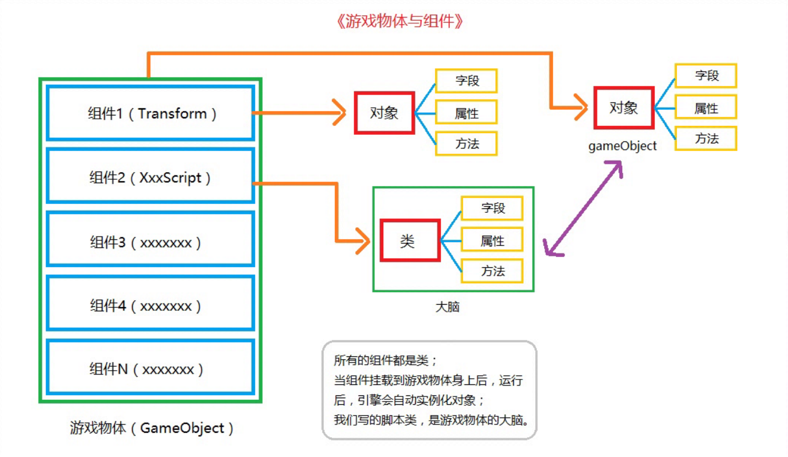    

* Transform组件    
    变换,所有的场景对象都具备的一个组件,用于存储场景对象的基本信息   
    * Position 位置   
    * Rotation 旋转   
    * Scale 缩放      

* Rigidbody组件   
    刚体,添加了刚体组件的游戏物体,就有了重力属性,会做自由落体运动   
    * Mass 质量   
        设置物体的质量,质量单位为KG   
    * Drag 阻力    
        设置空气阻力,0表示无阻力,值很大时物体就会停止运动    
    * Angular Drag 角阻力   
        受到扭曲力时的空气阻力,值很大时物体就不会发生旋转或运动   
    * Use Gravity 使用重力         
    * 刚体常用方法   
        * AddForce   
            给刚体添加一个力,让刚体根据世界坐标系进行移动    
            `Rigidbody.AddForce(Vector3, ForceMode);`   
            参数Vector3表示力的方向和大小   
            ForceMode是枚举类型,表示力的模式    
            * Acceleration 加速度   
            * Force 普通力模式,通常用于设置真实的物理效果   
            * Impulse 冲击力模式,通常用于设置瞬间发生的力    
            * VelocityChange 速度的变化     
        * AddRelativeForce    
            给刚体添加一个力,让刚体按照自身坐标系进行运动    
            `Rigidbody.AddRelativeForce(Vector3, ForceMode);`       
       
* Collider组件    
    碰撞体,给一个物体添加了刚体组件后,就会使该物体的运动带上物体特性,这个物体特性真正的触发者其实是碰撞体   
    当两个带有刚体组件的游戏对象进行碰撞后,实际上是两个物体的碰撞体进行了作用   
    碰撞体可以理解为模型的"外骨骼"     

    **模型只要添加了刚体组件,就必须添加碰撞体组建,否则该物体在场景内就无意义,而且我们直接创建的游戏对象,默认都会加上碰撞体组建,然后根据用户需要自行添加刚体组件来触发物理效果**    

    碰撞体分类   
    * Box Collider     
        盒型碰撞体,形状为立方体型    
        * Center 中心点   
        * Size 碰撞体大小    
    * Sphere Collider  
        球型碰撞体   
        * Radius 半径,用来设置大小   
    * Capsule Collider    
        胶囊碰撞体    
        * Height 设置高度   
        * Direction 设置碰撞体的轴向   
    * Mesh Collider   
        网格碰撞体,用于包裹复杂结构的模型   
        * Mesh 网格属性
            根据指定的网格属性,给当前物体生成碰撞体     

* MeshFilter组件   
    网格过滤器  
    该组件只有一个`Mesh`属性,用于设置当前物体使用哪个模型进行展示    
    这里的网格Mesh可以看作是一个模型      

* MeshRenderer组件    
    网格渲染器    
    该组件用于渲染显示模型      
    * Cast Shadows 投射阴影   
    * Receive Shadows 接收阴影     

* TrailRenderer特效组件    
    拖尾渲染器   
    该组件用来渲染拖尾效果,拖尾效果可以体现物体的运动速度       
    在给一个物体添加了拖尾特效组件后,在Scene视图中移动该物体可以看到最原始的拖尾效果    
    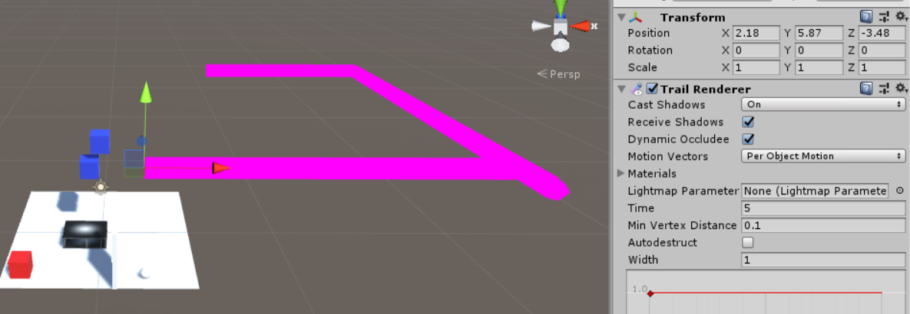       
    **注意**    
    在Unity中所有的Renderer组件,都需要给它们指定材质球,包括上面的MeshRenderer,当这类组件没有材质球时,默认就会像上图那样显示成粉红色   
    * Time 设置拖尾特效的持续时间    
    * Start Width和End Width 设置拖尾开始和结束时的大小   

* LineRenderer特效组件     
    线渲染器    
    该组件用来渲染显示线特效   
    * Positions 位置,设置线的开始点和结束点的位置   
    * Start Width和End Width 设置线开始和结束时的宽度   
    * Start Color和End Color 设置先开始和结束时的颜色     

* AudioSource音频源组件     
    AudioCilp音频剪辑,导入到Unity中的所有声音文件,在Unity中都是AudioClip类型,AudioSource组件就是用来播放AudioCilp文件的   
    Unity现在能识别的音频格式:.aif,.wav,.mp3,.ogg     
    * Play On Awake 当界面进行加载时就播放   
    * Loop 循环播放   
    * Mute 静音   
    * Spatial Blend 空间混合,选择声音类型是2D还是3D    

    * AudioListener组件   
        声音监听器,默认状态这个组件是挂载到场景中的摄像机上的    
        可以通过脚本来控制声音源的播放和停止   
        * Play() 播放  
        * Stop() 停止   
        * Pause() 暂停播放   

### 3.2 Script脚本      
当能过通过一些属性组件来描述和定位场景中的GameObject后，就要思考如何去操控这个游戏对象，这时就引入脚本组件`MonoBehaviour`    
其实在创建一个新的C#脚本后，该脚本或者说该操作都是以一个类来展现的，而且ide会默认给当前的脚本类继承上`MonoBehaviour`,这里的`MonoBehaviour`就是Unity中所有脚本的基类   
在使用MonoBehaviour时候，需要注意其中的可重写方法，因为Unity在处理这些脚本交互时应该也是使用观察者模式(个人理解)，所以MonoBehavior中的很多方法也都是回调方法        
* MonoBehaviour的生命周期   
    * Awake() 当一个脚本实例被载入时执行一次该方法，所以一般在这个方法中完成成员变量的初始化     
    * Start() 当游戏运行起来就会执行一次，该方法执行在Awake之后，所以可以进行一些依赖于Awake初始化变量的初始化，同时还在该方法中进行一些协程的触发    
    * Update()方法 循环调用方法,每帧调用一次,一秒钟大概执行60次      
    * FixedUpdate()          
        固定更新方法,所有和物理相关的操作都应写在`FixedUpdate`方法体内    
        固定更新时间间隔是0.02s,1秒执行50次     
        该方法与`Update`方法的区别是,`Update`方法是每帧执行一次,而且每帧的时间是不固定的,要根据当前画面中的内容复杂程度而定    
        **在Update方法执行物理操作,会出现卡顿现象**    

        更新时间间隔在Time面板中的Fixed TimeStep中设置     
    * OnEnable() 当对象变为可用或者激活状态时执行该方法    
    * OnDisable() 当对象变为不可用或者非激活状态时执行该方法   
    * OnDestory() 当MonoBehavior将被销毁时执行该方法    

* Debug.Log()方法  
    在Unity内置的Console输出调试信息   

#### 3.2.1 获取键盘输入    
返回值: bool类型  
参数: KeyCode Enum类型   
键码,保存了键盘上按键的索引码   

* Input.GetKey() 按下某键后,持续返回true  
* Input.GetKeyDown() 按下某键的一瞬间,返回true   
* Input.GetKeyUp() 抬起某键的一瞬间,返回true     

#### 3.2.2 获取鼠标输入   
返回值: bool类型   
参数: 鼠标按键索引值   
0 -> 左键, 1 -> 右键, 2 -> 中键    

* Input.GetMouseButton() 按下某键后,持续返回true   
* Input.GetMouseButtonDown() 按下某键的一瞬间,返回true   
* Input.GetMouseButtonUp() 抬起某键的一瞬间,返回true    

#### 3.2.3 获取相应组件的引用   
返回值:某个gameobject的某个组件的引用   
参数:组件类型   

* gameObject.GetComponent<T>()     

#### 3.2.4 移动物体位置   
* Transform.Translate(Vector3, Space)    
参数:   
* Vector3表示方向向量    
    比如Vector3.forward表示物体前方   
* Space枚举类型   
    表示当前移动方向相对于物体自身坐标系还是世界坐标系   

    * Space.Self  
    * Space.World     

* 使用WASD四键控制游戏物体前后左右移动   

    ```Csharp
    public class PersonMove : MonoBehaviour
    {
        private Transform mTransform;

        void Start()
        {
            mTransform = gameObject.GetComponent<Transform>();
        }

        void Update()
        {
            if (Input.GetKey(KeyCode.W))
            {
                mTransform.Translate(Vector3.forward * 0.1f, Space.Self);
            }

            if (Input.GetKey(KeyCode.S))
            {
                mTransform.Translate(Vector3.back * 0.1f, Space.Self);
            }

            if (Input.GetKey(KeyCode.A))
            {
                mTransform.Translate(Vector3.left * 0.1f, Space.Self);
            }

            if (Input.GetKey(KeyCode.D))
            {
                mTransform.Translate(Vector3.right * 0.1f, Space.Self);
            }
        }
    }
    ```  

* 使用刚体移动物体   

    * 使用刚体移动物体,物体是根据世界坐标系的方向进行移动的    
    * 使用刚体移动物体,物体会触发相关物理事件,比如碰撞等等   

    `Rigidbody.MovePosition(Vector3)`     
    * 参数: 
        使用刚体组件移动物体时,参数中的Vector3要使用**当前位置 + 方向**的方式    
        当前位置使用`Transform.Postion`获得       
        比如:  
        ```Csharp
        if (Input.GetKey(KeyCode.W))
            mRigidbody.MovePosition(mTransform.position +
             Vector3.forward * 0.2f);
        ```  
        这里给`Vector3.forward`乘上了0.2f是因为刚体移动速度太快,相当于每帧移动一个单位       

### 3.3 碰撞事件Collision    
当使用一个用刚体控制的物体与另一个物体碰撞时,就会触发碰撞事件,**目标物体必须带有Collider组件**      
碰撞事件检测方法    
* OnCollisionEnter(Collision)    
    当碰撞开始时调用,只会调用一次    
* OnCollisionExit(Collision)        
    当碰撞结束时调用,只会调用一次   
* OnCollisionStay(Collision)     
    当碰撞进行中,会一直调用该方法    
* Collision参数   
    该参数用来传递碰撞对象    
    * Collison.gameObject 属性   
        表示与当前物体碰撞的物体的引用    
    * gameObject.name 属性   
        表示当前物体的名字       

### 3.4 触发事件      
将碰撞体Collider组件面板上的`isTrigger`选项选中,当前物体的碰撞体就变成了触发器    
移动的带有刚体组件的物体会穿透已变成触发器的物体  

当一个用刚体控制的物体进入另一个物体的触发器范围内时,就会发生触发事件    

触发事件检测方法   
* OnTriggerEnter(Collider)   
    当进入触发范围时开始调用,只调用一次   
* OnTriggerExit(Collider)     
    当离开触发范围时开始调用,只调用一次    
* OnTriggerStay(Collider)     
    保持在触发范围内时,持续调用       

### 3.5 查找游戏物体    

`GameObject.Find(string);`    
在当前Hierarchy下通过对象名字查找游戏物体,并返回游戏物体引用     

`GameObject.FindWithTag(string);`    
通过对象标签进行查找    

`GameObject.FindObjectsWithTag(string);`   
通过标签返回一个对象数组    

### 3.6 实例化和销毁游戏物体    
* GameObject.Instantiate(Object, Vector3, Quaternion);   
    实例化方法,静态函数,第三个参数指定实例化后物体的姿态     
* GameObject.Destroy(Object, float);   
    销毁物体方法, 静态函数,第二个参数指定定时销毁物体的时间     

### 3.7 Invoke函数    
相当于一个计时器,可以设置时间,然后传入相应的方法名,就会按照我们给定的时间间隔去调用相应的函数   
* Invoke(string, float) 多少秒后执行某个函数(只会调用一次)   
* InvokeRepeating(string, float, float) 多少秒后(第二个参数)会执行某个方法,并且以后每隔多少秒(第三个参数)都会执行一次该函数   
* InvokeCancel() 取消掉当前脚本中所有的Invoke调用     

### 3.8 SendMessage消息发送   
* gameObject.SendMessage(string) 通知当前游戏物体上挂载的脚本中的指定方法执行,其中的string参数用来指定方法名    

## 4. 协程Coroutine    

* 协程是什么   
    从程序结构角度来看,协程是一个有限状态机,普通的函数是没有状态的,一个函数在执行了return后,它的所有局部变量都消失了,但是在协程中,可以在一个函数中进行多次返回,函数中的局部变量被当作状态保存在协程函数中,直到最后一次return,这些状态才会被清除   
    简单说,协程就是,写一段代码,然后标明在哪个位置需要暂停,然后在下一帧或者一段时间后,系统会继续执行这段代码     

* 为什么需要Coroutine    
    在游戏场景中会有很多过程需要花费多个逻辑帧去计算    
    * 比较密集的过程,比如自动寻路,这个过程的计算量很大,如果我们直接将它放在Update方法中去执行,会引起卡顿,所以需要将它分割到不同的逻辑帧去    
    * 比较稀疏的过程,比如触发器状态检测,绝大多数触发器在游戏运行之后不会一直使用,拥有很多的空闲时间,但是一旦触发都是比较重要事件处理    
    针对这两种过程,首先会直接想到使用多线程来实现,再比如进行网络通信时,需要处理异步传输,等待文件下载完成后再执行其他任务,一般使用**回调**来解决这个问题,但是在Unity中使用Coroutine可以更加自然,节省资源的解决这些过程    

* 协程的一般格式   
    ```c#   
    IEnumerator Task()
    {
        yield return new WaitForSeconds(2);
        Debug.Log("task");
    }
    ```  
    参数说明:    
    * IEnumerator 协程的返回值类型    
    * yield return 该协程返回....     
    * new WaitForSeconds(second) 实例化一个对象,等待多少秒后继续执行      
    开启协同程序   
    `StartCoroutine("方法名")`      
    停止协程    
    `StopCoroutine("方法名")`    

## 5. UnityUI系统    

### 5.1 常用UI简介    
* NGUI 第三方插件     
* UGUI 在4.6版本后自带的UI系统    
    GameObject -> UI 菜单下是UGUI的相关UI对象   
    Component  -> UI 菜单下是UGUI的相关UI组件     
* OnGUI 使用html和css进行编写,主要用于引擎的界面拓展    
* Legacy GUI 旧版UI   
    只有两个组件,文字和图片,配合鼠标事件来实现界面交互     

### 5.2 Legacy GUI   
下面两个组件在开发时只能在Game窗口下进行调试,Scene窗口看不到     
* GUIText   
    用来显示文字      
    创建步骤:   
    * 1. 新建一个空物体     
    * 2. Component -> Rendering -> GUI Text        
    相关属性:   
    * Font Size 文字大小   
    * Pixel Offset 像素位置偏移     
* GUITexture    
    用来显示图片   
    创建步骤:    
    * 1. 新建一个空物体    
    * 2. Component -> Rendering -> GUI Texture    
    * 3. 将其Scale属性都设置为0.1    
    相关属性:   
    * Texture 纹理 设置要显示的图片  
    * Pixel Inset 
        像素设置,调整XY坐标来设置图片要显示的位置,W(width)和H(height)设置图片的宽度和高度      

## 6. 射击飞盘实例    

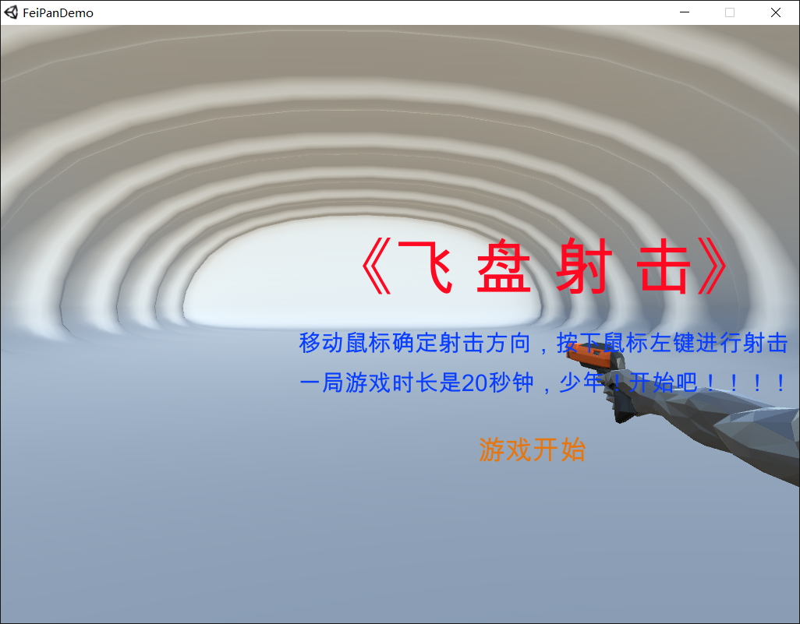   
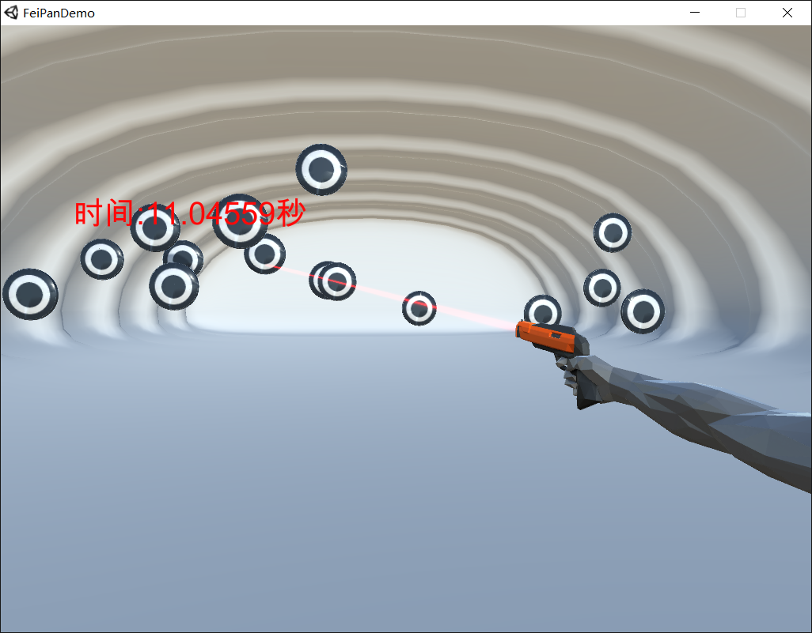       

### 6.1 要点分析   
* 主角控制   
    持枪的一个手臂,枪口的朝向一直朝向鼠标在屏幕上的位置,安住鼠标左键干掉目标   
* AI控制    
    飞盘在空中的位置是随机生成的,当枪的射线碰撞到飞盘时,飞盘破碎消失,分数加一     
### 6.2 设置主要场景和灯光       
* 1.首先将主要隧道场景拖拽到当前scene中,并使其位置归零      
    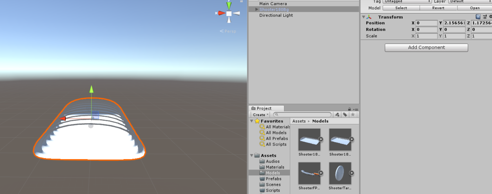     
* 2.在场景中设置两个DirectionalLight,一个照射上方一个照射下方,并且给它们设置层次关系    
    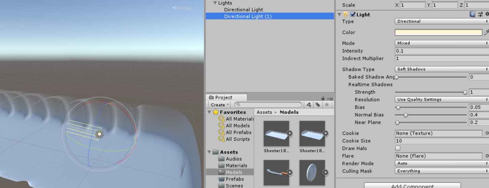     
* 3.导入手臂模型,并进行摄像机观察方向调整,调整到合适角度使用快捷键`ctrl+shift+f`快速锁定当前观察角度  
         
### 6.3 角色控制    
* 1.鼠标控制手臂朝向,使用主摄像机发射射线,与场景中的物体发生碰撞,然后将手臂朝向该碰撞点   
* 2.先给场景模型设置碰撞器组件主要是添加MeshCollider    
    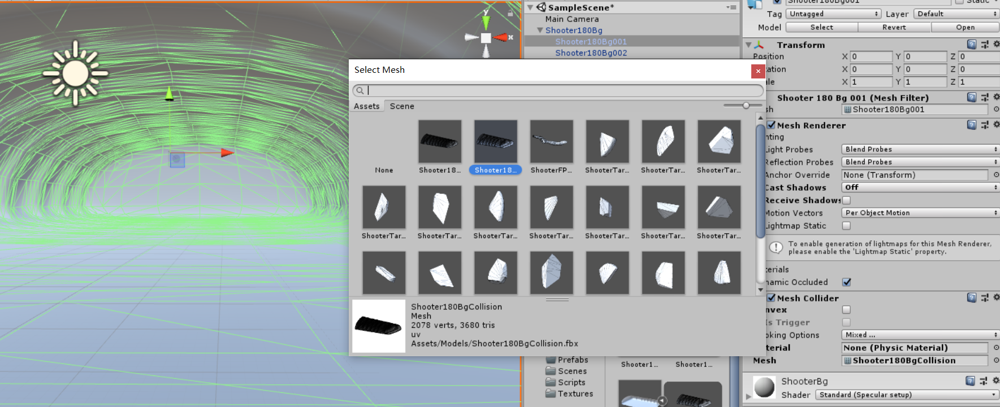      
    然后编写脚本实现手臂位置的改变   
    ```csharp  
    public class Weapon : MonoBehaviour
    {
        private Ray ray;
        private RaycastHit hit;
        private Transform mTransform;
        void Start ()
        {
            mTransform = gameObject.GetComponent<Transform>();
        }
        void Update ()
        {
            //获取到当前摄像机射线
            ray = Camera.main.ScreenPointToRay(Input.mousePosition);
            //检测碰撞
            if (Physics.Raycast(ray, out hit))
            {
                //改变手臂朝向
                mTransform.LookAt(hit.point);            
            }
        }
    }
    ```  
* 3.给枪口激光设置LineRenderer    
    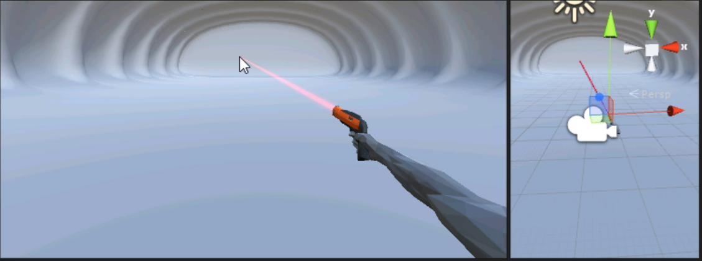     
* 4.设置飞盘目标,并编写击中飞盘逻辑    
    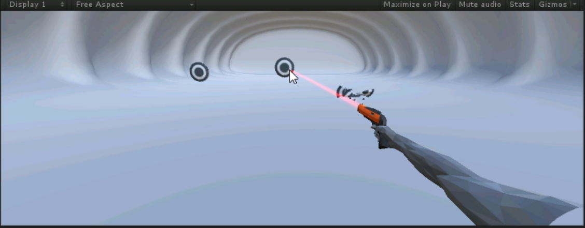     

## 7. 单例模式   
* 游戏中为什么需要单例   
    * 需要在游戏开始前和结束前做一些操作，比如网络的链接和断开，资源的加载和卸载，我们一般会把这部分逻辑放在单例里   
    * 单例可以控制初始化和销毁顺序，而静态变量和场景中的GameObject都无法控制自己的创建和销毁顺序，这样就会造成很多潜在的问题    
    * Unity3D的GameObject需要动态创建。而不是固定在场景里，我们需要使用单例来创建GameObject    
    * Unity3D的场景中的各个GameObject需要从单例中存取数据     

* 设计一个单例模式基类    
    ```cSharp  
    public class UnitySingleton<T> : MonoBehaviour
        where T : Component
    {
        private static T _instance;
        public static T Instance {
            get {
                if (_instance == null) {
                    instance = FindObjectOfType (typeof(T)) as T;
                    if (_instance == null) {
                        GameObject obj = new GameObject ();
                        obj.hideFlags = HideFlags.HideAndDontSave;//隐藏实例化的new game object，下同
                        _instance = obj.AddComponent (typeof(T));
                    }
                }
                return _instance;
            }
        }
    }
    ```   
* 使用单例   
    场景中需要单例化的脚本只要简单的继承这个类就行了   
    ```cSharp
    public class Manager : UnitySingleton<Manager>
    {
        public string testText = "Hello Singleton!";
    }
    ```


## 7. Unity3D操作问题解决记录   
在学习过程中遇到了一些操作上的问题,这里做一下记录    

1. 在Unity中Scripts文件夹下新创建了一个脚本,双击该脚本在VS或者其他编辑器中打开时,并不能马上包含在项目目录中,就不能得到相应的代码提示和错误检查,比如在Vs中会提示当前库目录为Csharp杂项问题    

* 解决办法   
    在VS解决方案管理器中点击显示所有文件,找到当前脚本文件,右击选择包含在项目中     

    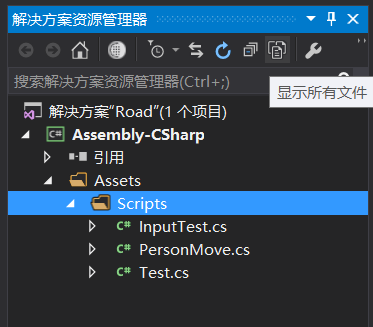   
    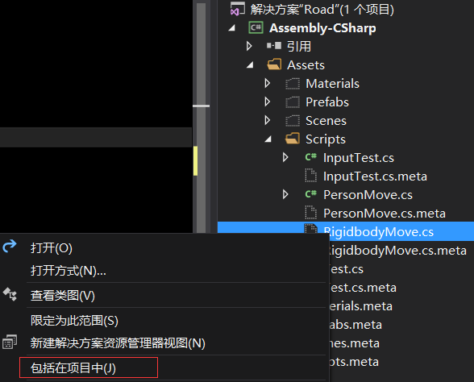       

## 8. 个人学习心得    

在学习Unity之前我主要学习方向为Android开发，图像处理和OpenCV，所以在学习Unity3D开发的时候我总是能和之前做过的项目联系起来，同时我也总是思考怎么和本学期开设的**计算机图形学课程**联系起来，感受最深的是，在学习到Unity中的摄像机时，可以直接看到当前摄像机观察的**观察视锥体**，并且可以直接通过变换工具调整视角和视锥体的大小和位置，让我理解了此前学习图形学中一直令我头大的透视投影，因为我实在无法在纸上将各个坐标系和实际的投影情况画出来，而且凭借自己的空间想象能力将一个复杂的场景变换想象出来实在太困难，而且在掌握了一些图形学基本概念之后再来看Unity，就会觉得某些设计和概念是顺理成章的。     

我个人觉得我的学习速度还算可以，加上上课时老师带着熟悉了操作界面和几个小项目，让我发现了很多能够提高开发效率的小技巧，Unity虽然并未完全开源,但是其社区还算活跃,我寻找到了很多其他优秀的Unity学习资源,加上我对组件化，模块化，设计模式，协程，消息传递机制，项目资源的管理等方面的了解，一个学期下来对Unity的学习还算令自己满意，同时在学习过程中，也参考了很多大佬的开源项目，尤其是一些非常炫酷的shader，足够吸引我去好好研究一下了。       

分享一个2013级网络工程陶程学长整理的一份国内外Unity3D学习资源,这份资源在知乎上获得了1500+赞同和收藏    
> https://zhuanlan.zhihu.com/p/29383687   


