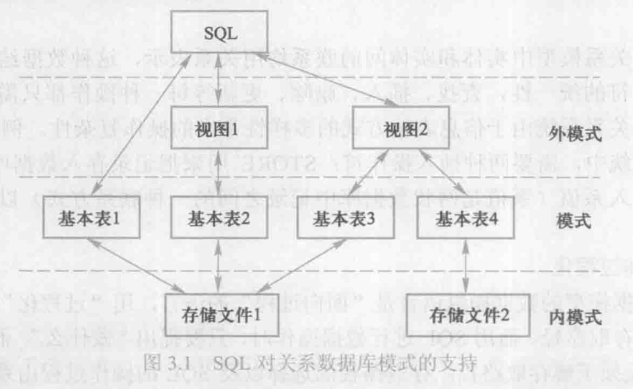

# SQL      
SQL是一种国际标准    

## SQL的特点     

* 综合统一   
    SQL集数据定义语言(DDL)，数据操纵语言(DML)和数据控制语言于一体
* 高度非过程化   
    就是只需告诉数据库管理系统“做什么”，而无须指明“怎么做”，因此在编写sql语句时，无须知道数据的具体存储路径，这些操作都由数据库管理系统完成。    
* 面向集合的操作方式      
* 以同一种语法结构提供多种使用方式    
* 语言简洁，易学易用    


## SQL的基本概念    

支持SQL的关系数据库管理系统同时支持关系数据库的三级模式     

其中外模式包括若干视图和部分基本表，模式包括若干基本表，内模式包括若干存储文件。       

       


## 数据定义    

关系数据库系统支持三级模式，其中模式，外模式，内模式的基本对象有模式、关系、视图和索引，所以sql首先有对这些对象操作的语句   

一个关系数据库管理系统的实例(instance)中可以建立多个数据库，一个数据库中可以建立多个模式，一个模式下通常包括多个表、视图和索引等数据库对象。    

* 模式的定义和删除    

    ```sql
    CREATE SCHEMA TEST AUTHORIZATION BAO 
    CREATE TABLE TAB1(
        COL1 SMALLINT,
        COL2 INT,
        COL3 CHAR(20),
        COL4 NUMERIC(10,3),
        COL5 DECIMAL(5,2)
    );
    DROP SCHEMA TEST CASCADE/RESTRICT;   
    ``` 

* 基本表的定义和删除和修改     

    ```sql
    //建一个基本表Student 
    CREATE TABLE Student(
        Sno CHAR(9) PRIMARY KEY,
        Sname CHAR(20) UNIQUE,
        Ssex CHAR(2),
        Sage SMALLINT,
        Sdept CHAR(20)
    );

    //建一个基本表Course
    CREATE TABLE Course(
        Cno CHAR(4) PRIMARY KEY,
        Cname CHAR(40) NOT NULL,
        Cpno CHAR(4),
        Ccredit SMALLINT,
        FOREIGN KEY(Cpno) REFERENCES Course(Cno)
    );

    //建一个基本表SC
    CREATE TABLE SC(
        Sno CHAR(9),
        Cno CHAR(4),
        Grade SMALLINT,
        PRIMARY KEY(Sno,Cno),
        FOREIGN KEY(Sno) REFERENCES Student(Sno),
        FOREIGN KEY(Cno) REFERENCES Course(Cno)
    );
    ```            

* 修改基本表     

    ```sql
    //向Student表中增加"入学时间"列，数据类型为日期
    ALTER TABLE Student ADD S_entrance DATE;
    //将Student表中的年龄的数据类型改为整数类型
    AlTER TABLE Student ALTER COLUMN Sage INT;
    //增加课程名必须取唯一值的约束 
    ALTER TABLE ADD COLUMN UNIQUE(Cname);
    ```   

* 删除基本表    

    ```sql
    //删除Student表   
    DROP TABLE Student CASCADE;  
    ```    

* 索引的建立和删除    
    
    ```sql
    //给Student、Course和SC三个表建立索引，其中Student表按学号升序建唯一索引，
    CREATE UNIQUE INDEX Stusno ON Student(Sno ASC);
    //Course表按课程号建唯一索引
    CREATE UNIQUE INDEX Coucno ON Course(Cno);
    //SC表按学号升序和课程号降序建唯一索引
    CREATE UNIQUE INDEX SCsnocno ON SC(Sno ASC,Cno DESC);
    ```   

* 修改索引     

    ```sql
    //修改索引名  
    ALTER INDEX SCsnocno RENAME TO SCno;
    ```    

* 删除索引    

    ```sql 
    DROP INDEX Stusno;
    ```   

* 数据字典    
    数据字典包括数据项，数据结构，数据流，数据存储，处理过程。   

    数据字典就是在数据库内部的一组系统表，存储数据库中的所有定义信息，包括关系模式定义，视图定义，索引定义，完整性约束定义，各类用户对数据库的操作权限。   

    当执行上面sql中数据定义的语句时，其实就是在更新数据字典这个系统表中的内容。    

## 数据查询   

* 单表查询    

* 连接查询    

* 嵌套查询       
    * 带有比较运算符的子查询    

        ```sql
        //找出每个学生超过他自己选修课程平均成绩的课程号
        SELECT Sno,Cno
        FROM SC x
        WHERE Grade >= (
            SELECT AVG(Grade)
            FROM SC y
            WHERE x.Sno = y.Sno
        );
        ```        
    * 带有ANY或ALL谓词的子查询     
    
        ```sql
        //查询非计算机系中比计算机系任意一个学生年龄小的学生姓名和年龄
        SELECT Sname,Sage
        FROM Student
        WHERE Sage < ANY (
            SELECT Sage
            FROM Student
            WHERE Sdept = 'CS'
        ) AND Sdept <> 'CS;
        ```  

    * 带有EXISTS谓词的子查询     

        ```sql
        //查询所有选修了1号课程的学生姓名
        SELECT Sname
        FROM Student
        WHERE EXISTS(
            SELECT * 
            FROM SC
            WHERE Sno = Student.Sno AND Cno = '1';
        )
        ```
    

* 集合查询     


## 数据更新    

* 插入数据    

    * 插入元组    

        ```sql
        //插入一个新学生元组到Student表
        INSERT 
        INTO Student(Sno,Sname,Ssex,Sdept,Sage)
        VALUES('201215128','陈东','男','IS',18)
        ```

    * 插入子查询的结果    

        ```sql
        //先创建一个新表
        CREATE TABLE Dept_age(
            Sdept CHAR(15),
            Avg_age SMALLINT
        );
        
        //计算每个专业的平均年龄，插入表中
        INSERT 
        INTO Dept_age(Sdept,Avg_age)
        SELECT Sdept,AVG(Sage)
        FROM Student
        GROUP BY Sdept;
        ```

* 修改数据    

    * 修改一个或多个元组的值  

        ```sql
        UPDATE Student 
        SET Sage = 22
        WHERE Sno = '201215121';

        UPDATE Student 
        SET Sage = Sage + 1;
        ```

    * 带子查询的修改语句

        ```sql
        UPDATE SC
        SET Grade = 0
        WHERE Sno IN(
            SELECT Sno 
            FROM Student
            WHERE Sdept = 'CS'
        );
        ```

* 删除数据    

    * 删除一个或多个元组的值

        ```sql
        DELETE 
        FROM Student 
        WHERE Sno = '201215128';

        DELETE 
        FROM Student;
        ```

    * 带有子查询的删除语句    

        ```sql
        DELETE 
        FROM SC
        WHERE Sno IN(
            SELECT Sno
            FROM Student
            WHERE Sdept = 'CS'
        );
        ``` 

## 视图    

* 定义视图   

    * 行列子集视图(从基本表中导出，只是去掉了基本表中的某些行或列)
        ```sql
        CREATE VIEW IS_Student(Sno,Sname,Sage)
        AS 
        SELECT Sno,Sname,Sage
        FROM Student
        WHERE Sdept = 'IS'
        WITH CHECK OPTION;
        ```   

    * 建立从多个基本表中导出的视图

        ```sql
        CREATE VIEW Good_C1_Stu(Sno,Sname,Sage)
        AS 
        SELECT Student.Sno,Sname,Sage
        FROM Student,SC
        WHERE Student.Sno = SC.Sno AND Grade >= 90 AND Cno = '1';
        ```  

* 删除视图    

    ```sql
    DROP VIEW IS_Student CASCADE; //强制删除
    ```   

* 查询视图    

    `并不是所有的视图都是可以更新的，因为有些视图的更新不能唯一的有意义的转换成对相应基本表的更新`      

    


