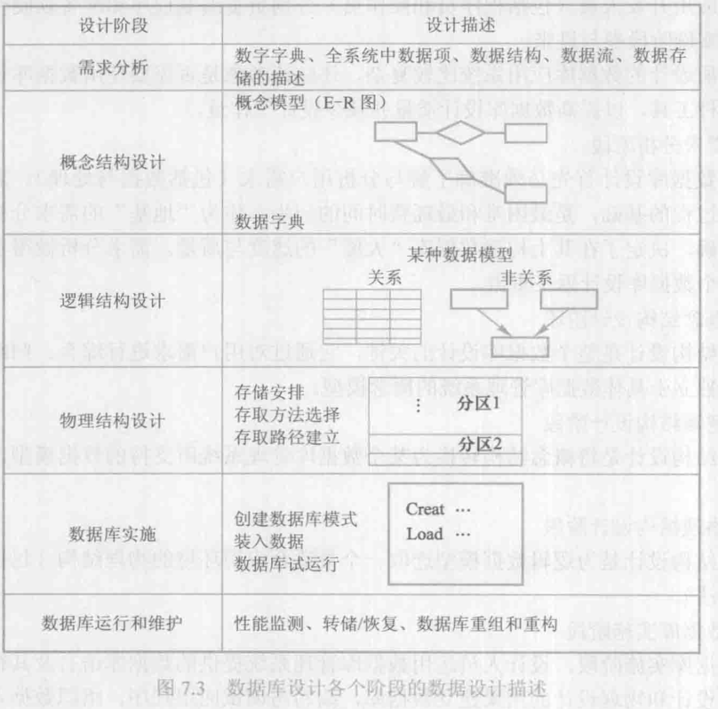
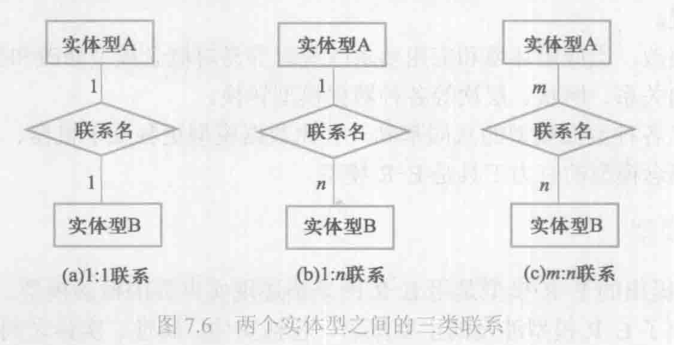
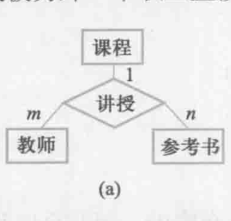
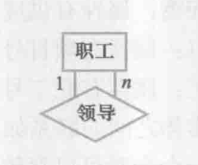

# 数据库设计    

## 数据库设计的基本步骤     

* 需求分析        
    进行数据库设计之前需要了解用户需求。   
* 概念结构设计      
    通过对用户需求的整合分析，形成于一个独立于具体数据库关系系统的概念模型    
* 逻辑结构设计   
    逻辑结构设计是将上面得到的概念模型转换为某个数据库管理系统所支持的数据模型      
* 物理结构设计     
    为上面的得到的逻辑结构搭建一个合适的物理运行环境(包括存储结构和存取方法)   
* 数据库实施   
    在数据库实施阶段，设计人员使用数据库管理系统提供的数据库语言和宿主语言根据逻辑设计和物理设计的结果建立数据库，并将初始数据入库，编写应用程序     
* 数据库运行和维护       
    数据库应用系统经过试运行之后即可投入正式运行，在数据库系统运行过程中需要不断的对其进行评估和完善。       

其中需求分析和概念结构设计可以独立于任何数据库管理系统进行，逻辑结构设计和物理结构设计与选用的数据库管理系统密切相关。     

      


## 数据库设计过程的各级模式     

在数据库设计的过程中会建立不同的模型，比如在(1).需求分析阶段，需要对现实世界进行总体分析，然后得到一个独立于任何数据库管理系统的概念模型，(2).在概念结构设计阶段，通过构建E-R图，得到一个概念模型,(3).在逻辑设计阶段，将上一部得到的概念模型，并根据选用的具体的关系数据库管理系统，建立一个适应于该数据库管理系统的逻辑模型，也就是关系模型，然后根据用户处理的要求和安全性上的考虑，在基本表的基础上再建立必要的视图，形成数据的外模式，(4).在物理结构设计阶段，根据关系数据库管理系统的特点，进行物理存储安排，建立索引，形成数据库内模式。      


## 需求分析     

* 需求分析的任务      
    需求分析要做的其实就是调查，需要调查和总结的任务如下：   
    * 信息要求    
        即用户需要从数据库得到什么数据和什么类型的数据，从信息要求得到数据要求，即数据库需要存储哪些数据   

    * 处理要求(操作要求)    
        即用户需要完成的数据操作功能，操作性能的要求    

    * 完整性和安全性要求     
        

* 数据字典       
    数据字典是在需求分析阶段就创建好的，在后面随着数据库设计的不断推进，不断的完善数据字典。       

    * 数据项    
        数据项是不可再分的数据单位，对数据项的描述如下：   
        ```
        数据项={数据项名，数据项含义，别名，数据类型，长度，取值范围，取值含义，与其他数据项的逻辑关系，数据项之间的关系}   
        ```   
        其中与其他数据项的逻辑关系定义了数据的完整性约束性条件。     
        根据实际语义写出每个数据项之间的数据依赖，他们是数据库逻辑设计阶段数据模型优化的依据      

    * 数据结构    
        数据结构描述：   
        ```
        数据结构={数据结构名,含义说明，组成:{数据项或数据结构}}  
        ```   

    * 数据流   
        指明了数据结构在系统内传输的路径。    
        
        数据流描述:  
        ```
        数据流={数据流名，说明，数据流来源，数据流去向，组成:{数据结构}，平均流量，高峰期流量}    
        ```   

    * 数据存储    
        数据存储是数据停留的地方，也是数据流的来源和去向。     

        数据存储描述:   
        ```
        数据存储={数据存储名，说明，编号，输入的数据流，输出的数据流，组成;{数据结构}，数据量，存储频度，存取方式}   
        ```   

    * 处理过程    
        处理过程描述：   
        
        ```
        处理过程={处理过程名，说明，输入：{数据流}，输出：{数据流}，
        处理：{简要说明}   
        ```   

## 概念结构设计   

* 概念模型    
    将现实世界抽象为信息世界       

* E-R模型    
    
    * 实体之间的联系     
        * 两个实体型之间的联系    

            * 一对一联系   
            * 一对多联系  
            * 多对多联系      

           

        * 两个以上实体型之间的联系   
            
            两个或多个实体型之间也存在一对一，一对多，多对多的联系，比如对于课程，教师，参考书三个实体型，一门课可以由多个老师教授，一门课程也可以对应多种参考书。
            这是一对多的联系     

               
        
        * 单个实体型内部的联系    
            同一个实体集内部的各个实体之间也存在一对一，一对多，多对多的联系，例如职工实体型内部具有领导和被领导的联系，即某一职工(干部)领导若干名职工，而一个职工只能被另外一个职工直接领导，这是一对多的联系  

                   


* UML    
    UML是对象管理组织的一个标准，他不是专门针对于数据建模的，而是为软件开发的所有阶段提供模型化和可视化支持的规范语言，从需求规格描述到系统完成后的测试和维护都可以用到UML，UML可以用于数据建模、业务建模、对象建模、组建建模等，它提供了多种类型的模型描述图，借助这些图可以使得计算机应用系统开发中的应用程序更易于理解，这里仅介绍如果使用UML中的类图来建立概念模型(E-R图)   

    UML中的类大致对应于ER图中的实体，由于UML中的类具有面向对象的特征，它不仅描述对象的属性，还包含对象的方法，方法是面向对象技术中非常重要的一部分，但是在关系型数据库中不支持方法这一概念。        

    * 实体型    
        用类表示，矩形框中实体名放在上部，下面列出属性名     
    * 实体的码      
        在类图中在属性后面加上PK(primary key)来表示码属性    
    * 联系    
        用类图之间的关联来表示，早期的两个类用无向边相连，在连线上写关联的名字     
    * 基数约束    
        用一个数对min..max表示类中的任何一个对象可以在关联中出现的最少次数和最多次数       
    * 子类    
        面向对象技术中支持超类-子类概念，子类可以继承超类的属性，也可以有自己的属性。         


## 逻辑结构设计     

概念结构是独立于数据库管理系统的一种信息结构，逻辑结构设计的任务就是将概念结构设计好的E-R图转换为数据库管理系统所支持的逻辑结构。      

* E-R图向关系模型的转换     
    E-R图是由实体型，实体的属性和实体型之间的联系组成，一般原则是：    
    一个实体型转换为一个关系，关系是属性就是实体的属性，关系的码就是实体的码。    

    对于实体型之间的联系有以下几种情况：   

    * 一对一联系    
        一个一对一联系可以转换为一个独立的关系，也可以与任意一端的关系模式合并，如果是一个独立的关系，则与该联系相连的各实体的码和联系本身的属性都是关系的属性，每个实体的码都是关系的候选码，如果与其中某一端的实体的关系模式合并，则需要在那一端的关系模式中加入另一个关系模式的码和联系本身的属性          

    * 一对多联系    
        一个一对多联系可以转化为一个独立的关系，也可以与n端对应的关系模式合并，合并后要增加1端关系模式的码作为属性，如果是一个独立的关系的话，则与该联系相连的各实体的码以及联系本身的属性作为关系的属性，关系的码是n端实体的码     

        


        
        
        


