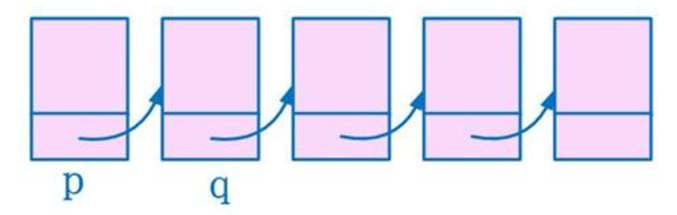
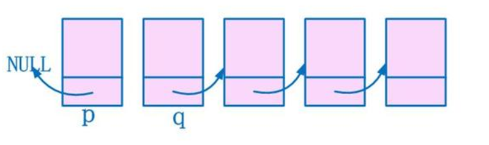
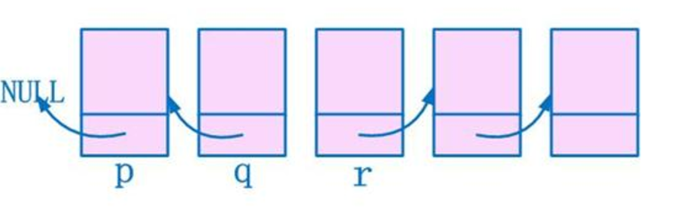
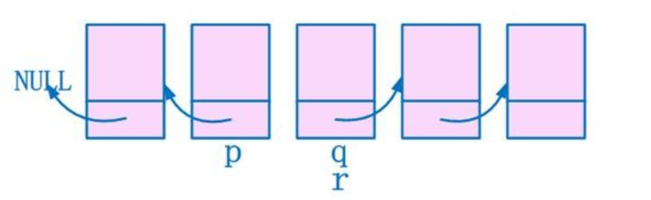
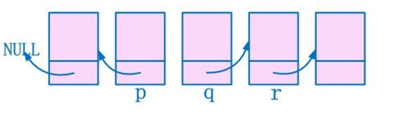
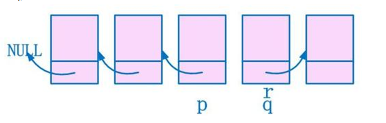
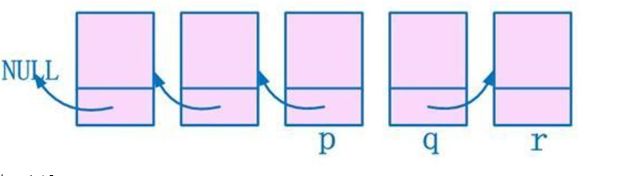

## 反转链表         

### 使用三个指针遍历单链表，逐个连接点反转          

* 使用p，q两个指针相邻遍历，让相邻的两个结点间的指针反向，同时使用第三个指针记录下一个结点         

* ```p = head; q = head -> next;```       

          

* 反转后原来的头结点就变为了表末,```head -> next = NULL;```     

         


* 开始循环, 用r指针记录下一个结点，并将中间结点的指针方向改变，第一次循环已结束```r = q -> next; q -> next = p; ```     

        

* 进行指针的推进，准备下一次循环,```p = q; q = r;```          

      

* 第二次循环开始,```r = q -> next;```        

           

* 将中间结点的指针方向改变,```q -> next = p;```       

       

* 向前推进指针，保持循环条件,```p = q; q = r;```      

      

       

* 下面的循环以此类推          


* 代码实现       

```C
Linklist* ReverseLinklist(Linklist* head)
{
  if(NULL==head|| NULL==head->next) return head;    //少于两个节点没有反转的必要。  
   Linklist* p;  
   Linklist* q;  
   Linklist* r;  
   p = head;    
   q = head->next;  
   head->next = NULL; //旧的头指针是新的尾指针，next需要指向NULL  
   while(q){  
       r = q->next; //先保留下一个step要处理的指针  
       q->next = p; //然后p q交替工作进行反向  
       p = q;   
       q = r;   
   }  
   head=p; // 最后q必然指向NULL，所以返回了p作为新的头指针  
   return head;      
}
```      
