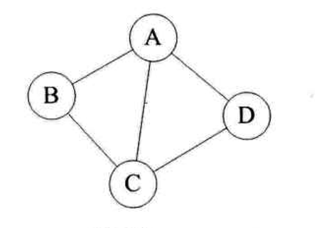
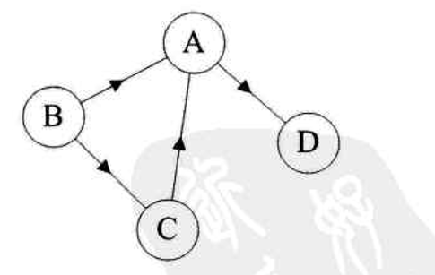
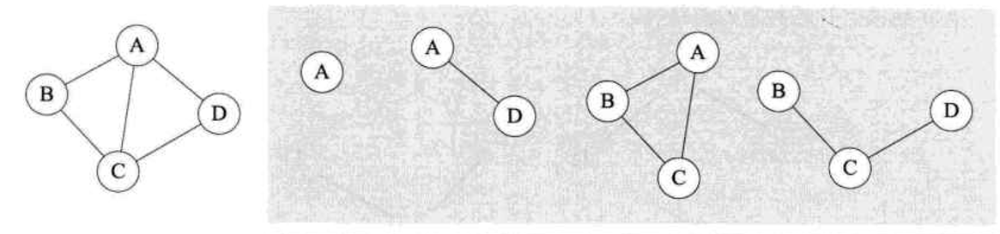

# 图       

图是一种比线性表和树更加复杂的数据结构，线性表中元素之间都有线性关系，每个元素都只有一个前驱和一个后继，在树结构中，元素之间有明显的层次关系，并且每一层的元素有可能和下一层中的多个元素有关系，这两种结构相当于是一对一、一对多的结构，而在图结构中，结点之间的关系可以任意的，相当于是多对多的关系。       

## 图的定义：     

图(Graph)是由顶点的有穷非空集合和顶点之间边的集合组成，通常表示为：`G(V,E)`，其中G表示一个图，V(Vertex)是图中顶点的集合，E(Edge)是图中边的集合。      

+ Precautions    

1). 在图结构中，不允许没有顶点，在定义中，若V是顶点的集合，则强调了顶点集合V有穷非空       

2). 在图结构中，任意两个顶点之间都有可能有关系，顶点之间的逻辑关系用边表示，边集可以为空。                    

## 图的相关术语        

* 无向边       

若顶点Vi到Vj之间的边没有方向，则称这条边为无向边，用无序偶对`(Vi,Vj)`来表示，如果图中任意两个顶点之间的边都是无向边，则称该图为无向图。     

下图就是一个无向图，连接顶点A与D的边，可以表示为`(A,D)`,也可以表示为`(D,A)`.       

        

* 有向边      

若从顶点Vi到Vj之间的边有方向，则称这条边为有向边，也叫做弧。         

用有序偶对`<Vi,Vj>`来表示，Vi称为弧尾，Vj称为弧头，如果图中任意两个顶点之间的边都是有向边，则称该图为有向图。             

如图为一个有向图，连接A到D的有向边就是弧，A是弧尾，D是弧头，`<A,D>`表示弧，`<D,A>`表示错误。      

          

* 图中边与顶点的数量关系            

在图中，若不存在顶点到其自身的边，且同一条边不重复出现，称这样的图为简单图，这里我们讨论的都是简单图。     

1). 在无向图中，如果任意两个顶点之间都有边，则称该图为无向完全图，含有n个顶点的无向完全图有`n*(n-1)/2`条边。           

2). 在有向图中，如果任意两个顶点之间都存在方向互反的两条弧，则称该图为有向完全图，含有n个顶点的有向完全图有`n*(n-1)`条边。      

* 网络(Network)      

有些图的边或弧具有与他相关的数字，这种与图的边或弧相关的数叫做权(Weight)，这种带权的图通常叫做网。     

* 子图     

假设有两个图`G=(V,{E})`和`G'=(V',{E'})`，如果`V'`,`E'`分别为`V`,`E`的子集，则称G'为G的子图。           

        

上图中右侧的均为左侧图的子图。      

*
