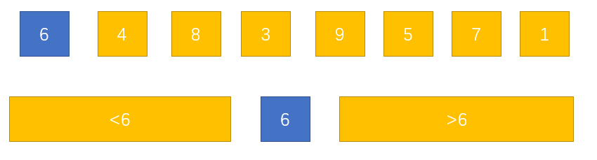
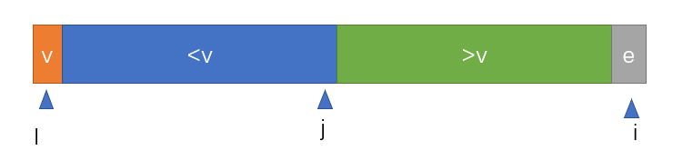
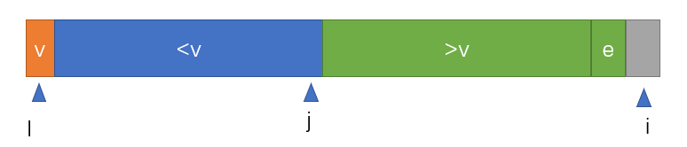
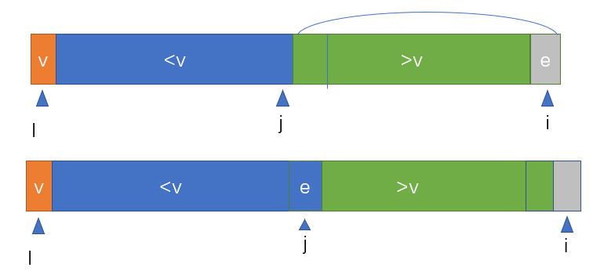
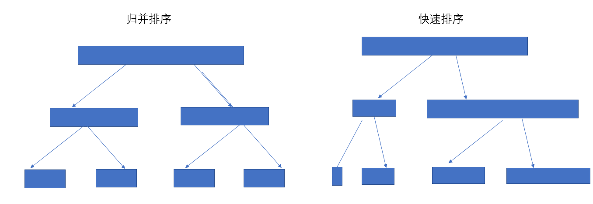

# 快速排序    

这个算法被称为20世纪最伟大的算法之一，同归并排序一样具有O(nlogn)的时间复杂度，也是一种高级排序算法。       

## 算法实现     


我们首先从一个数组中选取一个值作为一个标准值(这个值通常选择为数组第一个元素),然后我们进行一些操作，使得数组被划分成两个部分，前半部分的值都小于这个标准值，后半部分的值都大于这个标准值。    

下面看一下图示：    

   

这就是快速排序的基本思想。   

这一步完成后，我们就需要分别对小于6和大于6的两个子数组进行排序排序，这样一直递归下去我们就能得到排序的结果。   

### Partition操作(核心)

上面介绍了快速排序的基本思想，概括的说就是给数组的第一个值在数组中重新选择一个合适的位置，这也就是快速排序的核心。         

先来定义一下Partition操作的一些索引：    

   

* l指向数组的开始，也是此次Partition操作的标准值   

* j指向前后两部分的间隔位置，方便当前处理元素的位置放置，也保存了v的最终位置   

* i指向当前考察的元素。       


如果这时i指向的这个元素e大于v的话，这种情况很简单，只需要把e接在绿色区域中就ok了，然后让i++，处理下一个数据。       

   

如果这时i指向的这个元素e小于v的话，为了保证v能将前后两部分划分开，这里我们把i指向的值与j索引指向的下一位进行交换(j指向的位置是前后两部分的分界，其实就是前一部分的末尾，所以j的下一位就是后一部分的开始，这里我们把它和处理元素交换，但是这个元素所处的范围并没有改变，仍然处于大于v的范围内)，然后让j++，处理下一个数据。         

     

这个划分的过程就是这样，明白这个过程，我们就能实现最普通的快速排序算法了。    

### 代码实现    

```c++
#include <iostream>
#include <algorithm>

using namespace std;

/*partition操作*/
/*返回p，使arr[l..p - 1] < arr[p],arr[p + 1..r] > arr[p]*/
int __partition(int arr[], int l, int r)
{
	//以数组第一个元素作为标准
	int v = arr[l];
	//分界索引j初始也为l
	int j = l;
	//遍历元素
	for (int i = l + 1; i <= r; i++)
	{
		//如果当前考察的元素大于v的话i++即可
		//如果元素小于v的话，进行交换操作,把当前考察元素与j索引指向的下一个元素交换位置。
		if (arr[i] < v)
		{
			swap(arr[i], arr[j + 1]);
			j++;
		}
	}
	//划分结束后，需要将标准值放到数组中间，并返回下标
	swap(arr[l], arr[j]);
	return j;
}


/*快速排序具体实现*/
/*对arr[l..r]进行快速排序*/
void __quicksort(int arr[], int l, int r)
{
	//递归结束条件
	if (l >= r)
		return;
	int p = __partition(arr, l, r);
	//递归对划分后的区间快速排序
	__quicksort(arr, l, p - 1);
	__quicksort(arr, p + 1, r);

}


/*快速排序外部方法*/
void quicksort(int arr[], int n)
{
	__quicksort(arr, 0, n - 1);
}

int main()
{
	int arr[6] = { 3,4,2,1,5,0 };
	quicksort(arr, 6);
	for each (int i in arr)
	{
		cout << i << " ";
	}
	cout << endl;
	system("pause");
	return 0;
}
```   

### 简单分析  

上面提到快速排序的时间复杂度为O(nlogn)，这里我们用很大的数据量对这上面这段代码进行测试时，也能够很快的排好序，但是如果**我们的测试数据中有大量相同的元素，或者是近乎有序的数组时**，很不巧，这个算法的时间复杂度就退化到了O(n²)级别，下面来分析一下：        

之所以说快速排序的时间复杂度也能达到O(nlogn)级别的，是因为它也像归并排序一样每次通过划分的方式来递归的实现排序。但是与归并排序不同的是，归并排序每次都能划分成两个长度相同的部分，其形成的一个递归树是一颗平衡树，而快速排序划分的结果就与参与排序的数据有关了，如果是近乎有序的数组或者有大量相同数据时，快速排序形成的递归树就有可能极度的不平衡，有可能退化成一个单链表，这时的时间复杂度自然就退化成了O(n²)。      

     

针对这种情况，我们来做一些优化。      

## 二路快速排序         

二路快排也有两种情况，下面分别介绍：       

### 原数组覆盖法    

这个名称是我编的....
