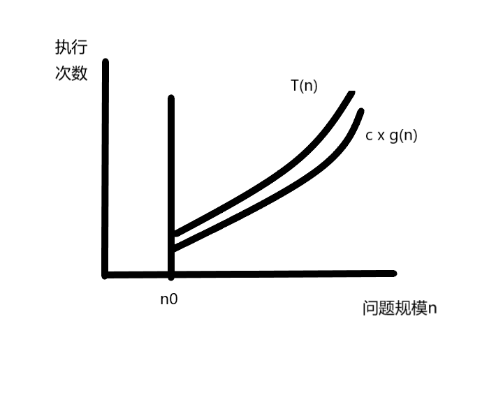
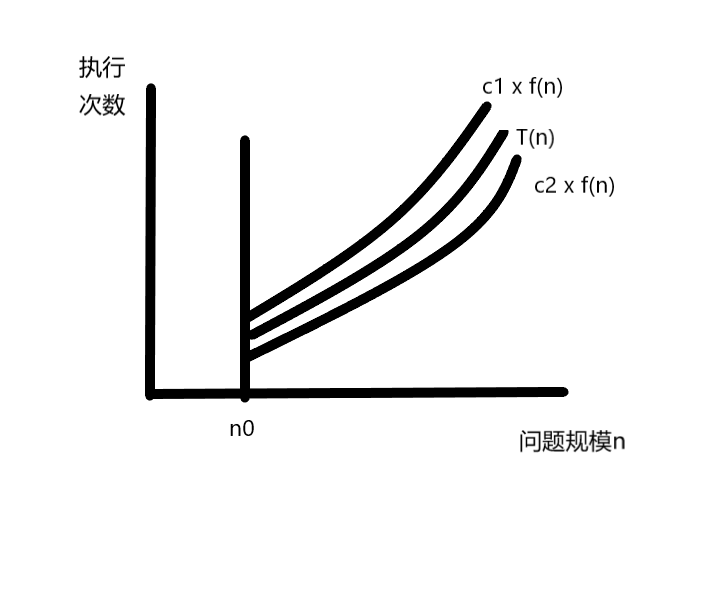

# 复杂度分析框架     

只依赖于算法要解的问题的规模、算法的输入和算法本身的函数，如果分别用N、I和A表示算法要解的问题的规模、算法的输入和算法本身，而且用C表示复杂性，那么有C=F(N,I,A)     
一般把时间复杂性和空间复杂性分开，并分别用T和S来表示，则有:T=T(N,I)和S=S(N,I)  (通常，让A隐含在复杂性函数名中)

# 算法的时间复杂度

评价一个算法的优劣，一个重要的指标就是算法的执行时间，如果我们知道一个算法的大致执行时间，我们就能估算出该程序对处理器的实用程度。    

## 时间频度  

一个算法执行所耗费的时间在理论上是不能计算出来的，必须实际测试才能得到准确的结果，但是我们没必要每个程序都去执行得到准确的数值，而且这些数据往往受收到计算机自身硬件条件的影响，所以我们只需要大致知道那些算法需要的时间长，哪些需要的时间短就可以了。一个算法花费的时间和算法中语句的执行次数成正比，一个算法中执行的语句多，它的耗时就长。一个算法中语句的执行次数称为算法的语句频度或时间频度，记为:`T(n)`。

## 算法渐进复杂性     
* 当n->∞，T(n)->∞   
* 当n->∞，(T(n) - t(n)) / T(n)->0     
* t(n)是T(n)的渐进性态，为算法的渐进复杂性    
* 在数学上，t(n)是T(n)的渐进表达式，直观上，是T(n)略去低阶项留下的主项，它比T(n)简单，可进一步简化，只关心t(n)的阶就够了，不必关心t(n)中的常数因子。     


## 时间复杂度 

上面提到的时间频度`T(n)`中，`n`看作是问题的规模，当n不断变化时，时间频度T(n)也会发生变化，如果我们想知道他们的变化规律来做进一步的分析，就需要引入算法时间复杂度的概念。一般情况下，算法的语句执行次数是问题规模n的函数`T(n)`，我们在定义一个辅助函数`f(n)`，使得当问题 规模n趋近于无穷大时，`T(n)/f(n)`的极限值为不等于0的常数，这样就称`f(n)`为`T(n)`的数量级函数，**f(n)就是算法的执行指令数**，记作:`T(n) = O(f(n))`,称为算法的渐进时间复杂度，简称时间复杂度。    

## 渐进符号    

+ 大O符号(低阶或同阶)     
  如果存在两个正的常数c和n0，对于任意n>=n0(极限定义)，都有T(n)<=c * f(n)，则称T(n)=O(f(n))，更直观的表示如下图：   
     

  - 加法   
    T(n,m) = T1(n) + T(m)  
    = O(max(f(n),g(m))     当两项相加时，只考虑阶数最大的一项的极限      
    针对并列的程序段   
  - 乘法  
    T(n,m) = T1(n) * T2(m)  
    = O(f(n)*g(n))    
    针对嵌套的程序段      

+ 大Ω符号(高阶或同阶)   
  如果存在两个正的常数c和n0，对于任意n>=n0，都有T(n)>=c * g(n)，则称T(n)=Ω(g(n)),更直观的表示如下图：      
         

+ Θ符号(同阶)     
  如果存在三个正的常数c1，c2和n0，对于任意n>=n0,都有c1 * f(n) >= T(n) >= c2 * f(n),则称T(n)=Θ(f(n)),更直观的表示如下图：    
        

+  例子    
  给定T(n) = 5n² + 8n + 1，求算法复杂度渐进性(是什么阶，用什么符号表示)    
   + 使用定义求解   
    先求O表示法，求两个常数c和n0    
    当n>=1时，5n²+8n+1 <= 5n²+8n+n = 5n²+9n <= 5n²+9n² = 14n² = O(n²)      
    求Ω表示法，求两个常数c和n0    
    当n>=1时，5n²+8n+1 >= 5n² = Ω(n²)    
    因为，14n² >= T(n) >= 5n²    
    所以，T(n) = Θ(n²)     
   + 使用极限求解   
    先根据T(n)估算出一个大致的结果，其实就是T(n)的主项,这个例子里面就是n²，然后求:   
      ```  
            lim T(n) / t(n) = lim (5n²+8n+1) / (n²) = 5  
      ```     
      最后求得一个常数，说明是与主项同阶的，使用Θ(主项)表示。   
   + 总结一下    
    这里我们之所以要使用这三种渐进符号就是为了方便的表示一个时间频度表达式T(n)与它的主项(也就是我们提前估计的那个结果)的一个关系。    


## 数据规模       

如果想要在1s内解决问题：    

O(n^2)的算法可以处理大约10^4级别的数据     
O(n)的算法可以处理大约10^8级别的数据    
O(nlogn)的算法可以处理大约10^7级别的数据   

## 大O表示法   

上面用`O()`来表示算法的时间复杂度的方法，成为大O表示法。    

算法时间复杂度应该从最好，最坏，平均三种情况下考虑，由于平均情况大多与最坏情况持平，所以我们一般直接计算最坏情况下的时间复杂度。     

`O(f(n))`中的f(n)可以为1、n、logn、n²等，我们分别将他们称为常数阶，线性阶，对数阶和平方阶，下面来看一下如果推导出来这些函数。       

## 推导大O阶   

先来看几个规则：

* 用1代替运行次数函数中的所有加法常数
* 修改后的运行次数函数中，只保留最高阶项 
* 如果最高阶项存在而且它的系数不是1，则去掉这个系数    


### 常数阶   

先看一个例子：  

```java 
int sum = 1；//执行一次
int n = 100; //执行一次
sum = n * sum; //执行一次
System.out.println(sum); //执行一次
```

上面这段程序的运行次数函数为`f(n) = 4`，根据上面的规则，将常数4改为1，所以时间复杂度为`O(1)`,如果`sum = n * sum`这条语句再执行几十次，但是这并没有影响问题的规模n,所以这个算法的时间复杂度仍为O(1),称为常数阶。   


### 线性阶

线性阶通常是用来描述循环结构的算法时间复杂度，举个例子：  

```java
int num = 0;
for(i = 0; i < n; i++) {
  num += 1;
}
```

上面程序中语句`num += 1`执行了n次，所以算法时间复杂度为O(n)。    


### 对数阶   

```java
int a = 1;
while(a < n) {
  a = a * 2;
  //时间复杂度为O(1)的算法
}
```

上面这段程序,每次循环a都会乘以2，会越来越接近n，当a增加到不小于n时循环结束。假设循环的次数为X，根据

`2 ^ X = n`,得到`X = log2n`,所以这个算法的时间复杂度为`O(logn)`.      


 