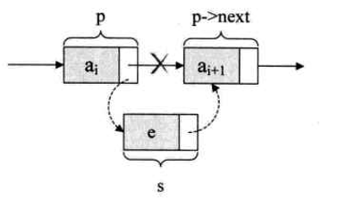
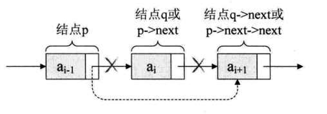

## 链表一些重点         


### 头指针和头结点              

* 头指针           

链表中第一个结点的存储位置叫头指针，头指针具有标识作用，所以常用头指针作为链表的名字，不论链表是否为空，头指针均不为空，对于链表而言，头指针是必要的。如果链表有头结点，头指针就是指向头结点的指针。           

* 头结点        

有时，为了更方便的对链表进行操作，会在单链表的第一个结点前再设置一个结点，称为头结点，它的数据域可以不存储任何信息，它只负责存储第一个结点的地址，有了头结点，对在第一元素结点前插入结点和删除第一结点，其操作和其他结点的操作就统一了。       


### 单链表的插入和删除        

* 插入       

       


  这时需要两句插入操作      

```c
s -> next = p -> next; p -> next = s;
```      

也就是让p的后继结点改成s的前驱结点，再把s变成p的后继结点        

但是两句的顺序是绝对不能颠倒的         


* 删除      

          


这时需要一句删除语句       

```c
q = p -> next; p -> next = q -> next;
```          

其实相当于            


```c
p -> next = p -> next -> next;
```        
