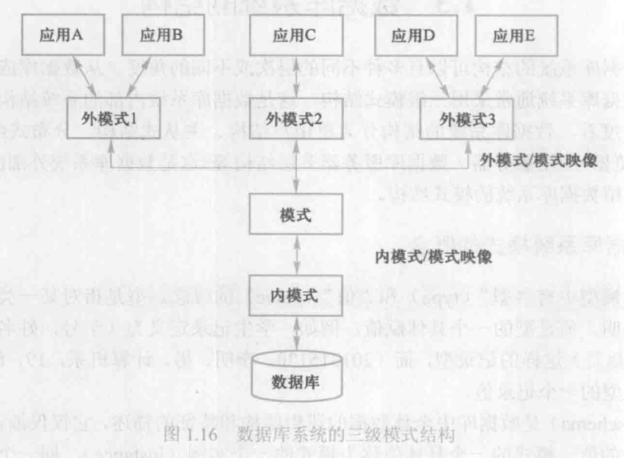

## 数据库四个基本概念   

* 数据(data)     
    数据的含义称为数据语义，数据及其语义是不可分的。   
* 数据库(DataBase DB)   
    数据库可以理解为储存在计算机内的大量数据的集合，它按照一定的数据模型组织、描述和储存数据。   
    数据库中的数据按一定的数据模型组织、描述和存储，具有较小的冗余度、较高的数据独立性和易拓展性，并可以为各种用户共享。
    概括的讲，数据库系统具有永久存储、有组织和可共享这三个基本特点。
* 数据库管理系统(DataBase Management System DBMS)    
  数据库管理系统位于用户和操作系统之间的一层数据管理软件，有以下几个主要功能:     
  * 数据定义功能   
    提供数据定义语言(Data Definition Language DDL)    
  * 数据组织、存储和管理    
  * 数据操纵   
    提供数据操纵语言(DML)      
  * 数据的事务管理和运行管理     
  * 数据库的建立和维护    

* 数据库系统    
  数据库系统是由数据库、数据库管理系统(及其应用开发工具)、应用程序和数据库管理员(DataBase Administrator DBA)组成的存储、管理、处理和维护数据的系统。    

## 数据库系统的特点    

* 数据结构化    
  数据库系统实现整体数据的结构化，这是主要特征之一，也是他和文件系统的主要区别。

  在文件系统中，某个文件中的记录是有结构的，但是记录的结构和记录之间的联系被固化在程序中，需要程序员去维护。    

  所谓数据整体结构化是指数据库中的数据不在仅仅针对于一个应用，而是面向整个企业或组织，不仅数据内部是结构化的，整体也是结构化的，数据之间有联系。     

  要达到数据整体结构化，就要求在描述数据时不仅要描述数据本身，还要描述数据之间的关系，在数据库系统中，记录的结构和记录之间的关系由数据库管理系统完成。

  在数据库系统中，不仅数据是整体结构化的，而且存取数据的方式也很灵活，可以存取数据库中的某一个或一组数据项、一个记录或一组记录，而在文件系统中，数据的存取的单位是记录，粒度不能细到数据项。

* 数据的共享性高、冗余度低而且易扩充     
  数据库系统从整体角度看待数据，数据面向多个应用，因此数据可以同时被多个用户，多个应用使用，数据的共享可以大大减小数据冗余度，不必使用很多的空间去存储相同的数据，而且还能避免数据之间的不相容性和不一致性。     

  由于数据面向整个系统，不仅可以被多个应用共享使用，而且容易增加新的应用，这就使得数据库系统易于扩充。      

* 数据独立性高      
  数据独立性包括数据的物理独立性和逻辑独立性    

  物理独立性是指用户的应用程序和数据库中的数据的物理存储是相互独立的。        

  逻辑独立性是指用户的应用程序与数据库的逻辑结构是相互独立的，也就是说数据的逻辑结构改变时用户程序可以不变。    

* 数据由数据库管理系统统一管理和控制    

  * 数据的安全性保护
  * 数据的完整性检查
  * 并发控制
  * 数据库恢复    

## 数据模型    

数据模型也是一种模型，是对现实世界数据特征的抽象，也就是说数据模型是用来描述数据、组织数据和对数据进行操作的。  

数据模型主要分为两类，一类是概念模型，一类是逻辑模型和物理模型    

第一类概念模型也称为信息模型，是对现实世界的一种描述，是按用户的观点来对数据和信息建模，主要用于数据库设计。    

第二类中的逻辑模型主要包括层次模型、网状模型、关系模型、面向对象数据模型和对象关系数据模型、半结构化数据模型等，它是按照计算机系统的观点对数据建模，主要用于数据库管理系统的实现。      

第二类中的物理模型是描述数据在系统内部的表示方式和存取方法，或在磁盘上的存储方式，是面向计算机系统的。     

为了解决现实生活中的问题，我们首先要将现实世界中的具体事物抽象、组织成为数据库系统支持的数据模型，一般是先将现实世界转换为信息世界，然后将信息世界转换为机器世界。         

从现实世界到概念模型的转换时数据库设计人员完成的，概念模型到逻辑模型的转换由数据库设计人员完成，从逻辑模型到物理模型的转换是数据库管理系统完成的。        

### 1.概念模型    

概念模型主要是用来表达某些语义，他涉及以下一些概念：    

* 实体(entity)   
  客观存在并可以相互区别的事物称为实体，实体可以是具体的人、事、物，也可以是抽象的概念或联系，例如一个学生，学生的一次选课、教师与院系的工作关系都是实体。    

* 属性(attribute)   
  实体具有的某一特性成为属性，一个实体可以由很多属性来描述。       

* 码(key)   
  唯一标识实体的属性集合称为码，例如学号是学生实体的码。    

* 实体型(entity type)    
  具有相同属性的实体必然具有共同的特性和性质。用实体名及其属性名集合来抽象和刻画同类实体，例如学生(学号，姓名，性别)就是一个实体型，而一个具体的学生就是一个实体。    

* 实体集(entity set)   
  同一类型的实体的集合称为实体集，例如一个年级的全体学生就是一个实体集      

* 联系(relationship)      
  实体内部的联系通常是指组成实体的各属性之间的联系，实体之间的联系通常是指不同实体集之间的联系。      

概念模型的一种表示方法：实体-联系方法。    

### 2.数据模型的组成要素     

一个完整的数据模型通常由数据结构、数据操作、数据的完整性约束条件三部分组成。    

* 数据结构    
  数据结构描述数据库的组成对象以及对象之间的联系。      
  数据结构是对数据库系统静态特性的描述    

* 数据操作    
  数据操作是指对数据库中各种对象(型)的实例(值)允许执行的操作的集合，包括操作及有关的操作规则。     
  数据操作是对数据库系统动态特性的描述    

* 数据的完整性约束条件    
  数据的完整性约束条件是一组完整性规则。     

### 3.数据模型中逻辑模型之关系模型    
关系模型是最重要的一种数据模型。    

* 关系模型的数据结构   
  关系模型是建立在严格的数学概念的基础上的。从用户观点看，关系模型由一组关系组成，每个关系的数据模型是一张规范的二维表。     

  关系模型要求关系必须是规范化的，这些规范化条件中最基本的一条就是：关系的每一个分量必须是一个不可分的数据项。    

* 关系模型的数据操纵和完整性约束    
  关系模型中的操作都是集合操作，操作对象和操作结果都是关系，即若干元组的集合。        

## 数据库系统模式的概念         
在数据模型中有"型"type和"值"value的概念，型是对某一类数据的结构和属性的说明，值是型的一个具体赋值，例如，学生记录定义为(学号，姓名，性别，年龄，专业)这样的记录值，而(1607104130,鲍骞月，男，20，数字媒体技术)则是该记录型的一个记录值。    

模式(schema)是数据库中全体数据的逻辑结构和特征的描述，它仅仅涉及型的描述，不涉及具体的值，模式的一个具体的值称为该模式的一个实例(instance),同一个模式有很多实例。     

例如：在学生选课数据库模式中包含学生记录、课程记录和选课记录，现在有一个学生选课数据库模式的一个实例，比如说是2017年学校选课数据库的实例，这个实例中保存了2017年全校选课的记录，等到了2018年又会有一个新的实例产生，所以各个时刻的数据库实例是不同的，但不变的是数据库模式。       

## 数据库系统的三级模式结构    

数据库系统的三级模式结构是指数据库系统是由外模式、模式和内模式三级构成    

       

* 1.模式    

  模式也称为逻辑模式，是这个数据库中全体数据的逻辑结构的描述，是所有用户的公共数据视图。
  它规定了此数据库主要完成的任务，它位于数据库系统结构的中间层，不涉及数据的物理结构，也不涉及具体的应用程序开发。      

  一个数据库只有一个模式，模式以某一种数据模式为基础，统一综合的考虑了用户的需求，并将这些需求结合成一个整体。定义模式时不仅要定义数据的逻辑结构，例如数据是由哪些数据项构成，数据项的名字、类型、取值范围等，而且要定义数据之间的类型，定义数据有关的安全性、完整性要求。      

* 2.外模式     
  外模式也叫子模式或用户模式，是数据库用户的数据视图，是与某一应用有关的数据的逻辑表示。 
  外模式通常是模式的子集，一个数据库可以有多个外模式，是为了满足不同用户，不同应用程序在需求上、数据保密的严格要求等。        

* 3.内模式    
  内模式也叫存储模式，一个数据库中只有一个内模式，他是数据物理模型和存储方法的描述，例如：记录的存储方式是堆存储还是按照某个属性值的升序存储，或者按照属性值聚簇存储。索引按照什么方式组织，是B+树索引还是Hash索引。         

## 数据库的二级映像功能与数据独立性      
数据库系统为了方便的在数据库三级模式自由转换，提供了两层映像：外模式/模式映像和模式/内模式映像      

* 1.外模式/模式映像      

  数据库系统中外模式描述的是数据的局部逻辑结构，模式描述的是全局逻辑结构，一个模式对应了多种外模式，对于每一种外模式，都有一个外模式/模式映像，它定义了该外模式与模式之间的对应关系。     

  当模式(例如增加新的关系、新的属性、改变属性的数据类型)发生改变时，需要数据库管理员去修改对应的外模式/模式，可以使外模式保持不变，应用程序时根据外模式编写的，从而应用程序不需要改变，保证了数据与程序的逻辑独立性。        

* 2.模式/内模式映像       
  
  数据库只有一个模式，也只有一个内模式，所以模式/内模式映像是唯一的，它定义了数据全局逻辑结构与存储结构之间的对应关系。当数据库的存储结构发生改变时，需要数据库管理员对模式/内模式进行改动，可以保持模式不变，从而应用程序也不用改变，保证了数据与程序的物理独立性。        

  