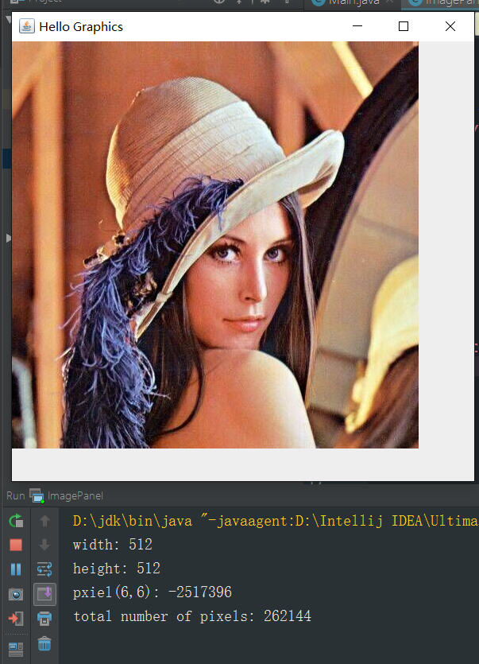

## 图像的基本构成     

+ 像素数据     

+ 元数据属性

+ 格式信息    

+ 文件信息     


## Java中对图像操作的API       

+ BufferedImage对象     

+ ImageIO读写图像文件     

+ Android中的Bitmap对象     

+ BitmapFactory        


代码演示：    

```Java
public class ImagePanel extends JComponent {
    private BufferedImage image;

    public ImagePanel(BufferedImage image) {
        this.image = image;
    }

    @Override
    protected void paintComponent(Graphics g) {
        Graphics2D g2d = (Graphics2D) g;
        if (image != null) {
            //我们来输出一下图片的尺度和具体的像素值
            System.out.println("width: " + image.getWidth());
            System.out.println("height: " + image.getHeight());
            //输出一下第十个像素，这里是默认RGB模型的整数像素，其实是有三个通道的数值,这里是三个字节数叠加起来的结果
            int pixel = image.getRGB(6, 6);
            System.out.println("pxiel(6,6): " + pixel);
            //输出总的像素个数,就是宽度和高度的乘积
            System.out.println("total number of pixels: " + image.getWidth() * image.getHeight());
            //图片大小为原图大小
            g2d.drawImage(image, 0, 0, image.getWidth(), image.getHeight(), null);
        }
    }

    public static void main(String[] args) {
        File file = new File("C:\\Users\\鲍骞月\\Desktop\\computergraphics.jpg");
        try {
            BufferedImage image = ImageIO.read(file);
            //装载图片
            ImagePanel imagePanel = new ImagePanel(image);
            //设置窗口和一些属性
            JFrame frame = new JFrame();
            frame.getContentPane().add(imagePanel, BorderLayout.CENTER);
            frame.setSize(600, 600);
            frame.setTitle("Hello Graphics");
            frame.setVisible(true);

        } catch (IOException e) {
            e.printStackTrace();
        }
    }

}
```      


输出：    

    
