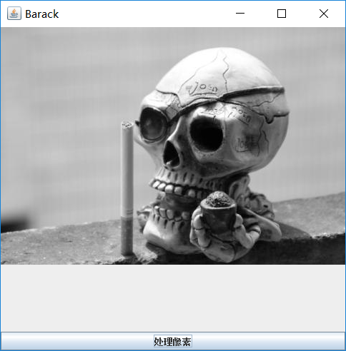
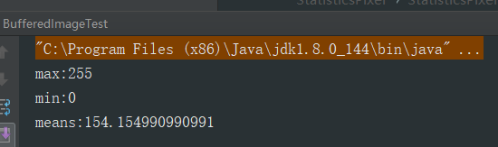
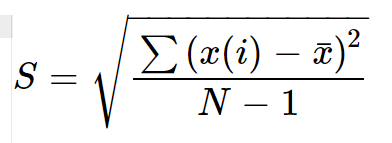
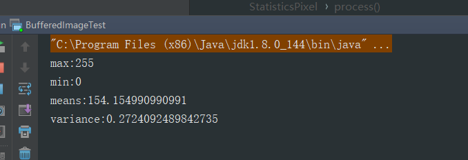
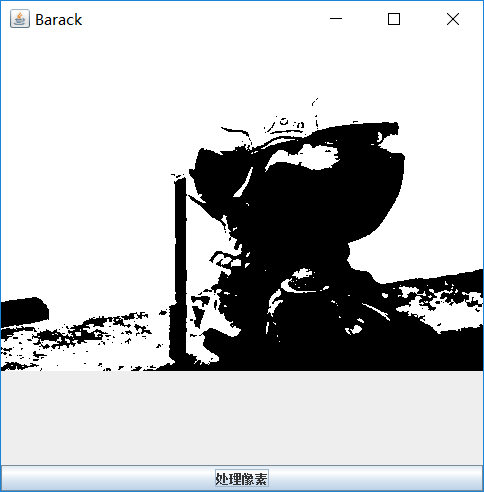

# 像素值统计信息(灰度图)      

这里我们想要实现一下图像二值化而且减少重复的一些操作，所以这里只对灰度图进行操作。      

## 统计最值     

* 像素最大值        

* 像素最小值          

计算像素最值很简单，就是将一张灰度图中的像素都遍历，然后得到最值，代码如下：       

```java
public void process(BufferedImage image) {
       int width = image.getWidth();
       int height = image.getHeight();
       int[] pixels = new int[width * height];
       getRGB(image,0,0,width,height,pixels);
       int index = 0;
       double num = 0;
       for (int row = 0; row < height; row++) {
           for (int col = 0; col < width; col++) {
               index = row * width + col;
               int pixel = pixels[index];
               //因为灰度图的各通道的像素值都一样，这里我们只计算出一个通道的像素值即可
               int pr = pixel >> 16 & 0xFF;
               //像素最大值
               max = Math.max(max,pr);
               //像素最小值
               min = Math.min(min,pr);
               num += pr;
           }
       }
       //像素均值
       means = num / (width * height);
       System.out.println("max:" + max);
       System.out.println("min:" + min);
       System.out.println("means:"+means);
   }
```         

        

输出：     

       


## 均值和方差      

* 均值         

均值很简单而且上面的程序中已经计算，这里略过...

* 方差         
这里我们计算标准差                     

首先看一下统计学中标准差的公式：       

       

然后我们用代码实现一下：       

```java
       num = 0;
       for (int row = 0; row < height; row++) {
           for (int col = 0; col < width; col++) {
               index = row * width + col;
               int pixel = pixels[index];
               //因为灰度图的各通道的像素值都一样，这里我们只计算出一个通道的像素值即可
               int pr = pixel >> 16 & 0xFF;
               num = Math.pow((pr - means), 2);
           }
       }
       int len = width * height;
       variance = Math.sqrt(num / len);
       System.out.println("variance:" + variance);
```      

输出：      

           


* 通过均值的图像二值化        

原理很简单，同样先遍历各像素，然后对每个像素值与上面计算出来的均值`means`比较，如果大于均值就把该像素设为最大值`255`,否则就设为最小值`0`,然后将二值化后的各个像素值写回到图片中，就得到了结果。        

我们具体实现一下：       

```java
      /**
        * 通过均值实现图像的二值化
        */
       for (int row = 0; row < height; row++) {
           for (int col = 0; col < width; col++) {
               index = row * width + col;
               int pixel = pixels[index];
               int pr = pixel >> 16 & 0xFF;
               //进行二值化操作
               if (pr > means) {
                   pr = 255;
               } else {
                   pr = 0;
               }
               //将各通道像素装载起来，重新写入
               //灰度图alpha通道值都为255
               pixels[index] = (255 << 24 | pr << 16 | pr << 8 | pr);
           }
       }
       setRGB(image, 0, 0, width, height, pixels);
```     

输出：      

      

效果还是很明显的。        


* 通过方差确定图片信息         

方差可以反映一群数据中每个数据与总体均数的差异程度，试想一张空白图片或者一张纯色图片，它的方差肯定为0或者接近于0，所以方差就是图片的一个很重要的信息。    
