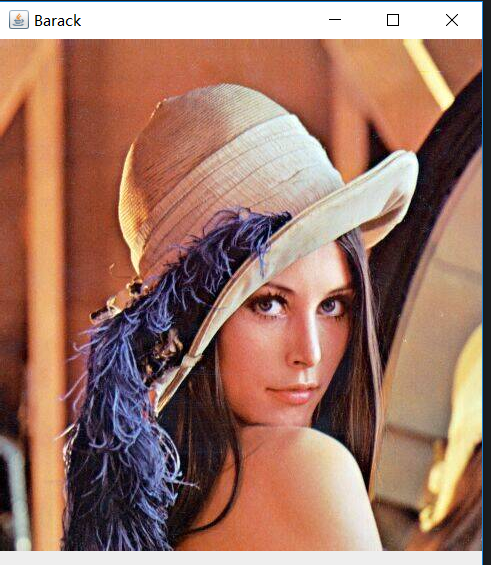
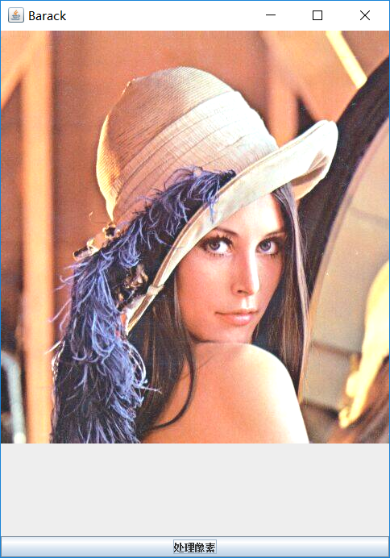
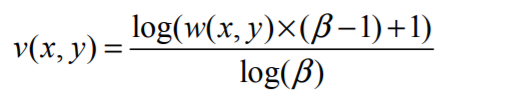
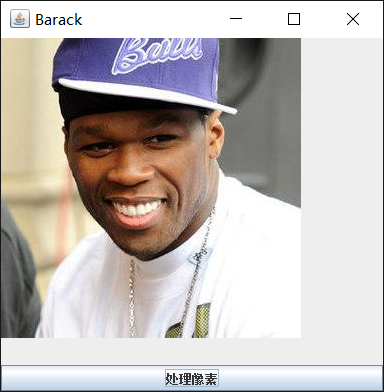
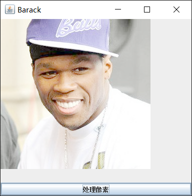

# 像素的数学运算     

这次我们先来介绍一些对像素的简单运算，虽然很简单，但却是之后复杂算法的基础      

## 对像素进行四则运算        

同样是通过遍历图片拿到具体的像素信息，然后分离各通道数据，再进行数学运算，这里用加法示例：       

原图：        

            

我们对每个像素值都做加法运算       

```java
public void process(BufferedImage image) {
        int width = image.getWidth();
        int height = image.getHeight();
        int[] pixels = new int[width * height];
        int index = 0;
        getRGB(image, 0, 0, width, height, pixels);
        for (int row = 0; row < height; row++) {
            for (int col = 0; col < width; col++) {
                index = row * width + col;
                int pixel = pixels[index];
                int pa = pixel >>> 24;//alpha
                int pr = (pixel >> 16) & 0xFF;
                int pg = (pixel >> 8) & 0xFF;
                int pb = (pixel) & 0xFF;

                //只对RGB三个通道进行运算
                pr = imageMath(pr);
                pg = imageMath(pg);
                pb = imageMath(pb);

                //将处理后的像素重新写回图片中
                pixels[index] = (pa << 24 | pr << 16 | pg << 8 | pb);
            }
        }
        setRGB(image, 0, 0, width, height, pixels);
    }

    private int imageMath(int pixel) {
      //运算的尺度
      int value = 20;
      int result = value + pixel;
      //需要将运算后的像素重新规划到0-255像素范围内
      return(result < 0 ? 0 : (result > 255 ? 255 : result));
    }
```

输出：     

       

可以看到整个照片的亮度值都有所提升         


## 其他运算         

* 平方运算     

* 开方运算    

* LOG运算     

详细代码在文件夹下         

## 简单应用:图像美白               

先给出公式：   

       

我们这里要求的效果不仅仅像上面那样只是单纯的给像素值做加法运算从而使图片变亮，我们想要使经过处理后的图片有美白效果，就是整体上有亮度的提升，但是要保持原有的一些图像细节特征。            

终于我找到了这个公式的出处，在一篇图像增强论文中`A Two-Stage Contrast Enhancement Algorithm for Digital Images`,论文中把这种增强方式称为`Logarithmic Curve`,就是利用log函数曲线的特点，找到一个合适的像素值映射表，在亮度增强时，使像素两端增强的稍弱，中间稍强。      

公式中的各个参数的意义论文中也有介绍：   

> where v(x,y) is the luminance level after enhancement,
> w(x,y) is the luminance level before enhancement and
> β is the value that controls logarithmic curve. 

可以得到`v(x,y)`代表处理后的像素，`w(x,y)`代表原像素，`β`代表log曲线的系数，也是该公式的调节参数。      

根据验证，当β值越大时图像增强的效果也越强。    


* 编程实现   

  ```java
   public void process(BufferedImage image) {
          int width = image.getWidth();
          int height = image.getHeight();
          int[] pixels = new int[width * height];
          getRGB(image, 0, 0, width, height, pixels);
          int index;
          for (int row = 0; row < height; row++) {
              for (int col = 0; col < width; col++) {
                  index = row * width + col;
                  int pixel = pixels[index];
                  int pa = pixel >>> 24;
                  int pr = (pixel >> 16) & 0xFF;
                  int pg = (pixel >> 8) & 0xFF;
                  int pb = pixel & 0xFF;

                  pr = imageMath(pr);
                  pg = imageMath(pg);
                  pb = imageMath(pb);

                  pixels[index] = (pa << 24 | pr << 16 | pg << 8 | pb);
              }
          }
          setRGB(image, 0, 0, width, height, pixels);

      }

      private int imageMath(int p) {
          //将处理后的像素值规划到0~255范围内
          double scale = 255 / (Math.log(255 * (beta - 1) + 1) / Math.log(beta));
          double p1 = Math.log(p * (beta - 1) + 1);
          double p2 = Math.log(beta);
          double result = scale * (p1 / p2);
          return (int) result;
      }
  ```

来看一下效果：       

我故意找了张黑人头像，哈哈哈哈这效果。            

原图：    


      


处理后效果：    

      


还可以通过调整β这个参数来进一步调整美白的程度。       


