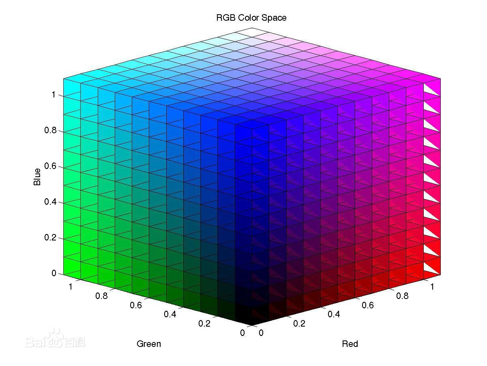

#  色彩空间   

颜色通常使用三个相对独立的属性来描述，三个独立变量综合作用就构成一个空间坐标，进而构成色彩空间。       

色彩空间的种类也有很多，但是其实不论我们以哪种色彩空间来分析图像，被描述的色彩对象本身是固定的，只是我们从不同的角度去看待同一个对象。     

## RGB空间       

**Red,Green,Blue**

该空间是计算机图形系统中采用的色彩空间，基于颜色的加法混色原理，如果我们把r，g，b三个通道分别作为笛卡尔坐标系的x，y，z轴，就能得到该色彩空间：    

前面也说过rgb每个通道都是用八位存储的，然后就可以产生`256*256*256`种颜色，也就是常说的“24位真彩色”。       

## YCbCr空间  

这种色彩空间是使用在视频中的，可以和RGB色彩空间互相转换。    

以后如果深入学习到这种色彩空间再回来补充...      

## 

## HIS/HSB/HSV(色相、饱和度、亮度)     

* HSI(hue,saturation,intensity)     
* HSB(hue,saturation,brightness)
* HSV(hue,saturation,value)           

这三种空间都是六角锥体空间模型，但是值得一提的是该空间不像RGB那样方便计算机存储，面向硬件的。      

这几种空间都是面向用户的，分别对应色调(hue),饱和度(saturation),亮度(...),这是针对于人对色彩的感受强弱特点提出的色彩空间，人类对亮度的敏感度要强于色彩，使用这种色彩空间来做图像处理会更贴近我们的直观感受。     

各要素的取值范围(不知道以后会不会用到)：   

* 色调H：用角度度量，取值范围为0°～360°，从红色开始按逆时针方向计算，红色为0°，绿色为120°,蓝色为240°。它们的补色是：黄色为60°，青色为180°,品红为300°；
* 饱和度S：取值范围为0.0～1.0；
* 亮度V：取值范围为0.0(黑色)～1.0(白色)。          

在Java和Android中都提供了GRB和HSB通道互相转换的API。      

