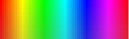
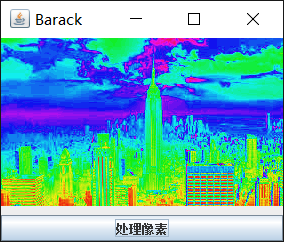

# 颜色查找表(Color Lookup Table)    

在图像处理中，难免会碰到一些对像素的复杂数学运算，而且又可能是对多通道同时计算，或者每次运算付出的时间和空间代价都很大，这样的处理效率就很低，但是如果我们事先在一定范围内，将我们需要进行的运算先实现一遍，而且要把这次实现的结果保存下来成为一个表，然后给每个像素值建立到这个查找表的索引，这样我们再进行这样的操作时，只需要根据索引从表中把结果读取出来就行了，单纯的查找比起复杂运算不知要给cpu减少多少的负担，关键是提高了效率，也有一点空间换时间的感觉。

其实在很多复杂的算法中，经常会用到Lookup Table来提高算法效率。        

## 建立颜色查找表    

我们这里用到的查找表其实就是一个一维线性表，我们举一个之前的例子来说明查找表的效率问题。     

之前有一个图像美白的应用，而且采用的是分通道分别计算，应该是有`width * height * 3`次运算，所以我们就为这个运算建立一个Lookup Table来看看效果。       

* 我们先来看一下普通处理用的时间：     

```java
 public void process(BufferedImage image) {
        int width = image.getWidth();
        int height = image.getHeight();
        int[] pixels = new int[width * height];
        getRGB(image, 0, 0, width, height, pixels);
        long starttime = System.nanoTime();
        int index;
        for (int row = 0; row < height; row++) {
            for (int col = 0; col < width; col++) {
                index = row * width + col;
                int pixel = pixels[index];
                int pa = pixel >>> 24;
                int pr = (pixel >> 16) & 0xFF;
                int pg = (pixel >> 8) & 0xFF;
                int pb = pixel & 0xFF;

                pr = imageMath(pr);
                pb = imageMath(pb);
                pg = imageMath(pg);
                
                pixels[index] = (pa << 24 | pr << 16 | pg << 8 | pb);
            }
        }
        setRGB(image, 0, 0, width, height, pixels);
        long endtime = System.nanoTime();
        System.out.println("the process duration is: " + (endtime - starttime));
    }
```


输出： 

```
the process duration is: 101063156
```


* 我们使用颜色查找表再来看一下用时：    

```java
 public void process(BufferedImage image) {
        int width = image.getWidth();
        int height = image.getHeight();
        int[] pixels = new int[width * height];
        getRGB(image, 0, 0, width, height, pixels);
        //建立颜色查找表
        int[] table = new int[256];
        for (int i = 0; i < 256; i++) {
            table[i] = imageMath(i);
        }
        long starttime = System.nanoTime();
        int index;
        for (int row = 0; row < height; row++) {
            for (int col = 0; col < width; col++) {
                index = row * width + col;
                int pixel = pixels[index];
                int pa = pixel >>> 24;
                int pr = (pixel >> 16) & 0xFF;
                int pg = (pixel >> 8) & 0xFF;
                int pb = pixel & 0xFF;

                //根据像素索引到查找表读取对应的结果
                pr = table[pr];
                pg = table[pg];
                pb = table[pb];

                pixels[index] = (pa << 24 | pr << 16 | pg << 8 | pb);
            }
        }
        setRGB(image, 0, 0, width, height, pixels);
        long endtime = System.nanoTime();
        System.out.println("the process duration is: " + (endtime - starttime));
    }
```


输出：    

```
the process duration is: 34641793
```


可以看到效率提升很明显。      


## 颜色查找表应用：灰度图上色      

这里我们先读取一个24位真彩色条带，根据这个条带上的像素分布建立一个颜色查找表，然后根据灰度图的像素值作为索引读取查找表上色。     

* 建立查找表   

  彩色条带    

  ​

  

  然后我们根据这个条带建立查找表：   

  ```java
   private void setColorLookupTable() {
          int width = colorRes.getWidth();
          int height = colorRes.getHeight();
          int[] pixels = new int[width * height];
          getRGB(colorRes, 0, 0, width, height, pixels);
          int index;
          //查找表
          table = new int[256];
          //因为色块在垂直方向是均匀分布的，所以这里为了像素的准确性，我们提取最中间一行的像素值做查找表
          int row = height / 2;
          //错开图片边缘的一些杂色
          for (int col = 4; col < 260; col++) {
              index = row * width + col;
              int pixel = pixels[index];
              table[col - 4] = pixel;
          }
      }
  ```


* 给灰度图上色   

  灰度图原图：    

  

  因为这是张灰度图，它的rgb三个通道的像素值应该是相同的，所以我们只需要提取其中一个通道的值作为查找表的索引就能给整张图像上色，代码如下： 

  ```java
  public void process(BufferedImage image) {
          setColorLookupTable();
          int width = image.getWidth();
          int height = image.getHeight();
          int[] pixels = new int[width * height];
          getRGB(image, 0, 0, width, height, pixels);
          int index;
          for (int row = 0; row < height; row++) {
              for (int col = 0; col < width; col++) {
                  //因为是灰度图，所以这里只提取一个通道的像素
                  index = row * width + col;
                  int pixel = pixels[index];
                  System.out.println(pixel);
                  int pr = (pixel >> 16) & 0xFF;
                  pixels[index] = table[pr];
              }
          }
          setRGB(image, 0, 0, width, height, pixels);
      }
  ```

  效果如下：     

  

  可以看到原先的灰度图，被我们按照颜色分布卡的分布规则重新上色。     

  看上去还不错......(ps:详细代码在同文件夹下)。       

  ​

