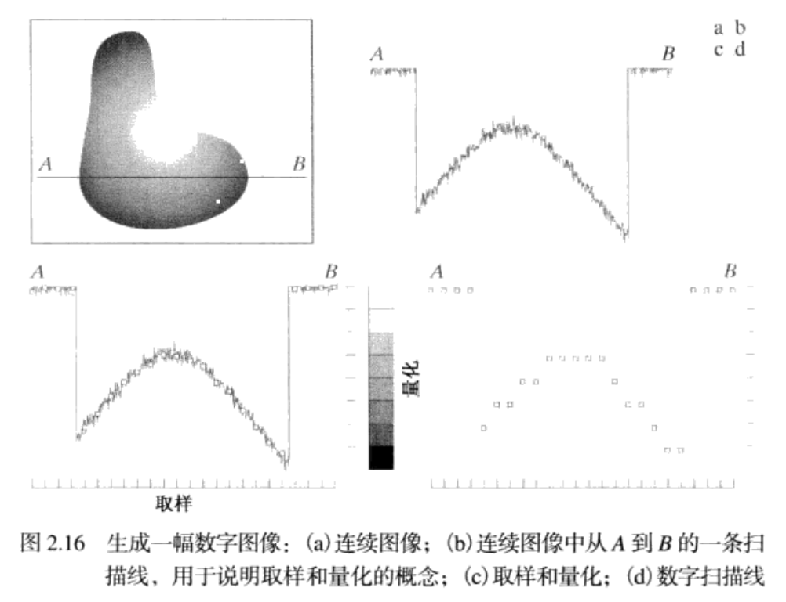
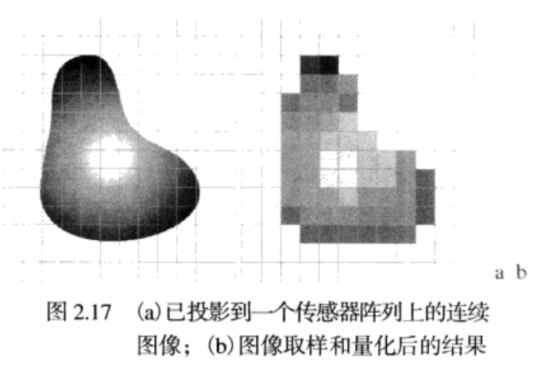
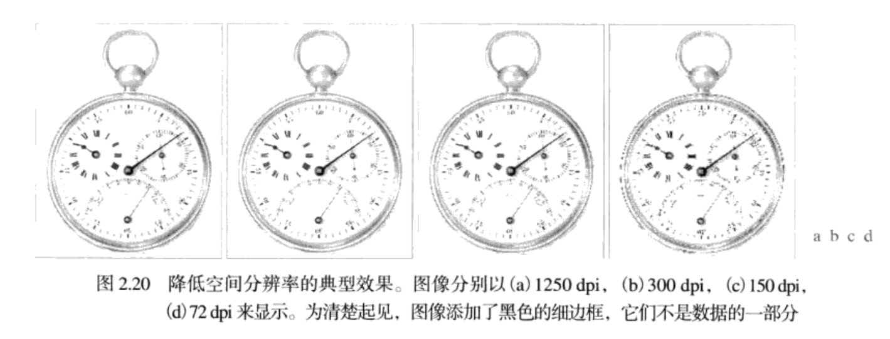
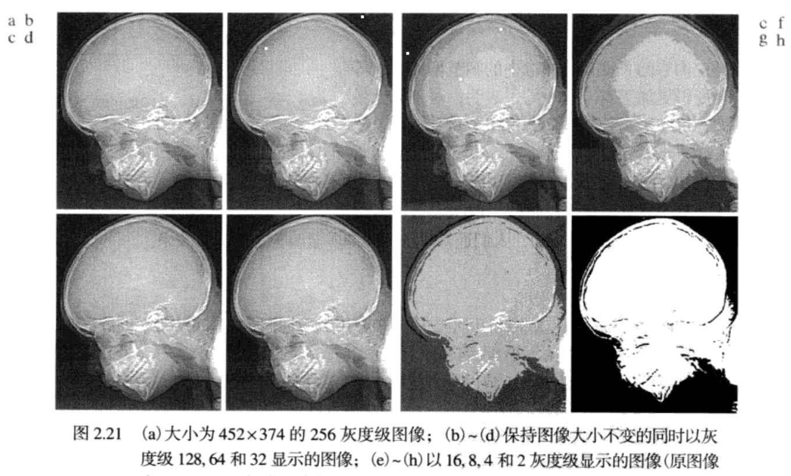
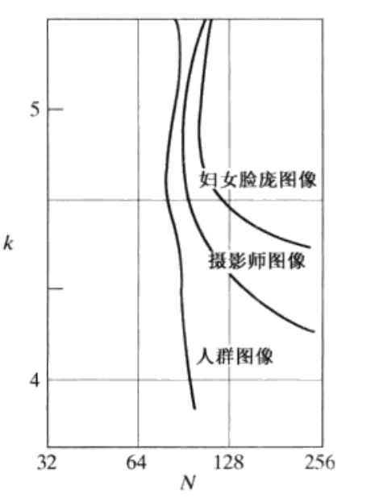

# 图像处理基础知识                


## 光的强度和单色光的灰度级     

这两个东西本质上都是描述光的强度，但是比较特殊的是没有颜色的光，我们称为单色光或无色光，单色光的属性就是它的光强。单色光形成的图像我们俗称为黑白图像，强度就是从黑到灰，再到白，灰度级用来描述单色光的强度，在后面的学习中，从黑到白的单色光的度量值范围称为灰度级，单色图像被称为灰度图像。          


## 简单的图像形成模型    

我们所看到的图像都是由"照射"源和形成图像的"场景"元素对光能的反射或吸收而产生的。      
我们使用形如`f(x,y)`的二维函数表示图像，在空间坐标`(x,y)`处，f的值应该是一个正标量，其物理意义由照射源决定(可见光、伽马射线、x射线等等),**当图像有物理过程产生时，其亮度值正比于照射源，所以，`f(x,y)`一定是非零有限的**，但是在图像处理的过程中，图像灰度总会不可避免的出现负值，为了解决这个问题，在存储和显示图像时，我们会标定灰度，以便最小的负值变为0.  

* 数字图像获取的过程:    

能量(“照射”)源  ->  场景元素  ->   成像系统   ->   场景到图像平面的投影   ->   数字化图像     

上面提到我们使用函数`f(x,y)`来表示图像，该函数可以由两个分量来表述，(1)入射到场景元素的光源照射总量；(2)场景中物体反射的光照总量，简称为入射分量和反射分量，表示为`i(x,y)`和`r(x,y)`，两个函数的乘积合并形成`f(x,y)`，`f(x,y) = i(x,y) * r(x,y)`        

其中：       
``` 
			0 < i(x,y) < ∞              
			0 < r(x,y) < 1(表示场景中物体的全吸收和全反射)            
```


## 图像的取样和量化    

前面说了一幅图像可以看作就是一个函数f，为了将图像数字化方便计算机存储和科学运算，我们需要对每个坐标点进行处理，对具体像素的位置、坐标的数字化称为取样，对其灰度级的数字化称为量化。      

       

可以看到先对图像中的一行进行了像素提取，在底部以很小的间隔进行坐标分化，在侧面则是提供了8个离散灰度区域，然后将具体的灰度值划分到这8个离散区域内，这就是取样和量化的过程。     

       

上图的对比可以反映出数字图像的质量很大程度上取决于取样和量化中所用的样本数和灰度级。      

## 数字图像的表示     


我们可以将数字图像取样量化成为一个二维阵列(矩阵)，包括M行N列，这样`(x,y)`就是每个离散坐标，我们假定离散坐标使用整数值，那么`x = 0,1,2...M-1,y = 0,1,2...N-1`,这样数字图像f位于原点的函数值就是f(0,0),第一行的第二个样本点的值就是f(0,1)。x,y称为空间变量或空间坐标。       

常见有三种方法来表示      

* 1.三坐标表示法      
用两个坐标x，y来决定空间位置，第三个坐标表示当前位置的灰度值，这样的一幅图像就被立体的表示出来了。     

* 2.归一化表示     
图像中只有三个等间距的灰度值，将所有的灰度值归一化到`[0,1]`中，那么图像中每个点的灰度都有0，0.5,或1这样的值，在屏幕上就对应的显示出黑、灰、白的图像。      

* 3.阵列表示法    
将f(x,y)按照矩阵的方式记录下来，数值阵列用于处理和算法开发。           

以公式形式，我们可以将一个MxN的数值阵列表示为:     
```
f(x,y) = {
	f(0,0),f(0,1) ... f(0,N-1)
	f(1,0),f(1,1) ... f(1,N-1)
	  ...    ...  ...   ...
	f(M-1,0),f(M-1,1)...f(M-1,N-1)
}
```    

该式的两端以等效的方式定量的表述了一幅数字图像，右边是一个实数矩阵，矩阵的每个元素称为图像单元、图像元素或**像素**，图像和像素这两个术语将一直伴随着图像处理。      


## 图像灰度的动态范围    

动态范围在不同的场景中有不同的意义，这里可以表述图像系统中最大度量灰度与最小可检测灰度之比。其上限取决于饱和度，下限取决于噪声。与图像系统动态范围联系紧密的还有图像对比度。      


## 图像对比度(Contrast)      

我们定义一幅图像中最高和最低灰度级间的灰度差为对比度，当一幅图像中可以被感知的数值有较高的动态范围时，我们认为该图像有较高的对比度，具有低动态范围的图像看上去像冲淡了灰度，对比度低。         

## 图像的空间和灰度分辨率　　　　


### 图像空间分辨率　　　

直观上讲，空间分辨率就是指图像中可以辨别的最小细节的度量。
最常见的度量是指每单位距离内的线对数和每单位距离内的点数(像素数)。　　　　

从空间分辨率的定义我们可以看出，该分辨率必须针对空间单位来规定才有意义，也就是说首先要明确图像的空间大小(尺寸)，如果没有规定图像包含的空间维数，那么我们说一幅图像的分辨率为1024x1024像素是没有意义的。　

如果我们说一幅图像的尺寸大小是MxN,就表明在成像时取样了MxN个样本，其空间分辨率也为MxN，如果我们一直降低一幅图像的空间分辨率的话，很自然，图像的尺寸就会减小，如果还要保持原来的大小的话，就需要使用一些增大图像的方法，比如图像内插，后面会提到。　　　　

* 降低图像空间分辨率的效果　 

　     
   

上面几幅图像是一次减少图像空间分辨率后的效果，实际上这样的缩小，图像的大小也会减小，但是这里对后面几幅图像进行了放大，可以看到，后面的几张图已经有图像特征的退化，当以这样低的分辨率印刷时，印刷和出版业会使用一些技巧，后面都会提到。　　　


### 图像分辨率　　　　

广泛使用的图像分辨率的定义是每单位可以辨别的最大线对数量(比如每毫米100个线对)。　　
便于理解的是每英寸图像内的像素点数，分辨率越高，同样范围内的像素点就密，图像就越清晰.当做大型的喷绘时，就要求图像有较大的分辨率，保证每英寸的画面上有更多的像素点。　　　　

每单位距离点数是印刷业中常用的图像分辨率的度量，在美国，这个度量通常使用`每英寸点数(dpi)`来表示。

### 图像灰度分辨率　　　　

同样的，灰度分辨率也指灰度级中可以分辨的最小变化。　　　

前面提到过，灰度级数通常是2的整数次幂，最常用的数是8比特,比特数的减小会增大对比度，通常情况下灰度范围为`[0,255]`灰度分辨率不像空间分辨率必须以每单位距离为基础才有意义，**灰度分辨率指的是用于量化灰度的比特数**。     

* 改变图像灰度级数的效果　　　

这次保持图像内样本数不变，将灰度级数以２的整数次幂从256减小到2,来看一下效果

     

这就是对比特数的直接减小，一般量化采用8比特。　　　　


### 等偏爱曲线　　　　

    

可以看到曲线有向右上方移动的趋势，N和K值在一直增大，也代表了更好的图像质量。　　　  
而且可以看出等偏爱曲线有一直变垂直的趋势，这表明**对于有大量细节的图像，可能只需要较小的灰度级。**　　　
当M,N的值固定时，图像的质量与所用的灰度级数是近似独立的。　　　　

windowsTest


## 几何基元和变换           

* 齐次坐标        

齐次坐标是相对于笛卡尔坐标而言的，我们平时所说的坐标系都是笛卡尔坐标系，表示的是笛卡尔空间，在这个空间内，两条直线是不能相交的，但是在透视空间里，情况就不一样了，什么叫透视空间，生活中，一条很长的马路，马路两边是平行的，你从马路一端向另一端看，马路在你视野的尽头会相交于一点，如果这时使用笛卡尔坐标表示就是(∞，∞)，这在透视空间内就没有意义，所以引进齐次坐标。         


齐次坐标就是使用n+1维来代替n维,我们可以在2D坐标后面加上一个额外的坐标w形成2D齐次坐标     


比如一个点的坐标为(X,Y),它的齐次坐标为(x,y,w)    


```
X = x/w  
Y = y/w
```    


这样，笛卡尔坐标系下(1,2)的齐次坐标就是(1,2,1),当把这个点移动到无限远处，它的齐次坐标就是(1,2,0)，而不是没有意义的(∞，∞)。   


将齐次坐标转换为非齐次也很简单         
通过除以最后一个元素转换
(1,2,1)
```
(1/1,2/1,1) = (1,2)
```            


