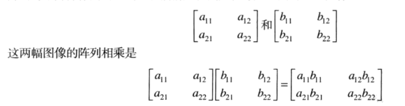
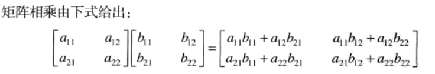
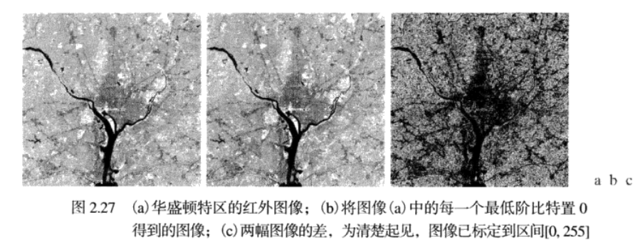

## 阵列与矩阵操作    

这二者有区别：   

* 阵列操作   
    阵列操作是逐像素为基础实行的   

        

* 矩阵操作    

    就是线性代数中的矩阵运算    

         

例如，当谈到一幅图像的求幂时，意味着每个像素都进行求幂运算。   

当谈到一幅图像去除以另一副图像时，意味着在相应的像素对之间进行相除。  

## 线性操作和非线性操作    


## 算术操作   

* 针对降噪的带噪图像相加      
* 增强差别的图像相减    
     图像相减经常用于增强图像之间的差：   

         
     图b只是将图a每个像素的最低有效比特置0得到的，可以看到差异并不是很明显，在视觉上，这些图像都不可辨别。 
     图c是一幅图像减去另一幅图像的结果，清楚的显示了两幅图像的差异，在差值图像中，黑色值表示在该位置，这俩幅图像没有差异。       

* 使用图像相乘和相除来校正阴影       

    * 阴影矫正   

        如果现在有一幅带有些许阴影的图像，它可以表示成:   
        `g(x,y)=f(x,y)*h(x,y)`，其中`f(x,y)`表示完美图像，为了得到这个完美图像，我们可以使用已有的图像`g(x,y)`去除以阴影模式`h(x,y)`，至于阴影模式如何获取，如果图像系统可以访问，我们可以通过对具有恒定灰度的目标成像得到一个近似的阴影函数，当传感器不可用时，常常使用某种方式直接从图像估计阴影模式(后面会讨论).     

    * 图像掩膜(mask)操作   
        
        也可以叫做感兴趣区域(ROI)操作，给定ROI范围，和mask，就可以做到过滤和扣图等操作。  
        后续补充...     

## 集合与逻辑操作      

* 集合操作   
    集合操作处理正常图像和灰度图像时会有在定义上的不同之处。   

* 逻辑操作    
    在操作二值图像时，我们可以将图像想象为像素集合的前景(1值)和背景(0值)，如果把区域(目标)定义为由前景像素组成，那前面所说的集合操作就变成了二值图像种目标坐标间的操作。    

* 模糊集合   


## 空间操作      

* 单像素操作   

    这种方式是针对图像中的每个元素进行操作的，最常见的就是对每个像素的灰度值的改变，例如前面使用集合操作可以求出一幅图像的负图像，这里使用对每个像素进行`(0,255)`的计算，同样可以得到目标图像的负图像。   

* 邻域操作   

    令Sxy代表图像f中以任意一点为中心的一个邻域的坐标集，在输入图像g中的相同坐标处生成一个相应像素，只不过这个目标像素的值是通过f图像中这个确定的邻域内的各个像素值通过指定某种计算规则计算得到的，最常见的就是求这个邻域内像素的平均值，可以将公式表示为：    
    ```
                                    g(x,y) = 1/m*n Σ f(r,c)
    ```   
    其中r和c就是邻域Sxy中像素的行和列坐标，图像g是这样得到的：在g中开始遍历每个像素位置，每次遍历都去f中寻找相应的邻域，然后求平均值，最后赋值到g中的像素上，这样可以在原图像中执行局部模糊。   

* 几何空间变换和图像配准    

    几何变换改进图像中像素间的空间关系，这些变换可以形象的称为橡皮膜变换，可以看成在一快橡皮膜上印制了一幅图像，然后根据一定的规则拉伸这个橡皮膜，但是实际中，拉伸这个橡皮膜后，几乎所有的位置的颜色都会变淡，这个时候就需要我们重新着色，在数字图像处理中，这个操作由两个操作组成：(1)坐标的空间变换；(2)灰度内插，即对空间变换后的像素赋灰度值。    
    坐标变换可以由这个公式表示：   
    ```
                            (x,y) = T{(v,w)}
    ```    
    其中(v,w)是原图中的坐标，(x,y)是变换后图像的坐标，只是通过改变矩阵T来进行旋转，平移，错切等空间变换，这种坐标的变换称为仿射变换。    

    上面的变换只是将一幅图像中的像素重新定位到一个新的位置上，接下来就要对这些位置进行灰度值的赋值，使用灰度内插方法。      

    图像配准就是对齐两幅或多幅相同场景的图像，而且往往这时我们并不知道这些图像之间的坐标 变换关系，就需要我们通过一定的算法估计这个变换函数。   
    这个算法的第一步就是选定**约束点**，这些点是在输入图像和参考图像中位置恰好已知的相应点。          
    估计变换函数问题是建模问题之一，例如，假设在输入图像和参考图像中由一组4个约束点，我们可以基于双线性近似给出模型，然后求解模型，就得到了一个大致的配准的函数。   

## 向量和矩阵操作   

一个有RGB三通道的图像可以通过矩阵方便的表示出来，其中的每个像素都有三个分量，这些分量可以组织成一个列向量的形式,或者看成空间中的一个深度，其中的每个元素表示各个通道的像素的亮度。这样大小为MxN的RGB彩色图像就可以用这一大小的三个分量图像来表示(列向量)，或者总共用MN个三维向量来表示(空间深度)来表示。         

一旦像素被表示成向量，我们就可以使用向量矩阵理论工具。例如一个像素向量z和一个任意点a在n维空间的欧氏距离可以用一个向量积来定义。    


## 图像变换    

到目前为止，讨论的所有图像处理中用到的数学工具都是直接对像素进行操作的， **即直接工作在空间域**，在有些情况下，通过变换输入图像来表达图像处理任务，在变换域执行相应的任务，之后再用反变换返回到空间域会更好，这其中会有很多种变换，表示为T(u,v)的二维线性变换是一类特别重要的变换，其通用形式可以表示为：   

```
                        T(u,v) = ΣΣf(x,y)r(x,y,u,v)    
```   
其中，f(x,y)是输入图像，r(x,y,u,v)是正变换核，两个求和符号是对`u=0,1,2,...,M-1`和`v=0,1,2,...,N-1`进行计算。和以前一样，x和y是空间变量，M和N是f的行和列，u和v是变换变量，T(u,v)称为f(x,y)的正变换，给定T(u,v)后，我们还可以用T(u,v)的反变换还原f(x,y):   

```
                        f(x,y) = ΣΣT(u,v)s(x,y,u,v)   
```   
其中，`x=0,1,2,..,M-1,y=0,1,2,...,N-1,s(x,y,u,v)`称为反变换核。上面两个式子一起称为变换对。    

线性变换域执行图像处理的基本操作：   
首先，变换输入图像，然后用预定义的操作修改该变换(傅里叶变换等等)，最后输出图像由计算修改后的变换的反变换得到。这样可以看出，该过程是从空间域到变换域，然后返回到空间域。       


## 概率方法    

概率有很多方式都运用在图像处理中，最简单的方式就是当我们以随机变量处理灰度值时，例如，令Zi，i =0,1,2...,L-1表示一幅MxN大小数字图像中所有可能的灰度值，则在给定图像中灰度级Zk出现的概率为P(Zk)可以估计为:    
```
                p(Zk) = nk/MN
```
其中nk是灰度Zk在图像中出现的次数，MN是图像像素总数，显然：    
```
                Σp(Zk) = 1
``` 
一旦我们知道了p(Zk)，就可以得到很多图像的特性，比如可以求得图像平均灰度：   
```
                m = ΣZkp(Zk)  //就是求期望
```   
类似地，灰度的方差是:   
```
                σ^2 = Σ(Zk-m)^2p(Zk)   
```  
方差是z值关于均值m的展开度的度量，因此他是图像对比度的有用度量。     

在开发图像处理算法中，概率的概念起着核心的作用，例如，使用概率度量推导灰度变换算法；使用概率和矩阵公式开发图像复原算法；概率还能被用于图像分割。   
**到目前为止，我们已经讨论了将概率运用到单幅二维图像上的单个随机变量(灰度)的问题，如果考虑序列图像，我们可能解释成为时间的第三个变量，处理这一附加复杂性的工具是随机图像处理技术，我们可以进一步将整个图像考虑为一个空间随机事件(相对于一个点)，基于这一概念所需要的处理工具是来自随机域的技术。**


